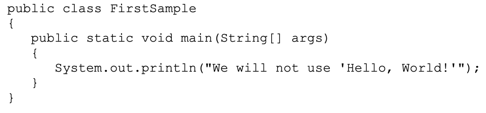
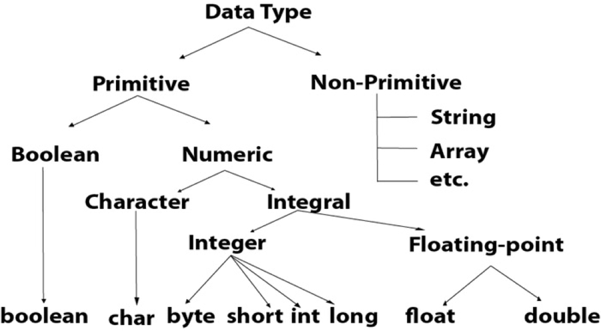
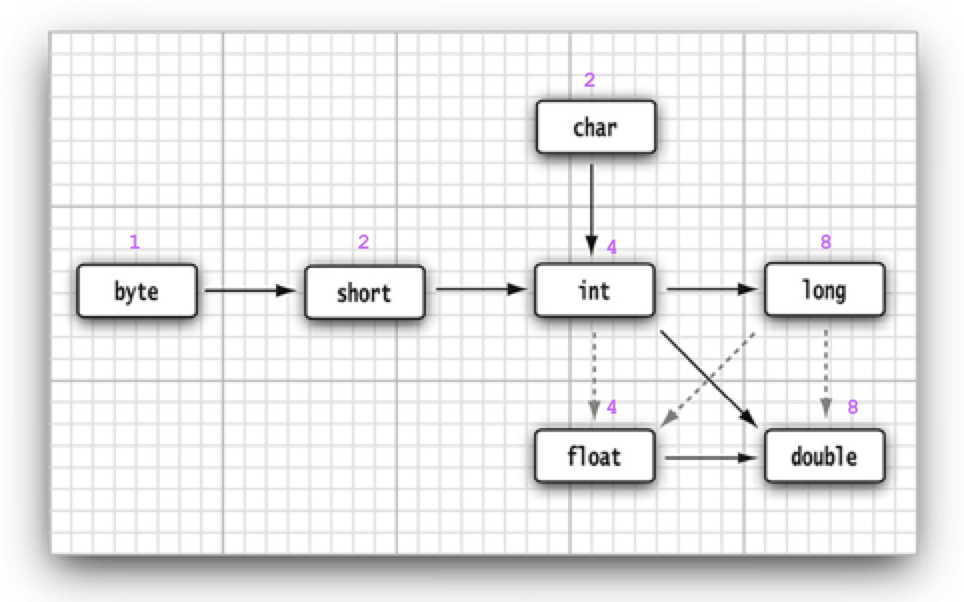
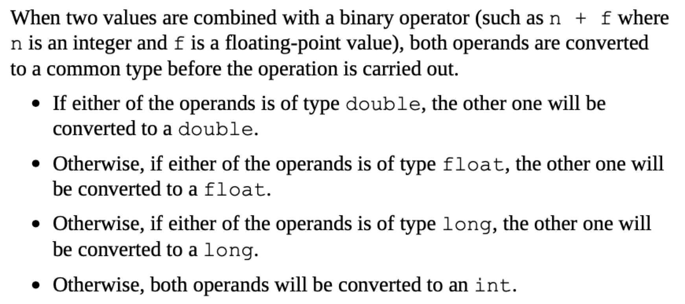
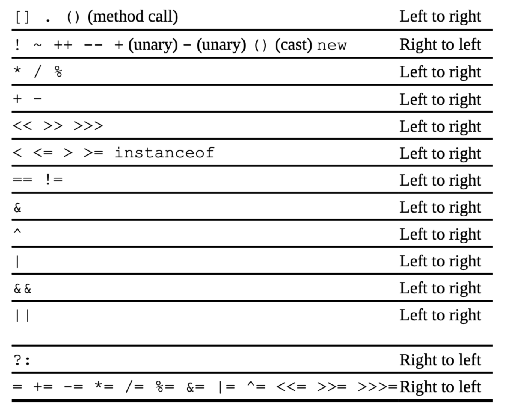
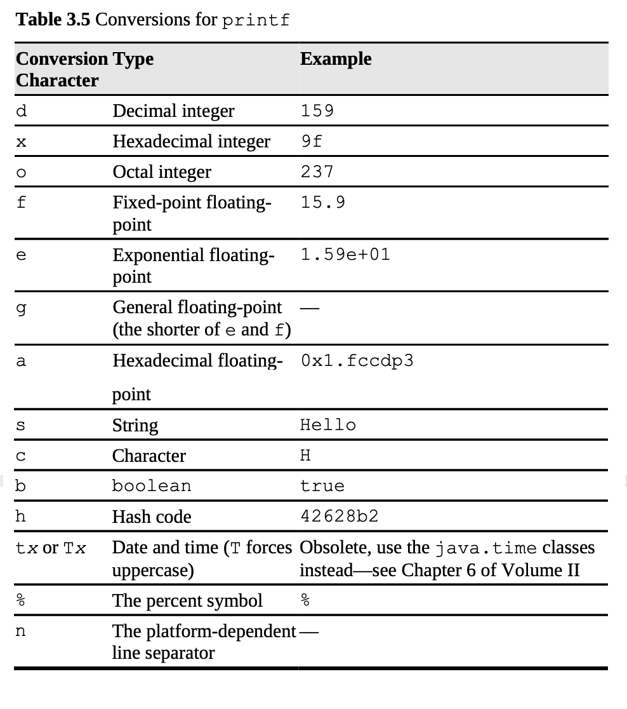
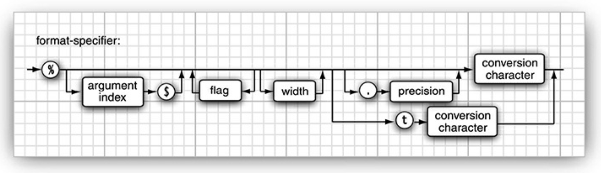
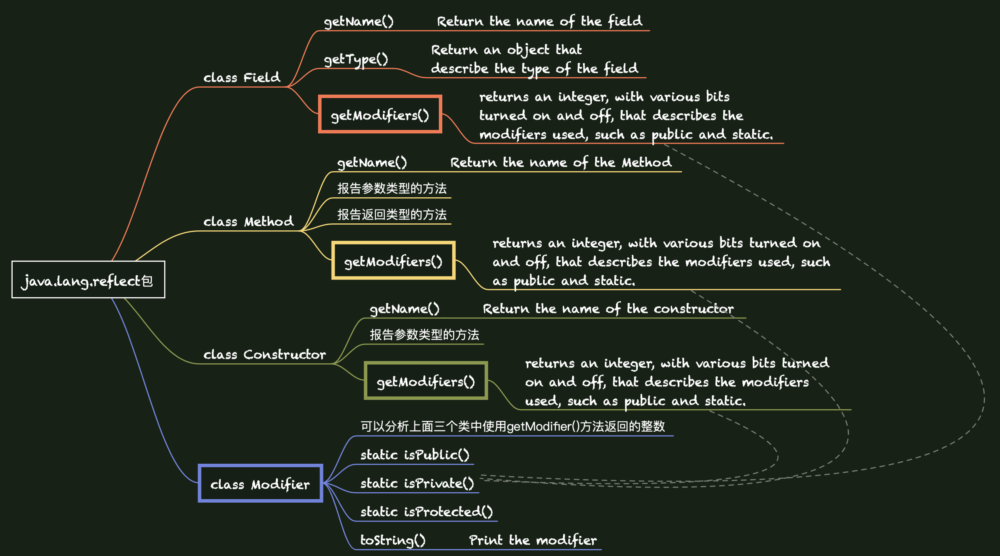
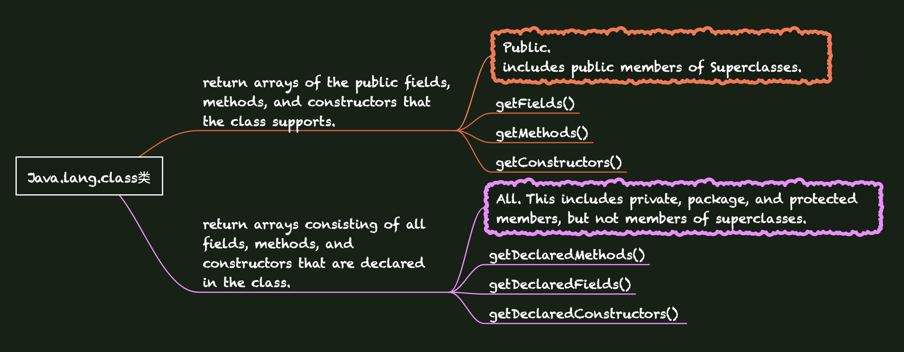

# Core Java I

## 一、An Introduction to Java

### 1.2 The Java “White Paper” Buzzwords

1. Simple.
2. Object-Oriented.
3. Distributed.
4. Robust.
5. Secure.
6. Architecture-Neutral.
7. Portable.
8. Interpreted.
9. High-Performance.
10. Multithreaded.
11. Dynamic.

**Java的版本：**Standard Edition，Micro Edition (for embedded devices)，Enterprise Edition (for server-side processing)。

## 二、The Java Programming Environment

JDK = Java development kit

JRE = Java runtime environment

## 三、Fundamental Programming Structures in Java

###3.1 A Simple Java Program

1. First and foremost, Java is case sensitive. If you made any mistakes in capitalization (such as typing Main instead of main), the program will not run. 

2. A sample program:  

   ---

   

   ---

- - - `public` - **access modifier** : control the level of access other parts of a program have to this code. 
    - `class` - **everything** in a Java program must be inside a class. 
    - The rules for class names in Java are quite generous. Names must **begin with a letter**, and after that, they can have any combination of letters and digits. The length is essentially unlimited. You cannot use a Java reserved word (such as `public` or `class`) for a class name. 
    - **The standard naming convention** (which we follow in the name `FirstSample`) is that class names are nouns that start with an uppercase letter. If a name consists of multiple words, use an initial uppercase letter in each of the words. 
    - Make the file name for the source code the same as the name of the public class, with the extension `.java` appended. 
    - The Java compiler automatically names the bytecode file `FirstSample.class` and stores it in the same directory as the source file. Finally, launch the program by issuing the following command: `java FirstSample`

- - - the Java virtual machine always starts execution with the code in the main method in the class you indicate. (The term “method” is Java-speak for a function.) Thus, you *must* have a `main` method in the source of your class for your code to execute. You can, of course, add your own methods to a class and call them from the `main` method. 
    - Java uses the general syntax: `object.method(parameters) `
    - Methods in Java, like functions in any programming language, can use zero, one, or more parameters (some programmers call them arguments). Even if a method takes no parameters, you must still use empty parentheses. 

### 3.2 Comments

- - - //
    - /* */
    - /**  */ : generate documentation automatically. 

### 3.3 Data Type

Java is a **_strongly typed language_**. This means that every variable must have a declared type. 

There are eight *primitive types* in Java. Four of them are integer types; two are floating-point number types; one is the character type `char`, used for code units in the Unicode encoding scheme; and one is a `boolean `type for truth values. 




### **3.4 Variables and Constants** 

#### **3.4.1 Declaring Variables** 

In Java, every variable has a *type*. You declare a variable by placing the type first, followed by the name of the variable. Here are some examples: 

```java
double salary;
int vacationDays;
long earthPopulation;
boolean done;
```

A variable name must begin with a letter and must be a sequence of letters or digits. *All* characters in the name of a variable are significant and *case is also significant. Spaces* cannot be used inside variable names. The length of a variable name is essentially unlimited. 

#### **3.4.2 Initializing Variables** 

```java
int vacationDays = 12; 
double salary = 65000.0;
var vacationDays = 12;  //根据 赋的值类型 确定 变量类型
```

#### **3.4.3 Constants** 

In Java, you use the keyword final to denote a constant. 

```java
final double CM_PER_INCH = 2.54;
```

The keyword `final` indicates that you can assign to the variable once, and then its value is set once and for all. It is customary to name constants in all uppercase. 

It is probably more common in Java to create a constant so it’s available to multiple methods inside a single class. These are usually called *class constants*. Set up a class constant with the keywords `static final`. 

#### **3.4.4 Enumerated Types** 

https://www.liaoxuefeng.com/wiki/1252599548343744/1260473188087424

### **3.5 Operators**

#### **3.5.1 Arithmetic Operators**

The usual arithmetic operators +, -, *, / are used in Java for addition, subtraction, multiplication, and division. The / operator denotes integer division if both arguments are integers, and floating-point division otherwise. Integer remainder (sometimes called modulus) is denoted by %. For example, `15 / 2` is `7`,`15 % 2` is `1`, and`15.0 / 2` is `7.5`. 

Note that integer division by 0 raises an exception, whereas floating-point division by 0 yields an infinite or NaN result. 

#### **3.5.2 Mathematical Functions and Constants** 

`Double y = Math.sqrt(4);`

`Double k = Math.pow(x, a);`

#### **3.5.3 Conversions between Numeric Types**  

The six solid arrows denote conversions without information loss. 

The three dotted arrows denote conversions that may lose precision.  

#### **3.5.4 Casts**

Conversions in which loss of information is possible are done by means of casts. 

```java
double x = 9.997; 
int nx = (int) x; 
```

Now, the variable `nx` has the value `9` because casting a floating-point value to an integer discards the fractional part. 



If you want to **round a floating-point number** to the nearest integer (which in most cases is a more useful operation), use the `Math.round` method: 

```java
double x = 9.997;
int nx = (int) Math.round(x); 
```

The return value of the round method is a long, and a long can only be assigned to an int with an explicit cast because there is the possibility of information loss. 

#### **3.5.5 Combining Assignment with Operators** 

`x += 4;` is equivalent to `x = x + 4;`

#### **3.5.6 Increment and Decrement Operators** 

```java
int n = 12;
n++;
++n;
```

Since these operators change the value of a variable, they cannot be applied to numbers themselves. For example, `4++` is not a legal statement. 

The prefix form does the addition first; the postfix form evaluates to the old value of the variable. 

#### **3.5.7 Relational and boolean Operators**

`3 == 7 //false`

`3 != 7 //true`

Finally, you have the usual `<` (less than), `>` (greater than), `<=` (less than or equal), and `>=` (greater than or equal) operators. Java uses `&&` for the logical “and” operator and `||` for the logical “or” operator. 

*`expression1`* **&&** *`expression2`* 

**the ternary `?:` operator** 

`condition? expression1 : expression2`
 `x < y ? x : y`

#### **3.5.8 Bitwise Operators** 

- [ ] todo

- [ ] 补充：强制类型转换的细节，字典。

  前面，类型表复制进去。

#### **3.5.9 Parentheses and Operator Hierarchy** 括号与运算符级别

`a && b || c ` means `(a && b) || c`

Since `+=` associates right to left, the expression `a += b += c` means `a += (b += c)`



## **3.6 Strings**

Conceptually, **Java strings are sequences of Unicode characters (Java strings are sequences of char values)**. For example, the string "Java\u2122" consists of the five Unicode characters J, a, v, a, and TM. Java does not have a built-in string type. Instead, the standard Java library contains a **predefined class** called, naturally enough, String. <u>Each quoted string is an **instance** of the **String class**</u>:

```java
String e = ""; // an empty string 
String greeting = "Hello";
```

- [ ] 什么是built-in type.

#### **3.6.1 Substrings**

```java
String s = greeting.substring(0, 3);//0,1,2
```

this means from position 0 inclusive to position 3 exclusive.

`s.substring(a, b)` always has length b − a. 

#### **3.6.2 Concatenation**

1. Use `+` to join (concatenate) two strings.

   `String message = "expletive" + "PG13";`

   When you concatenate a string with a value that is not a string, the latter is converted to a string. (As you will see in Chapter 5, every Java object can be converted to a string.)

   This feature is commonly used in output statements. 

   * eg:`System.out.println("The answer is " + answer);`

2. If you need to put multiple strings together, separated by a delimiter, use the static join method:

   `String all = String.join(" / ", "S", "M", "L", "XL"); `// all is the string "S / M / L / XL"

3. As of Java 11, there is a repeat method:

   `String repeated = "Java".repeat(3); // repeated is "JavaJavaJava"`

#### **3.6.3 Strings Are Immutable**

The String class gives no methods that let you *change* a character in an existing string. If you want to turn greeting into "Help!", you cannot directly change the last positions of greeting into 'p' and '!'. How are we going to modify the string? In Java, it is quite easy: Concatenate the substring that you want to keep with the characters that you want to replace.

```java
greeting = greeting.substring(0, 3) + "p!";
```

Since you cannot change the individual characters in a Java string, the documentation refers to the objects of the String class as *immutable*. Just as the number 3 is always 3, the string "Hello" will always contain the code-unit sequence for the characters H, e, l, l, o. You cannot change these values. Yet you can, as you just saw, change the contents of the string *variable* greeting and **make it refer to a different string**, just as you can make a numeric variable currently holding the value 3 hold the value 4.

But immutable strings have one great advantage: The compiler can **arrange** that strings are ***shared***. 编译器可以让字符串共享。

To understand how this works, think of the various strings as sitting in a common pool. String variables then point to locations in the pool. If you copy a string variable, both the original and the copy share the same characters.

Overall, the designers of Java decided that the efficiency of sharing outweighs the inefficiency of string editing by extracting substrings and concatenating. Look at your own programs; we suspect that most of the time, you don’t change strings — you just compare them. (There is one common exception—assembling(集合) strings from individual characters or from shorter strings that come from the keyboard or a file. For these situations, Java provides a separate class that we describe in *Section 3.6.9*, “Building Strings,(构建字符串)” on p. 74.)

#### **3.6.4 Testing Strings for Equality**

* `s.equals(t)`

* `"Hello".equalsIgnoreCase("hello")` —— To test whether two strings are identical except for the upper/lowercase letter distinction.

**Do *not*** use the `==` operator to test whether two strings are equal!

* `==` only determines whether or not the strings are stored in the **same location**.

* If the virtual machine always arranges for equal strings to be shared, then you could use the `==` operator for testing equality. But only string *literals* are shared, not strings that are the result of operations like `+` or `substring`. 
* Therefore, *never* use == to compare strings lest you end up with a program with the worst kind of bug—an intermittent one that seems to occur randomly.

#### **3.6.5 Empty and Null Strings**

**Test** whether a string is **empty**:

1. `if (str.length() == 0)`
2. `if (str.equals(""))`

**Test** whether a string is **null**:

1. `if (str == null)`

**Test** a string is neither **empty** nor **null**:

1. `if (str != null && str.length() != 0)`

#### **3.6.6 Code Points and Code Units**

Java strings are sequences of char values. The **char data type** is a **code unit** for representing **Unicode code points** in the UTF-16 encoding. 

1. The most **commonly** used Unicode characters can be represented with a **single code unit**. 

2. The **supplementary** characters require **a pair of code units**.

`.length()`——return code units

`.codePointCount((int beginIndex,int endIndex))`——return code point——the true length

`.charAt(n)`——returns the code unit at position n (`0 <= n <= str.length()-1`)

....未完待续

#### **3.6.9 Building Strings**

if you need to **build a string** from many small pieces: 

1. `StringBuilder builder = new StringBuilder();`

2. `builder.append(ch);`-->可以append很多次。

3. `String completedString = builder.toString();`

### 3.7 Input and output

#### **3.7.1 Reading Input**

**Output**: `System.out.println()`

**Input**: `import java.util.*;`

1. construct a **Scanner** that is attached to `System.in`:
   * `Scanner in = new Scanner(System.in);`

2. read the input : （还缺输入判断细节）
   * `String name = in.nextLine();` —— a line
   * `String firstName = in.next();` —— a word
   * `int age = in.nextInt();` —— an int

```java
import java.util.*;
public class InputTest 9{
    public static void main(String[] args){
      Scanner in = new Scanner(System.in); 
      
      System.out.print("What is your name? ");
      String name = in.nextLine();
      System.out.print("How old are you? ");
      int age = in.nextInt();
      System.out.println("Hello, " + name + ". Next year, you'll be " + (age+1));
    }
}
```

**Read passwords:** 使用console类，因为input是可见的，密码是不可见的。

```java
Console cons = System.console();
String username = cons.readLine("User name: ");
char[] passwd = cons.readPassword("Password: ");
```

#### **3.7.2 Formatting Output：`.printf()`**

**eg1**: `System.out.printf("%8.2f", x);`

​	—— prints **x** with a ***field width*** of 8 characters and a ***precision*** of 2 characters.

**eg2** : `System.out.printf("Hello, %s. Next year, you'll be %d", name, age);`

​	—— Each of the ***format specifiers*** that start with a % character is replaced with the corresponding argument.

​	—— The ***conversion character*** that ends a format specifier indicates the type of the value to be formatted: `f` is a floating-point number, `s` a string, and `d` a decimal integer. 





#### **3.7.3 File Input and Output**

**Read** from a file : `Scanner`

**Write** to a file : `PrintWriter`

```java
Scanner in = new Scanner(Path.of("myfile.txt"), StandardCharsets.UTF_8);
PrintWriter out = new PrintWriter("myfile.txt"),StandardCharsets.UTF_8);
```

If the file does not exist, it is **created**.

**NOTE**: You can construct a Scanner **with a string parameter**, but the scanner interprets the string as data, not a file name.  For example,

```java
Scanner in = new Scanner("myfile.txt"); // ERROR?
//Scanner会把字符串"myfile.txt"读取进来，但不会出错。
```

### **3.9 Big Numbers: `BigInteger`and `BigDecimal`**

If the precision of the basic integer and floating-point types is not sufficient.

**Turn** an ordinary number into a **big number : `.valueOf()`**

* `BigInteger a = BigInteger.valueOf(100);`
* 更大的数：

```java
BigInteger reallyBig = new BigInteger("2222322446294204455297398934619099672066669390");

BigInteger c = a.add(b);
BigInteger d = c.multiply(b.divide(BigInteger.valueOf(100)));
```

### 3.10 Array

Arrays hold sequences of values of the same type.

Once you create an array, you **cannot change its length** (although you can, of course, change an individual array element). Array一旦定义，不可改变长度，但是可以改变元素值。

```java
//create an array:
int[] a;
int[] a = new int[n]; //initializes an array of n integers.
var a = new int[n];
int[] smallPrimes = { 2, 3, 5, 7, 11, 13 };

//reinitialize smallPrimes by an anonymous array: /əˈnɑnəməs/匿名
smallPrimes = new int[] { 17, 19, 23, 29, 31, 37 };  

//An array of length 0
new emptyArray[] {}
new emptyArray[0]
```

#### **3.10.2 Accessing Array Elements**

`smallPrimes[index]`

#### **3.10.3 The “for each” Loop: `for (variable : collection) statement`**

```java
for (int ele: a) System.out.println(ele); //不需要花括号

int[] a = new int[] {2, 3, 5, 7, 11, 13};
//直接打印数组元素：用Arrays.toString(array)转为string，然后打印string。
System.out.println(Arrays.toString(a)); //[2, 3, 5, 7, 11, 13]
```

#### **3.10.4 Array Copying**

both variables **refer to** the **same array :**

```java
int[] bArray = anArray;
bArray[5] = 12; // now anArray[5] is also 12
```

**copy** all values of one array **into a new array :**

```java
int[] copiedB = Arrays.copyOf(bArray, bArray.length);
//.copyOf(被拷贝的array, 要复制的长度)
```

#### **3.10.5 Command-Line Parameters** 命令行参数

```java
public static void main(String[] args)
```

The **parameter** `String[] args` indicates that the **`main` method** receives **an array of strings**—namely, the arguments specified on the command line.

If the program is called as: `java Message -g cruel world`

then the args array has the following contents:

* args[0]: "-g" 
* args[1]: "cruel" 
* args[2]: "world"

#### **3.10.6 Array Sorting : `Arrays.sort(a)`**

This method uses a tuned version of the **QuickSort algorithm** that is claimed to be very **efficient on most data sets**.

**The `Math.random` method** returns *a random floating-point number* that is **between 0 (inclusive) and 1 (exclusive)**. By **multiplying** the result with **n**, we obtain a random number between **0 and n – 1**.

此处写一个”抽取k个随机数，并对result数组排序的程序“。

#### **3.10.7 Multidimensional Arrays**

two-dimensional array (matrix)

```java
//declaration
double[][] matrix;

//initialization
matrix = new double[row][columns];//row is the number of the elements.
int[][] magicSquare = {
         {16, 3, 2, 13},
         {5, 10, 11, 8},
         {9, 6, 7, 12},
         {4, 15, 14, 1}
};

//for-each:
for (double[] row : matrix)
    for (double value : row)
				do something with value
          
//quick-and-dirty list of the elements of a two-dimensional array:
System.out.println(Arrays.deepToString(a));
//[[16, 3, 2, 13], [5, 10, 11, 8], [9, 6, 7, 12], [4, 15, 14, 1]]

//
```

#### **3.10.8 Ragged Arrays** 不规则数组

输出一个三角矩阵

## 四、Objects and Classes

Encapsulation: The key to making encapsulation work is to have methods *never* directly access instance fields in a class other than their own. 

#### **4.1.4 Relationships between Classes**

* **Dependence** (“uses–a”)
  * **eg:** the `Order` class uses the `Account` class because Order objects need to access Account objects to check for credit status. 
  * a class depends on another class if **its methods** use or manipulate **objects of that class**.
  * Try to minimize the number of classes that depend on each other. Minimize the ***coupling*** between classes (in software engineering terminology).
* **Aggregation** (“has–a”)  /ægrəˌgeɪt/集合，聚合 = **association**
  * **eg:** an `Order` object contains `Item` objects. 
  * Containment means that objects of class A contain objects of class B.
* **Inheritance** (“is–a”) 
  * expresses a relationship between a more **special** and a more **general** class.
  * **eg:** `RushOrder` and `Order`

* 参考书p95的UML图例。ebook p193.

### **4.2 Using Predefined Classes**

#### **4.2.1 Objects and Object Variables**

**Construct** objects & Specify their **initial** state & Apply **methods** to the objects.

**1. Constructor**: have the same name as the class name. 

* create a new object: `new Date()`
  * You can pass the object to a method: `System.out.print(new Date());`
  * Date class有一个toString() method，对object使用方法: `String s = **new Date()**.toString();`
  * Simply **store** the object in a variable: `Date birthday = **new Date();**`
* constructor can only be called in conjunction with the new operator. You can’t apply a constructor to an existing object to reset the instance fields. 构造器要结合new来调用。并且不能用它来重置已有的对象。
* A constructor has **the same name as the class**.
  A class **can** have **more than one** constructor.
  A constructor can take **zero, one, or more parameters**. A constructor has **no return value**.
  A constructor is always called with the `new` operator.

**2. 对象变量**：`Date deadline;` 这里只是定义了一个对象变量，它可以指向一个Date object，但它现在还不是一个对象。对象变量并不是一个对象，它只是一个对象的引用(reference)。

**3. 初始化对象变量**：`deadline = new Date();` 或者引用一个已有的Date对象`deadline = birthday;`

```java
Date deadline = new Date(); //创建一个新对象，用new
```

#### **4.2.3 Mutator and Accessor Methods** 更改器方法和访问器方法

**Mutator method**: After invoking it, the state of the object has changed.

**Accessor method**: Only access objects without modifying them.

### **4.3 Defining Your Own Classes**

```java
class ClassName {
    field1
    field2
    ...
    constructor1
    constructor2
    ...
    method1 
    method2 
    ...
}
```

The **name of the source file** must match the **name of the public class**. You can only have **one** public class in a source file, but you can have any number of nonpublic classes. 在一个源文件中，只能有一个公共类。所以main方法必须在公共类里面。公共类名字要与file名字一致。

```java
public class EmployeeTest{
		public static void main(String[] args){
			......
		}
}

class Employee{
	......
}
```

1. when you compile this source code, the compiler creates **two class files** in the directory: `EmployeeTest.class` and `Employee.class`.

2. Then, you just need to run the class which contains `main` class to run your program: `java EmployeeTest`

#### **4.3.3 Dissecting the** **Employee** **Class**

**public**: any method in any class can call it. (Allows read and modify)

**private**: only self class can access it.

#### **4.3.5 Declaring Local Variables with** **`var`**

the `var` keyword can only be used with *local* variables **inside methods**. 

You must always declare the types of parameters and fields.

#### **4.3.6 Working with** `null` **References**

为了避免null引起的异常，最好把可能为null的值，设为一个适当的非null值。

```java
if(n==null) name = "unknown"; else name = n;

//Java 9
name = Objects.requireNonNullElse(n, "unknown")；
//或者直接拒绝null值
Object.requireNonNull(n, "The name cannot be null");
name = n;
```

#### **4.3.7 Implicit and Explicit Parameters**

eg: **number007**`.raiseSalary(5);

**Implicit parameter**: is the object of type Employee that appears before the method name. (又名***target*/*receiver***)

***explicit* parameter**: the number inside the parentheses after the method name.

the keyword **this** refers to the **implicit parameter**.

#### **4.3.8 Benefits of Encapsulation**

#### **4.3.9 Class-Based Access Privileges**

Privileges（特权，优惠，荣幸，特殊对待）

A method can access the private data of *all objects of its class*. 

For example, consider a method `equals` that compares two employees.

```java
class Employee{
			...
      public boolean equals(Employee other)
      {
				return name.equals(other.name); 
      }
}
//call it:
if (harry.equals(boss)) . . .
```

#### **4.3.10 Private Methods**

Sometimes, you may wish to break up the code for a computation into separate **helper methods**. Typically, these helper methods should not be part of the public interface—they may be too close to the current implementation or require a special protocol or calling order. Such methods are best implemented as **private**.

#### **4.3.11 Final Instance Fields**

The **final** keyword merely means that the object reference stored in the evaluations variable will never again refer to a different object. `final`表示变量中的对象引用不会再改变。

`private final String name;`

### **4.4 Static Fields and Methods**

`static` modifier 修饰符

#### **4.4.1 Static Fields** 静态字段

```java
class Employee{
    private static int nextId = 1; 
  	private int id;
    ...
}
```

Each object has its **own copy of nonstatic instance fields**.

每个Employee对象都有一个自己的id，但它们共有一个nextId。nextId属于类，不属于任何一个对象。It belongs to the class, not to any individual object.

#### **4.4.2 Static Constants**

**Static variables** are quite rare. 

**Static constants** are more common.

比如Math类中的`PI`常量: 可以用`Math.PI`访问它，而不需要通过一个Math对象来得到一个`PI`副本。

再比如System.out。

每个类的对象都可以修改公共字段，所以最好不要有公共字段。但是，可以用公共常量，out被声明为final，所以不允许再将它重新赋值给另一个打印流。

#### **4.4.3 Static Methods**

Static methods are methods that do not operate on objects.

Static methods as methods that don’t have a `this` parameter.

静态方法不能使用类的非静态变量。A static method of the Employee class cannot access the id instance field because it does not operate on an object. 

However, a static method can access a **static field**. 静态方法从类的静态字段得到数据，然后计算这些数据。

> **static** : 用来修饰**类方法**和**类变量**。
>
> **final** : 用来修饰类、方法和变量，final 修饰的**类——不能够被继承**，修饰的**方法**——**不能被继承类重新定义**，修饰的**变量**为**常量，是不可修改的**。
>
> **abstract** : 用来创建抽象类和抽象方法。
>
> **synchronized** 和 **volatile** 修饰符，主要用于线程的编程。

#### **4.4.4 Factory Methods**

Why doesn’t the NumberFormat class use a constructor instead? There are two reasons:

* You can’t give names to constructors. The constructor name is always the same as the class name. But we want two different names to get the currency instance and the percent instance.

* When you use a constructor, you can’t vary the type of the constructed object. But the factory methods actually return objects of the class DecimalFormat, a subclass that inherits from NumberFormat. (See Chapter 5 for more on inheritance.)

#### **4.4.5 The** `main` **Method**

main方法是静态方法，它不在任何对象上操作。In fact, when a program starts, there aren’t any objects yet. The static main method executes, and constructs the objects that the program needs.

main方法用来构建程序要使用的对象。

另外，每个类也可以有一个main方法，用来做单元测试。

### **4.5 Method Parameters**

***call by value*** means that the method gets just the **value** that the caller provides.

***call by reference*** means that the method gets the ***location*** of the variable that the caller provides.

java的方法是**按值调用**的，即方法得到的是参数的一个**副本**。方法不能修改它**参数变量的内容**。

**一个方法不能修改基本类型的参数，但是可以修改对象引用的参数。**

```java
double percent = 10; 
tripleValue(percent);//传入的是一个primitive type变量，percent的值不被方法改变，方法只复制percent然后计算然后输出
```

```java
public static void tripleSalary(Employee x){  //类方法
	x.raiseSalary(200);
}
harry = new Employee(...);
tripleSalary(harry); //传入的是一个对象的引用。方法复制这个对象引用，x和harry同时引用同一个对象。改变了对象的state。x不再使用。
```

```java
//交换两个Employee的方法swap(a,b);不会有效 --> 交换的是两个对象引用的副本，程序结束后副本不再使用，原来a,b两对象的引用没变。
```

所以：

java是按值调用。

* 方法不能修改**基本数据类型**的参数
* 方法可以改变**对象参数**的状态
* 方法不能让一个**对象参数**引用一个新的对象。

### **4.6 Object Construction**

**constructors** define the initial state of the objects.

#### **4.6.1 Overloading** 重载

一个类有多个构造器，就叫重载。

它们有相同的名字（跟类同名），不同的参数。

编译器会按照不同的值的类型，来自动匹配使用哪个构造器方法。

#### **4.6.2 Default Field Initialization**

如果没有构造器，就默认。0, boolean, false, null。

#### **4.6.3 The Constructor with No Arguments**

如果没写构造器，系统会默认给你一个无参数的构造器，所有值设默认值。

如果写了构造器，但是都有参数，那么如果你不提供参数使用构造器，会报错。

```java
class className{  //class
		public className(){ //constructor
			......
		}
}
```

#### **4.6.4 Explicit Field Initialization**

#### **4.6.5 Parameter Names**

1. single-letter parameter names 不如 prefix each parameter with an “a”:

```java
public Employee(String aName, double aSalary){...}
```

2. 问题2是：parameter variables *shadow* instance fields with the same name. 用this指示实例字段(instance field).

```java
public Employee(String name, double salary) {
    this.name = name;
    this.salary = salary; 
}  //this指所构造的对象
```

#### **4.6.6 Calling Another Constructor**

`this`还有另一个意思：If *the **first statement of a constructor*** has the form `this(. . .)`, then the constructor calls another constructor of the same class.

* 在构造器中，第一句用this(...); 表示调用另一个构造器。

#### **4.6.7 Initialization Blocks** 初始化块

You have already seen **two** ways to **initialize a data field**: 

* By setting a value in a **constructor**
* By assigning a value in the **declaration**

* ***3. initialization block***.

```java
class Employee
   {
      private static int nextId;
      private int id;
      private String name;
      private double salary;
      // object initialization block
      {
        id = nextId;
				nextId++;
      }
      public Employee(String n, double s)
      {...}
```

无论使用哪个构造器构造对象，都先执行initialization block进行初始化，在运行构造器主体。

如果类的静态字段需要很复杂的初始化代码，那么可以使用静态的初始化块。

```java
static
{	var a = new Random();
	...
}
```

在类第一次加载的时候，就会运行静态字段的初始化。

### **4.7 Packages**

To guarantee the **uniqueness** of **class names**. 

#### **4.7.2 Class Importation**

A class can use:

* all classes from its own package 
* and all *public* classes from other packages.

```java
//方法一，包名.类名.方法 --> 完全限定名fully qualified name
java.time.LocalDate today = java.time.LocalDate.now();
//方法二
import java.time.*;  //更准确是import java.time.LocalDate;
LocalDate today = LocalDate.now();
```

如果两个不同类的相同方法，则把完整的包名写上。

#### **4.7.3 Static Imports** 静态导入

permits the importing of **static methods and fields**, not just classes. 导入静态方法和静态字段。

```java
import static java.lang.System.*;
//使用System的静态方法exit(), 字段out
out.println("Goodbye, World!"); // i.e., System.out
exit(0); // i.e., System.exit
```

#### **4.7.4 Addition of a Class into a Package**

put the name of the package at the top of your source file, *before* the code that defines the classes in the package. 

```java
package com.horstmann.corejava; //base/com/horstman/corejava
public class Employee
{
  ...
}
```

source file 要放在包路径之内，否则编译会出错。

#### **4.7.5 Package Access**

public 所有类都可以访问；

private 只有定义它的类可以访问。

没有标记，则只有包内类可以访问。

#### **4.7.6 The Class Path**

JAR = java archive (java归档)

#### **4.7.7 Setting the Class Path**

### **4.8 JAR Files**

Java Archive (JAR) : When you package your application, you want to give your users a single file, not a directory structure filled with class files.

JAR files are compressed, using the familiar ZIP compression format.

#### **4.8.1 Creating JAR files**

`jar options file1 file2 . . .`

#### **4.8.2 The Manifest** 清单文件

In addition to class files, images, and other resources, each JAR file contains a *manifest* file that **describes special features of the archive**.

#### **4.8.3 Executable JAR Files**

1. use the `e` option of the jar command to specify the *entry point* of your program—the class that you would normally specify when invoking the java program launcher:

   `jar cvfe MyProgram.jar com.mycompany.mypkg.MainAppClass *files to add*`

2. Alternatively, you can specify the *main class* of your program in the manifest, including a statement of the form: `Main-Class: com.mycompany.mypkg.MainAppClass` 不要加.java后缀

Then, users can simply start the program as `java -jar MyProgram.jar`

#### **4.8.4 Multi-Release JAR Files** 兼容性

#### **4.8.5 A Note about Command-Line Options** 命令行选项

The options of commands in the **Java Development Kit** : single dashes followed by multiletter option names. `java -jar . . .`  `javac -Xlint:unchecked -classpath . . .`

The **jar** command : followed the classic option format of the `tar` command without dashes. `jar cvf . . .`  

java 9之后，都是两个短横线。--version而不是-version。--class-path而不是-classpath。

### **4.9 Documentation Comments** 文档注释 javadoc

that generates **HTML documentation** from your source files.

#### **4.9.1 Comment Insertion**

#### **4.9.2 Class Comments**

The class comment must be placed *after* any import statements, directly **before the class definition**.

```java
/**
* A {@code Card} object represents a playing card, such
* as "Queen of Hearts". A card has a suit (Diamond, Heart,
* Spade or Club) and a value (1 = Ace, 2 . . . 10, 11 = Jack, * 12 = Queen, 13 = King)
*/
public class Card {...}
```

#### **4.9.3 Method Comments**

precede the method that it describes. 放在方法之前。

* `@param` *variable description*
* `@return` *description*
* `@throws` *class description* : this method may throw an exception.

```java
/**
* Raises the salary of an employee.
* @param byPercent the percentage by which to raise the salary (e.g., 10 means 10%)
* @return the amount of the raise
*/
public double raiseSalary(double byPercent){...}
```

#### **4.9.4 Field Comments**

You only need to document **public fields**—generally that means **static constants**. For example:

```java
/**
* The "Hearts" card suit
*/
public static final int HEARTS = 1;
```

#### **4.9.5 General Comments** - for class

1. The tag `@since` *text* makes a “since” entry. The *text* can be any description of the version that introduced this feature. For example, `@since 1.7.1`.

2. Tags can be used in class documentation comments:

* `@author` *name*

* `@version` *text*

  You can use hyperlinks to other relevant parts of the javadoc documentation, or to external documents, with the `@see` and `@link` tags.

  The tag `@see` *reference* adds a hyperlink in the “see also” section. 以下是三种形式：

  ```java
  @see package.class#feature label //link to另一个类的方法或变量。使用(#)分开类和它的方法/它的变量
  @see <a href="...">label</a>
  @see "text"
  ```

  `@see` 可以写多个，但是必须写在一起。

3. 可以在注释中的任何位置插入link`{@link package.class#feature label}`

4. `{@index entry}` to add an entry to the search box.

#### **4.9.6 Package Comments**

*package* comments, you need to **add** a separate **file** in each package directory.

1. SupplyaJavafilenamedpackage-info.java.Thefilemust contain an initial Javadoc comment, delimited with /** and */, followed by a package statement. It should contain no further code or comments.
2. SupplyanHTMLfilenamedpackage.html.Alltextbetweenthe tags <body>. . .</body> is extracted.

#### **4.9.7 Comment Extraction** 注释抽取

### **4.10 Class Design Hints**

1. *Always keep data private.*

2. *Always initialize data.*
3. *Don’t use too many basic types in a class.*
4. *Not all fields need individual field accessors and mutators.*
5. *Break up classes that have too many responsibilities.* 职责
6. *Make the names of your classes and methods reflect their responsibilities.*
7. *Prefer immutable classes.*

## 五、Inheritance

### **5.1 Classes, Superclasses, and Subclasses**

#### **5.1.1 Defining Subclasses**

keyword `extends` to denote inheritance.

```java
public class Manager extends Employee {
      added methods and fields
}
```

子类比父类拥有更多功能。

#### **5.1.2 Overriding Methods** 覆盖/重写

```java
public double getSalary(){
    double baseSalary = super.getSalary();
    return baseSalary + bonus; //bonus是Manager的字段
}
//super表示要用superclass的.getSalary()方法 —— 要使用这个方法是因为子类不能直接访问父类的私有变量，只能通过public accessor method来获得。
```

#### **5.1.3 Subclass Constructors** 子类构造器

```java
public Manager(String name, double salary, int year, int month, int day){
		super(name, salary, year, month, day);//子类构造器 调用 父类构造器
		bonus = 0; 
}
//super(name, salary, year, month, day)的意思是: 调用父类Employee的构造器中带n,s,y,m,d的一个。
```

* `super`调用构造器，必须是本构造器的**第一句**。

`this`的含义：

* 表示隐式参数的引用 - to denote a reference to the implicit parameter。

* 调用该类的其他构造器 - call another constructor of the same class. 

  ```java
  class Employee{
    private static int nextId;
    private int id;
    private String name = "";
    private double salary;
    ...//初始化block - 设定nextId值为一个随机数；id = nextId; nextId++;
    public Employee(String n, double s){
      name = n;
      salary = s;
    }
    public Employee(double s){
      this("Employee#"+nextId, s);//调用参数为String，double的构造器
    }
  }
  ```

`super`的含义：

* 调用超类的方法 - `super.getSalary()`
* 调用超类的构造器 - `super(name, salary, year...);`

一个对象变量可以指示多中实际类型的现象（比如e.getSalary()的e可以指代Employee或Manager对象）就叫**多态(polymorphism)**。An object variable (such as the variable e) can refer to multiple actual types is called *polymorphism.* 

#### **5.1.4 Inheritance Hierarchies** 继承层次 (*inheritance chain*)

#### **5.1.5 Polymorphism** 多态

替换原则：超类对象出现的地方，都可以用子类对象替换。

在java中，**对象变量**是多态的。一个Employee类的变量，可以引用Employee类的对象，也可以引用Empolyee类任何子类的对象（Manager，Executive，Secretary等)

```java
Manager boss = new Empolyee(...);
Employee[] staff = new Employee[3];
staff[0] = boss;  //staff[0]
```

此例中，变量staff[0]与boss引用同一个对象。编译器只将staff[0]看成是一个Employee对象。

所以：

```java
boss.setBonus(5000);//ok
staff[0].setBonus(5000);//Error
```

此外，不能把父类的对象赋值给子类变量。eg: `Manager m = staff[2];//Error`

> The word **polymorphism** means having many forms.
>
> **Real life example of polymorphism:** A person at the same time can have different characteristic. Like a man at the same time is a father, a husband, an employee. So the same person posses different behaviour in different situations. This is called polymorphism.
>
> Polymorphism is considered as one of the important features of **Object Oriented Programming**. Polymorphism allows us to perform a single action in different ways. In other words, polymorphism allows you to define one interface and have multiple implementations. 
>
> 多态主要在is-a关系的类中。同一个对象变量，同一个方法，因为其被声明的烈性，而展现出不同的behavior
>
> 多态是overloading的结果。

#### **5.1.6 Understanding Method Calls**

#### **5.1.7 Preventing Inheritance: `Final` Classes and Methods**

final类：不允许被扩展(inheritance)的类。

final方法：子类不能覆盖(overriding)这个方法。

* final方法的原因是：确保方法不会再子类改变语义。

我们提倡在设计类层次的时候，仔细思考哪些类和方法应该设计为final。

#### **5.1.8 Casting** for classes

1. 只能在继承层次内进行casting，否则compile-time error
2. 父类变子类之前，要检查是不是instanceOf.
3. 一般最好别用强制类型转换。

```java
double b = 3.05;
int a = (int) b;

Employee e1 = new Employee(...);
Manager boss = (Manager) e1;
```

使用强制类型转换的唯一原因：to use an object in its full capacity(功能) after its actual type has been temporarily forgotten.

问题是：是否承诺过多(promise too much)？子类变父类可以，但是父类变子类就承诺过多，所以在casting之前要检查是否可以成功casting —— 用`instanceOf`

```java
if (staff[1] instanceof Manager) {
		boss = (Manager) staff[1]; 
 	  ...
}
```

#### **5.1.9 Abstract Classes**

A class which is declared as abstract is known as an **abstract class**. I

- An abstract class must be declared with an **abstract** keyword.
- It can have abstract and non-abstract methods.
- It **cannot be instantiated**. 不能实例化
- It can have constructors and static methods also.
- It can have final methods which will force the subclass not to change the body of the method.

首先，抽象类自身不能被实例化，它通过定义抽象方法，来给子类的相同方法占位。抽象类方法的内容为空，由子类具体实现。

```java
public abstract class Person(){
     private String name; //抽象类Person可以有自己的字段
   	 public Person(String name){//自己的构造器-->但不能实例化
       this.name = name;
     }
  	 public abstract String getDescription(); //一个用于占位的，抽象方法
  	 
     public String getName(){ //一个具体的方法
       return name;
     }
}
```

1. 拥有一个或多个抽象方法的类，**必须**被声明为抽象类。
   而如果一个类没有抽象方法，它也可以被声明为抽象类。

2. 抽象方法：用关键字abstract声明的方法，就是抽象方法，它不需要被实现，就像`getDescription()`这个方法。
   * 抽象方法用于占位。它们在子类中被实现。实现的方式有两种：
     * 子类可以实现部分抽象类方法（那么这个子类还是个抽象类）
     * 子类也可以实现全部抽象类方法（这时这个子类就不是抽象类了）。
   * 为什么一定要用抽象方法进行占位？
     * 因为在如下例子中，如果用抽象类的对象变量p，来分别引用两个类的实例，如果抽象类中没有声明getDescription()方法，p就不能调用这个方法。

抽象类不能构建对象，但是可以定义一个抽象类的**对象变量**。

```java
Person p = new Student("James","Math");//Person类型的变量p，引用了一个student类型的实例

Person people = Person[2];
people[0] = new Student("james","Math");
people[1] = new Employee("jamie");

for(Person p:people)
  System.out.println(p.getName()+","+p.getDescription());
//在这里，p永远不会调用Person类的对象，所以对于p[0],它调用的是Stduent的对象，getDescription()方法用的也是student的。
```

#### 5.1.10 Protected access 受保护的访问 - protected

Java中**protected部分**对所有子类及同一个包中的所有类都可见。

实际应用中，要谨慎使用受保护字段。因为可能会因为派生新类访问到你的手保护字段。如果你想修改你的类的内容，必然会影响别的程序员（破坏了封装）。so，使用**protected method**更好。

1. Accessible in the class only (**private**).
2. Accessible by the world (**public**).
3. Accessible in the package and all subclasses (**protected**).
4. Accessible in the package — the (unfortunate) default. No modifiers are needed.

### 5.2 Object: the cosmic superclass 所有类的父类

**可以用Object的变量引用任何类型的变量**：

```java
Object obj = new Student("james");
```

Object的变量 - 只能做各种值的泛型容器。如果要使用对象的原始类型：

```java
Student s = (Student) obj;
```

In Java, only the values of *primitive types* (numbers, characters, and boolean values) are **not objects**.

All **array types**, no matter whether they are **arrays of objects** or **arrays of primitive types**, are class types that extend the Object class.

#### 5.2.2 **The** `equals` **Method** : `x.equals(y)`

在Object类中，用于检测一个对象是否等于另一个对象：`Object x.equals(Object y)`- 检测两个**对象的引用**是否相同。

* 如果x和y都是null，则true
* 有一个null，则false

在子类中定义equals方法时，首先调用超类的equals。如果检测失败，对象就不可能相等。如果超类中的字段都相等，就需要比较子类的实例字段。

#### **5.2.3 Equality Testing and Inheritance**

**The Java Language Specification** requires that the `equals` method has the following **properties**:

1. It is ***reflexive***:For any non-null reference x, `x.equals(x)`should return **true**.
2. It is ***symmetric*** : For any references x and y, `x.equals(y)`should return **true** if and only if `y.equals(x)` returns **true**.
3. It is ***transitive*** : For any references x, y, andz, if `x.equals(y)` returns **true** and `y.equals(z)` returns **true**, then `x.equals(z)` should return **true**.
4. It is ***consistent*** : If the objects to which x and y refer haven’t changed, then repeated calls to `x.equals(y)` return the same value.
5. For any non-null reference x, `x.equals(null)`should return **false**.

Here is a recipe for **writing the perfect `equals` method**:

1. ...... (p177)

2. ……用==比较基本类型字段，用Object.equals比较对象字段。

   ```java
   return field1==field2 && Object.equals(field2,other.field2) && ...;
   ```

#### 5.2.4 `hashCode` Method

A hash code is an **integer** that is derived from an object.

**If you redefine the equals method, you will also need to redefine the hashCode method** for objects that users might insert into a hash table. (We discuss hash tables in Chapter 9.)

The hashCode method should return an integer (which can be negative). Just combine the hash codes of the instance fields so that the hash codes for different objects are likely to be **widely scattered**. 要确保hashCode分布均匀。

* First, use the null-safe method Objects.hashCode. It returns 0 if its argument is null and the result of calling hashCode on the argument otherwise. 

* Also, use the static Double.hashCode method to avoid creating a Double object.

* Even better, when you need to combine multiple hash values, call Objects.hash with all of them. It will call Objects.hashCode for each argument and combine the values.

  ```java
  public int hashCode()
     {return Objects.hash(name, salary, hireDay); }
  ```

Your definitions of `equals` and `hashCode` must be **compatible**: If `x.equals(y)` is true, then `x.hashCode()` must return the same value as ` y.hashCode()`. 

#### **5.2.5 The** `toString` **Method**

returns a **string** representing the value of this object. 

强烈建议为自定义的每一个类添加toString方法。自己受益，别人受益。

### **5.3 Generic Array Lists**

The **ArrayList** class is similar to an **array**, but it automatically adjusts its capacity as you add and remove elements, without any additional code.

ArrayList is a *generic class* with a *type parameter*. ArrayList是一个有类型参数的泛型类。

```java
//声明
ArrayList<Employee> staff = new ArrayList<Employee>();  //()内可填写容量。eg: 100
ArrayList<Employee> staff = new ArrayList<>();
var staff = new ArrayList<>();//会生成一个ArrayList<Object>.

//添加元素
staff.add(new Employee("james",...));

//如果已经确定数组要存的元素数量
staff.ensureCapacity(100);//capacity 100, size 0
//或者再创建时就说明：
ArrayList<Employee> staff = new ArrayList<Employee>(100); 
  
//trimToSize方法：把大小设定为「保存当前元素数量所需要的空间」
```

* 返回ArrayList的真实元素个数: `staff.size() `   
  * **capacity**在一开始设置为100，但**真实size**由`.size()`返回。
  * 类似于`array.length` —— 注意这里没有括号

ArrayList并不是Java程序设计的一部分，而是有人设计的一个实用工具。

**自动扩容的便利**也带来了**访问元素的复杂**。

```java
//add添加新元素

//set替换已有的元素：用harry替换第i个元素
staff.set(i,harry);
//对比：数组中设置元素
a[i] = harry;

//get获取元素：
staff.get(i);
```

* 即可以灵活扩展数组，又能方便访问数组：**ArrayList元素拷贝到Array中 —— ** `arrlist.toArray(arr)`

```java
var list = new ArrayList<X>();
while(...){
  x = ...;
  list.add(x);
}
var a = new X[list.size()]; //创建一个X类型的数组a
list.toArray(a);
```

* 在ArrayList中**插入**元素：`arrlist.add(index, ele)`

```java
int n = staff.size()/2; //中间位置
staff.add(n,e);  //n及以后的元素，都会后移一位
```

* 在ArrayList中**删除**元素：`arrlist.remove(index)` ——位置n之后的所有元素前移一位

> 插入删除元素，效率较低。如果要存储的元素较多，且经常插入、删除，需要用链表(Linked list)了。

* for each**遍历**ArrayList：

```java
for(Employee e:staff)
  do sth ...with e
    
for(int i=0;i<staff.size();i++){
  Employee e = staff.get(i);
  do sth ...with e
}
```

### **5.4 Object Wrappers and Autoboxing** 对象的包装器和自动装箱

当你想定义一个整型数组列表，但是却不允许你写`ArrayList<int>`，尖括号里不能是基本类型。

如何把基本类型变成对象呢？

**Wrapper包装器**： **Integer, Long, Float, Double, Short, Byte**, Character, and Boolean. (这6个类来自超类**Number**.)

* 包装器**不可变**，一旦构造了包装器，就不允许更改包装在其中的值。

* 包装器是final，不能派生子类。

`var list = new ArrayList<Integer>()`

但是它的效率远低于`int[]`，所以小集合可以这么构造。

**自动装箱autoboxing：**在向list添加元素时

```java
list.add(3);

//相当于
list.add(Integer.valueOf(3)); //valueOf()设置value
```

**自动拆箱unboxing：**在调用list的元素时

```java
int n = list.get(i);
//相当于
list.get(i).intValue();  //读取value
```

自动装箱在表达式：

```java
Integer n = 3;
n++; //此时，编译器会自动拆箱，然后自增运算，然后把结果装箱。
```

更多细节有待补充。。。

### **5.5 Methods with a Variable Number of Parameters**

参数数量可变的方法。例如`printf()`这个方法：

```java
public class PrintStream
{
	public PrintStream printf(String fmt, Object... args) { return format(fmt,
}
```

**The ellipsis ... is part of the Java code.** It denotes that the method can receive an arbitrary number of objects (in addition to the fmt parameter).除了fmt参数外。

实际上`printf()`只接受两个参数。一个fmt，一个Object[]数组（如果接受了原始值，则自动装箱为对象）。 for the implementor of printf, the Object... parameter type is exactly the same as Object[].

```java
System.out.printf("%d %s", new Object[] { new Integer(n), "widgets" } );  //3 widgets
```

### **5.6 Enumeration Classes** 枚举类

```java
public enum Size {SMALL, LARGE}
```

The type defined by this declaration is actually a **class**. The class has **exactly four instances**—it is not possible to construct new objects.

相等性测试：Therefore, you never need to use `equals` for values of enumerated types. Simply use `==` to compare them.

枚举类构造器

枚举类方法

### **5.7 Reflection** 反射

A program that can analyze the capabilities of classes is called *reflective*.

you can use it to

* Analyze the capabilities of classes at runtime
* Inspect objects 检查对象 at runtime—for example, to write a single toString method that works for *all* classes 
* Implement generic array manipulation code 泛型数组操作代码
* Take advantage of Method objects that work just like function pointers in languages such as C++ (Method对象，

它像C++的函数指针)





