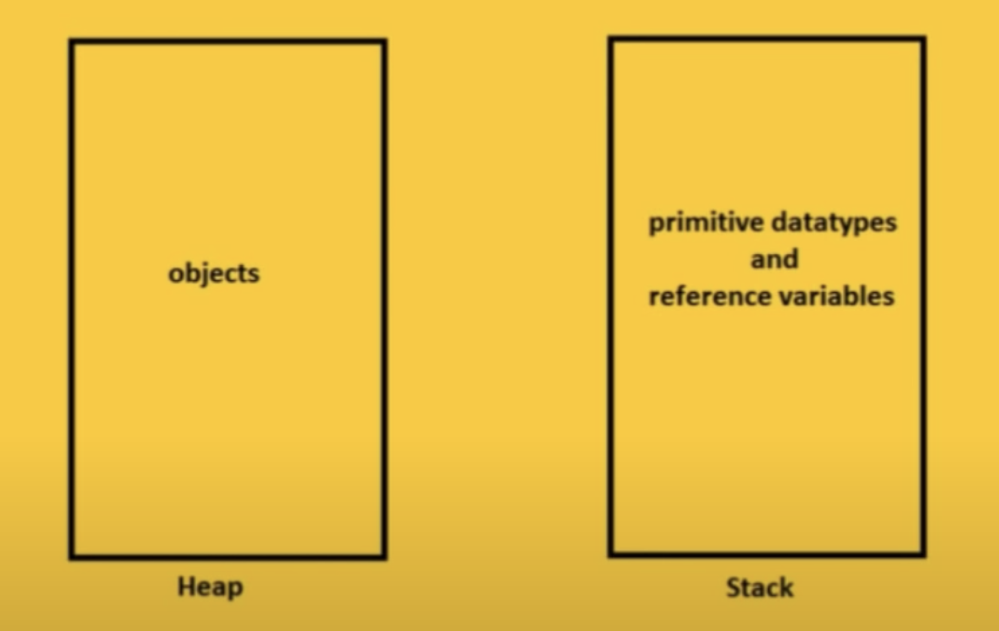

# Object-Oriented Programming 

* **Object**: Any entity that has state and behavior is known as an object. For example, a chair, pen, table, keyboard, bike, etc. It can be physical or logical.

* **Class**: *Collection of objects* is called class. It is a logical entity.

* **Inheritance**: *When one object acquires all the properties and behaviors of a parent object*, it is known as inheritance. It provides code reusability. It is used to achieve runtime polymorphism.

* **Polymorphism**: If *one task is performed in different ways*, it is known as polymorphism. For example: to convince the customer differently. In Java, we use **method overloading** and **method overriding** to achieve polymorphism. /pɒlɪˈmɔːfɪz(ə)m/ 多态

* **Abstraction**: *Hiding internal details and showing functionality* is known as abstraction. For example phone call, we don't know the internal processing. In Java, we use **abstract class** and **interface** to achieve abstraction. 

* **Encapsulation**: *Binding (or wrapping) code and data together into a single unit are known as encapsulation*. A java class is the example of encapsulation. Java bean is the fully encapsulated class because all the data members are private here.

* **Coupling**: Coupling refers to the knowledge or information or dependency of another class. It arises when classes are aware of each other. If a class has the details information of another class, there is strong coupling. In Java, we use private, protected, and public modifiers to display the visibility level of a class, method, and field. You can use interfaces for the weaker coupling because there is no concrete implementation. (具体的实现) 耦合

* **Cohesion**: Cohesion refers to the level of a component which performs a single well-defined task. A single well-defined task is done by a highly cohesive method. The weakly cohesive method will split the task into separate parts. The java.io package is a highly cohesive package because it has I/O related classes and interface. However, the java.util package is a weakly cohesive package because it has unrelated classes and interfaces. 内聚

* **Association**: Association represents the relationship between the **objects**. Here, one object can be associated with one object or many objects. There can be four types of association between the objects:

  - One to One
  - One to Many
  - Many to One, and

  Many to ManyLet's understand the relationship with real-time examples. For example, One country can have one prime minister (one to one), and a prime minister can have many ministers (one to many). Also, many MP's can have one prime minister (many to one), and many ministers can have many departments (many to many).

  Association can be undirectional or bidirectional. 单向和双向。关联

* **Aggregation**: Aggregation is a way to achieve Association. Aggregation represents the relationship where one object contains other objects as a part of its state. It represents the weak relationship between objects. It is also termed as a *has-a* relationship in Java. Like, inheritance represents the *is-a* relationship. It is another way to reuse objects. / ˈægrəgɪʃən/聚合

* **Composition**: The composition is also a way to achieve Association. The composition represents the relationship where one object contains other objects as a part of its state. There is a strong relationship between the containing object and the dependent object. It is the state where containing objects do not have an independent existence. If you delete the parent object, all the child objects will be deleted automatically.组合

* Association描述的是类与类之间一般的关联关系，而Aggregation和Composition都有整体和部分的关系。其中Aggregation中的部分脱离了整体，部分仍然有意义，是共享式的。而Composition中的部分脱离了整体，部分将没有任何意义，是独占式的。

##### Advantage of OOPs over Procedure-oriented programming language

1) OOPs makes development and maintenance easier, whereas, in a procedure-oriented programming language, it is not easy to manage if code grows as project size increases.

2) OOPs provides data hiding, whereas, in a procedure-oriented programming language, global data can be accessed from anywhere.

##### What is the difference between an *object-oriented* programming language and *object-based* programming language?

Object-based programming language follows all the features of OOPs **except Inheritance**. JavaScript and VBScript are examples of object-based programming languages.

## 0. Naming conventions

```java
package com.javatpoint; //lowercase
class Employee{  //uppercase and CamelCase
  public static int AGE; //uppercase
  public void methodOne(){  //lowercase and CamelCase
    string firstName;
  }
}
```

## 1. Objects in java

An object has three characteristics:

- **State:** represents the data (value) of an object.
- **Behavior:** represents the behavior (functionality) of an object such as deposit, withdraw, etc.
- **Identity:** An object identity is typically implemented via a unique ID. The value of the ID is not visible to the external user. However, it is used internally by the JVM to identify each object uniquely.

**An object is an instance of a class.** 

**Object Definitions:**

- An object is *a real-world entity*.
- An object is *a runtime entity*.
- The object is *an entity which has state and behavior*.
- The object is *an instance of a class*.

## 2. Class in Java

A class is a group of objects which have common properties. It is a template or blueprint from which objects are created. It is a logical entity. It can't be physical.

A class in Java can contain:

- **Fields**
- **Methods**
- **Constructors**
- **Blocks**
- **Nested class and interface**

**Instance variable** doesn't get memory at compile time. It gets memory at runtime when an object or instance is created. That is why it is known as an instance variable.

#### 2.1 Method in java

In Java, a method is like a function which is used to **expose** the behavior of an object.

##### Advantage of Method

- Code Reusability
- Code Optimization

**New keyword in java**

The new keyword is used to allocate memory at runtime. All objects get memory in Heap memory area. 

[Link]: https://www.youtube.com/watch?v=jzJjMefsFKE	"Prashun Das"



