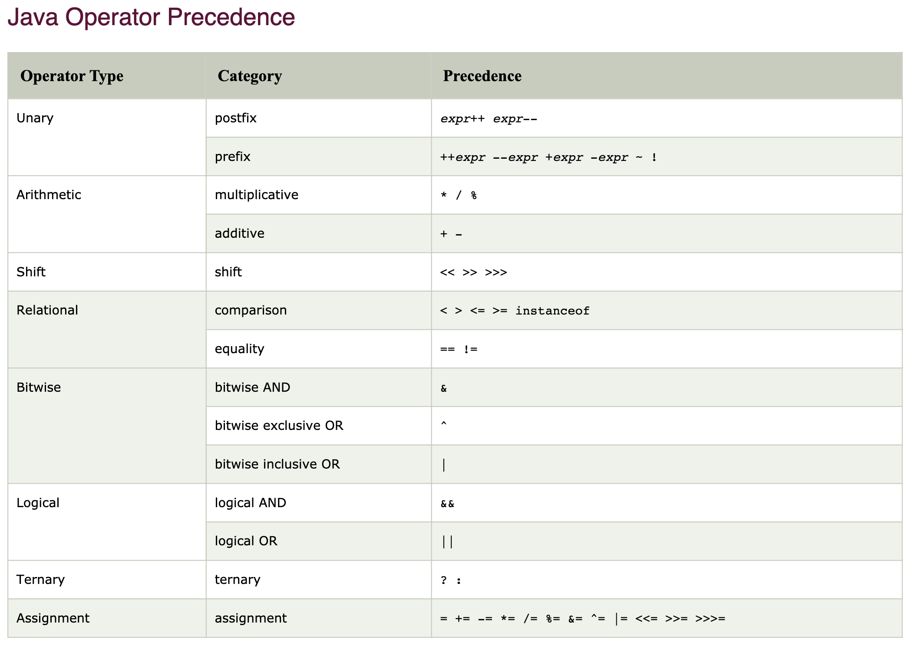
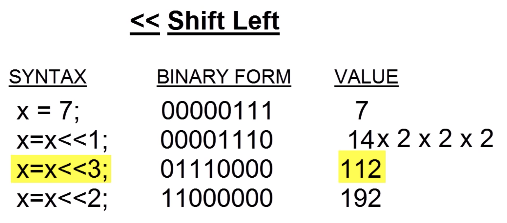
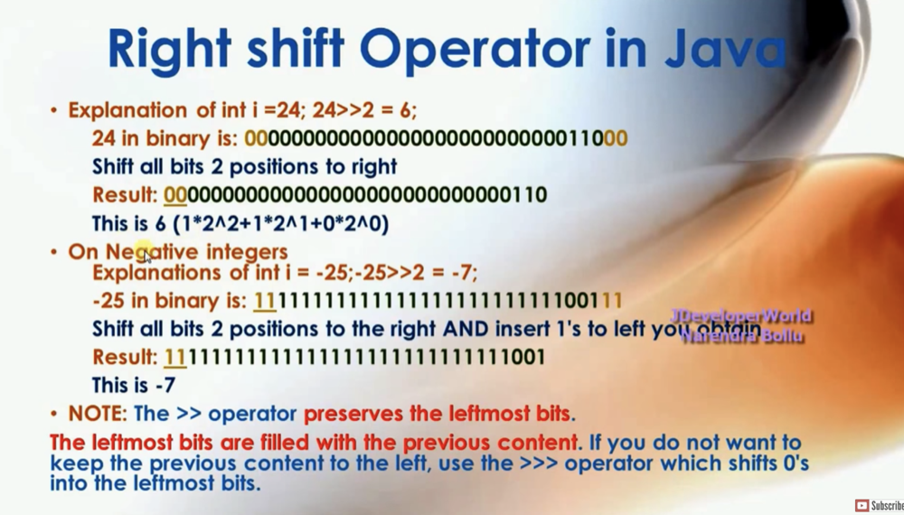

##### 1. `++`  `--`  

​	每一次使用`++`  `--`，变量的值都已改变，即便是在一条语句之中。

```java
class OperatorExample1{  
    public static void main(String args[]){  
      int x=10;  
      System.out.println(x++);//10 (x = 11)  
      System.out.println(++x);//12  
      System.out.println(x--);//12 (x = 11)  
      System.out.println(--x);//10  
}}  

class OperatorExample2{  
    public static void main(String args[]){  
      int a=10;  
      int b=10;  
      System.out.println(a++ + ++a);//10 → (a=11) → +12 = 22  
      System.out.println(b++ + b++);//10 → (b=11) → +11 = 21  
}}  
```

##### 2. `/`

```java
class DivisionExample{
  	public static void main(String[] args){
      System.out.println(1/5); //0  整数除法是截位
    }
}
```

##### 3. Adding short

使用`+`做数学运算时，如果有`double`，都casting to `double`。如果有`float`，都casting to `float`。如果有`long`，都casting to `long`。否则，全部转为`int`。

example: 这个例子的错误是，变量a是short类型，但是它被赋值int value，所以要将它cast to shrot才可以赋值。

```java
class OperatorExample{  
    public static void main(String args[]){  
      short a=10;  
      short b=10;  
      //a+=b;//a=a+b internally so fine  
      a=a+b;//Compile time error because 10+10=20 now int  
      System.out.println(a);  
}}  
```

```java
class OperatorExample{  
    public static void main(String args[]){  
      short a=10;  
      short b=10;  
      a=(short)(a+b);//20, which is int now converted to short  
      System.out.println(a);  
}}  
```

##### 4. Bitwise operators

Bitwise operators are used to perform manipulation of individual bits of a number. They can be used with any of the **integral types (char, short, int, etc)**. They are used when performing update and query operations of Binary indexed tree.

**Bitwise OR (|) **
This operator is binary operator, denoted by ‘|’. It returns bit by bit OR of input values, i.e, if either of the bits is 1, it gives 1, else it gives 0.
For example,

```java
a = 5 = 0101 (In Binary)
b = 7 = 0111 (In Binary)

Bitwise OR Operation of 5 and 7
  0101
| 0111
 ________
  0111  = 7 (In decimal) 
```

**Bitwise AND (&) **
This operator is binary operator, denoted by ‘&’. It returns bit by bit AND of input values, i.e, if both bits are 1, it gives 1, else it gives 0.
For example,

```java
a = 5 = 0101 (In Binary)
b = 7 = 0111 (In Binary)

Bitwise AND Operation of 5 and 7
  0101
& 0111
 ________
  0101  = 5 (In decimal) 
```

**Bitwise XOR (^) **
This operator is binary operator, denoted by ‘^’. It returns bit by bit XOR of input values, i.e, if corresponding bits are different, it gives 1, else it gives 0.
For example,

```java
a = 5 = 0101 (In Binary)
b = 7 = 0111 (In Binary)

Bitwise XOR Operation of 5 and 7
  0101
^ 0111
 ________
  0010  = 2 (In decimal) 
```

**Bitwise Complement (~) **
This operator is unary operator, denoted by ‘~’. It returns the one’s complement representation of the input value, i.e, with all bits inversed, means it makes every 0 to 1, and every 1 to 0.
For example,

```java
a = 5 = 0101 (In Binary)

Bitwise Compliment Operation of 5

~ 0101
 ________
  1010  = 10 (In decimal) --> -6
```

**Note –** Compiler will give 2’s complement of that number, i.e., 2’s compliment of 10 will be **-6**.

```java
-6d ==> step1 : 6d = 0110b
        step2 : ones = 1001b
        step3 : +1 = 1010b  //so 1010 is -6d.
```

### 5. Shift operators

These operators are used to shift the bits of a number left or right thereby multiplying or dividing the number by two respectively. They can be used when we have to multiply or divide a number by two. General format: `number shift_op number_of_places_to_shift;`

#### **5.1 Signed Right shift operator (>>)** 

Shifts the bits of the number to the right and fills 0 on voids(空虚空白处) left as a result. The leftmost bit depends on the sign of initial number. Similar effect as of dividing the number with some power of two.
For example,

```java
Example1:
a = 10   //a = 0000 1010b
a>>1 = 5 //a = 0000 0101b = 5d
b = 25   //b = 11001
b>>2 = 6 //b = 110 --> 6

Example2:
a = -10    //？？？？？？
a>>1 = -5  //？？？？？？
We preserve the sign bit.
```




#### 5.2 **Unsigned Right shift operator (>>>)**

Shifts the bits of the number to the right and fills 0 on voids left as a result. The leftmost bit is set to 0. 

(>>>) is unsigned-shift; it’ll insert 0. (>>) is signed, and will extend the sign bit.

```java
Example1:
a = 10
a>>>1 = 5

Example2:
a = -10   //0000 1010b -> 1111 0101b -> 1111 1010b
a>>>1 = 2147483643
DOES NOT preserve the sign bit. 
```



