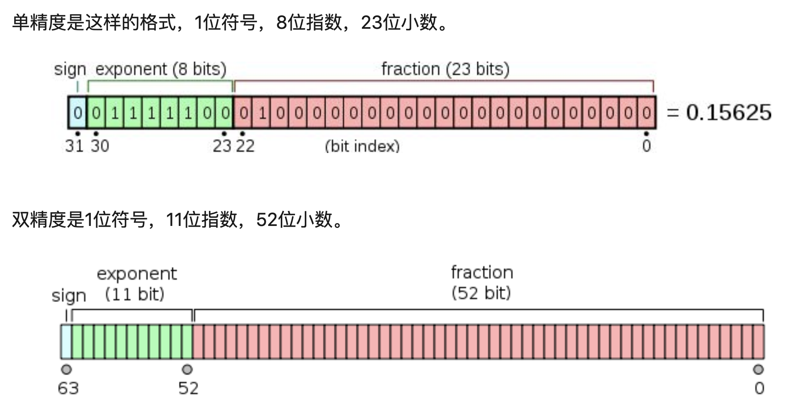
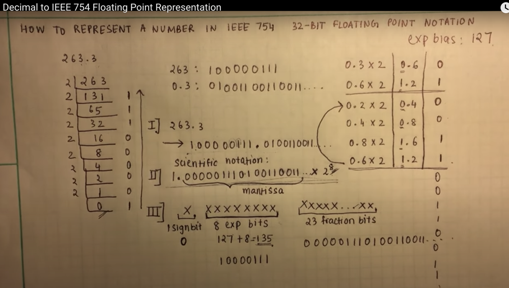

# Float and Double

fraction 分数；少量，一小份

Result: 263.3 = 0100 0011 1000 0011 1010 0110 0110 0110 (32-bit)

float尾数位23位，2^23=8.3E6，**6位**/7位

*  (2^23 = 8388608 = 8.3 * 10^6)

double尾数52位，2^52=4.5E15，**15位**/16位，所以double的有效位数是15位

**2.范围**
**float**  -2^128 ~ 2^127
**double** -2^1024  ~ 2^1023

* 理解：sign位和exp第一位，构成2和-2，exp后7位是小数点移动的位数。

**3.为什么浮点数会有精确度问题？**
浮点数是用二进制数据的科学计数法表示的，因此不能精确的表示。就像十进制1/3 0.3333...一样

**5.有效位数**
float   6位。小数点后6位都是准确的，而第7位就不一定
double 15位。

