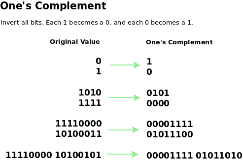
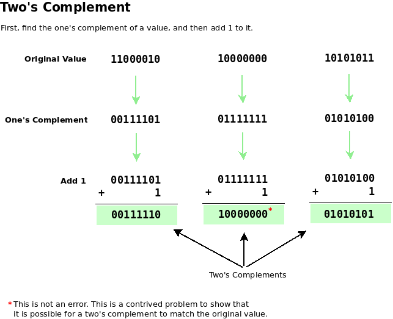

complement 补充

## One’s Complement and Two’s Complement

反码和补码

one’s complement is the interim step to finding the two’s complement.

#### 1. One’s Complement

Invert all bits in a byte by changing each 1 to 0 and each 0 to 1.

```java
Original       One's Complement
-------------------------------
10011001  -->  01100110
10000001  -->  01111110
11110000  -->  00001111
11111111  -->  00000000
00000000  -->  11111111
```



#### 2. Two’s Complement (Binary Additive Inverse)

The two’s complement is a method for representing positive and negative integer values in binary. The useful part of two’s complement is that it automatically includes the sign bit.

**Rule**: To form the two’s complement, add 1 to the one’s complement.

```java
Step1: Begin with the original binary value

    10011001  Original byte

Step2: Find the one's complement

    01100110  One's complement

Step3: Add 1  to the one's complement

    01100110  One's complement
  +        1  Add 1
 -----------
    01100111  <---  Two's complement
```



* contrived 人为的

#### 3. what is -65d in binary?

**Step 1:** Convert 65d to binary. Ignore the sign for now. Use the absolute value. The absolute value of -65d is 65d.

```
65d  -->  01000001b
```

**Step 2:** Convert 01000001 to its one’s complement.

```
01000001  -->  10111110
```

**Step 3:** Convert 10111110b to its two’s complement by adding 1 to the one’s complement.

```
    10111110
   +       1
   ---------
    10111111  <---  Two's complement
```

10111111b is -65d in binary. We know this it true because if we add 01000001b (+65d) to 10111111b (-65d) and *ignore the carry bit*(进位), the sum is 0, which is what we obtain if we add +65 + (-65) = 0.

##### Practice: **Convert these negative decimal values to negative binary using two’s complement:**

1. -192d
2. -16d
3. -1d
4. -0d

**Answers :**

1. 01000000b (192d = 11000000b –> 00111111 + 1 = 01000000b)
2. 11110000b (16d = 00010000b –> 11101111 + 1 = 11110000b)
3. 11111111b (1d = 00000001b –> 11111110 + 1 = 11111111b) Tricky? Before converting from binary to decimal, we must know ahead of time if the binary value is signed or not because a signed binary value will not convert properly using the place value chart we have seen so far. If seen by itself, 11111111b = 255d, not -1d. As a rule, assume that a binary value, such as 11111111b, is a positive integer unless context specifies otherwise. Since we are dealing with negative binary values in this problem set, then 11111111b is -1d, not 255d.
4. \0. There is no such thing as negative zero (-0). Nothing is always nothing and does not have a sign. We can convert anyway: 0d = 00000000 –> 11111111 + 1 = 1 00000000b. We still arrive at 0 in binary for the eight relevant bits. Ignore the ninth carry bit.

结论：负数不一定第一位都是1。