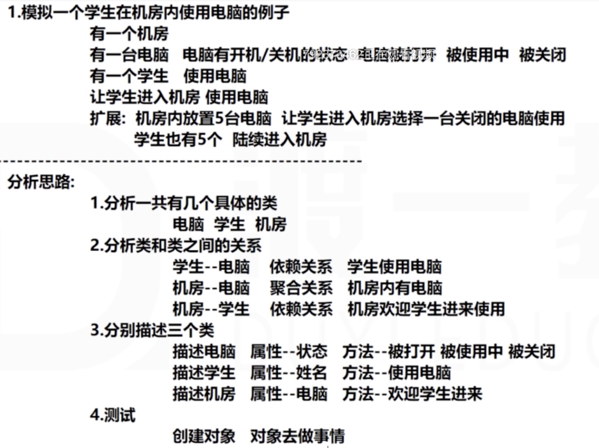

 写本程序时遇到的问题：

* Computer[ ] computers = new Computer[5];时，只是生成了一个数组，但是数组里的引用都是空的。

  ----> 需要给每一个数组元素创建新对象引用。

```java
package student_use_computer;

public class Student {
    private String name;
    private static int nextId = 1;
  
    public Student(String name){
        this.name = name;
        nextId++;
    }
    public Student(){
        this.name = "第"+nextId+"位同学";
        nextId++;
        System.out.println( this.name+"被创造");
    }
    public void useComputer(Computer computer){
        computer.beUsed(this, computer);

    }
    public void stopUseComputer(Computer computer){
        computer.beStoppedUsing(this,computer);
    }
    public String getName(){
        return this.name;
    }
}
```

```java
package student_use_computer;

public class Room {
    private Computer[] computers;
  
    public Room(int add_n_computer){
        this.computers = new Computer[add_n_computer];
        for(int i=0;i<computers.length;i++){
            computers[i] = new Computer();
        }
        System.out.println("现在机房里有"+computers.length+"台电脑。");
    }
    public void addComputer(int addNumber){
        enlargeComputers(addNumber);
        System.out.println("现在机房里有"+computers.length+"台电脑。");
    }
    public void welcomeStudent(Student student){
        int avaliable = checkAvaliableComputer();
        if(avaliable != -1){
            student.useComputer(computers[avaliable]);
        }else{
            addComputer(5);
            welcomeStudent(student);
        }
        int RP = (int)(Math.random()*10);
        if(RP<5){
            student.stopUseComputer(computers[avaliable]);
        }
    }
    private int checkAvaliableComputer(){
        for(int i=0;i<computers.length;i++){
            if(computers[i].getStatus() == false){
                return i;
            }
        }
        System.out.println("对不起，电脑不够。");
        return -1;
    }
    private void enlargeComputers(int addNumber){
        Computer[] newComputers = new Computer[computers.length+addNumber];
        computers = copyOf(newComputers);
    }
    private Computer[] copyOf(Computer[] newComputers){
        for(int i=0;i<computers.length;i++){
            newComputers[i] = computers[i];
        }
        for(int i=0; i<newComputers.length-computers.length;i++){
            newComputers[computers.length+i] = new Computer();
        }
        return newComputers;
    }
}
```

```java
package student_use_computer;

public class Computer {
    private boolean status = false;
    private int id;
    private static int nextId = 1;

    public Computer(){
        id = nextId++;
        System.out.println("第"+id+"台电脑被创造");
    }
    public void beUsed(Student student, Computer computer){
        computer.status = true;
        System.out.println(student.getName()+"正在使用"+computer.id+"号电脑");
    }
    public void beStoppedUsing(Student student, Computer computer){
        computer.status = false;
        System.out.println(student.getName()+"离开了"+computer.id+"号电脑\n"+computer.id+"号电脑可以使用");
    }
    public boolean getStatus(){
        return this.status;
    }
}
```

```java
package student_use_computer;

public class Test {
    public static void main(String[] args){
        Room room = new Room(5);
        for(int i=0;i<10;i++){
            Student s = new Student();
            room.welcomeStudent(s);
        }
// 本程序的不足：1.学生不够模块化。2.学生只能创造，用一次然后离开，不能反复来。3.学生不能随时离开，电脑随时被空出。（学生使用电脑的周期时间）

// 引发的思考：1.类怎么进一步抽象？（学生是不是不应该有太多复杂的功能，而应该拆分开）高内聚低耦合
//           2.需要多线程？学生随机离开和计时。----> 要把测试类和功能模块分开：不能把测试写在功能模块里面。太乱，后期删的时候不好删。
//           3.想做界面。  做一个完整的游戏。room，创造电脑，尽力让来学生。就像LOL的练习模式。
// 本程序的优点：业务逻辑还可以。电脑按顺序被使用。可以灵活应对学生离开和进入的情况，以及电脑不够的情况。
    }
}

```

