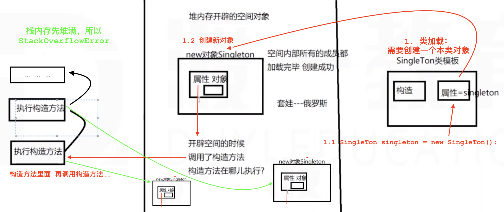

# 类之间的 关系：

* A   is-a   B   （泛化）继承  实现   inheritance

* A  has-a B   （包含） 组合  聚合   关联  composition

* A  use-a B   （依赖） 依赖（need a）

### 一、继承 extends: is-a


1. 子类对象可以调用父类的（**public**和**protected**）的属性和方法。

   * 构造方法不算子类继承过来的，只是在子类产生对象时，默认调用父类的构造方法。
   * 程序块，在调用父构造方法之前，自动调用了父类块。

2. 子类可添加自己的方法和属性。

3. 子类可以重写（override）父类方法。

4. 所有的类都继承了Object类。

5. java的继承是**单继承**，每个类只能有一个继承的父类，父类可以有一个祖父类。（extends后面只能跟一个类）—— 为了类的安全。

   * 传递——实现多继承
   * 多实现——实现多继承

6. 继承在内存中的存储形式

   * 当你创建了一个Person p = new Person()，你会发现，Person的父类Animal的构造方法也走了一遍。
   * 1. 加载类模板的过程： Object类 Animal类 Person类 —— 三个类的模型都加载，然后三个类是继承关系。
   * 2. new Person在堆内存中创建对象。并且会执行一遍父类的构造方法（但不会产生一个父对象）——总之就是会加载一遍父类的构造方法。这里面加载出来的东西只为子对象服务。（其实就是一个子类，没有产生父类的任何东西）（所有都是子类的）

   * 

   * 当你构造了一个子类对象，同时也会构造出一个父类对象。相当于在你的构造函数第一行写了默认的隐藏的super();

     * 总之是需要调用父类的构造方法，才能调用父类的所有方法。

   * 例子：

   * ```java
     class Animal{
        public Animal(){  System.out.println("Animal无参构造方法");  }
        public	void eat(){  System.out.println("Animal吃");  }
        public void sleep(){ this.eat(); System.out.println("Animal睡");  }
     }
     class Person extends Animal{
        public Person(){  System.out.println("Person无参构造方法");  }
        public void eat(){  System.out.println("人吃东西，香");  }
     }
     public class Test{
        public static void main(String[] args){
           Person p = new Person();  //这里执行了: Animal无参构造方法+Person无参构造方法
           
           p.sleep();  //这里执行了: Person的eat和Animal里继承的sleep ---> 调用的不是Animal的eat
                       //如果子类重写了eat方法，那么this只能调到子类的eat方法。想调父类的eat，要用super
        }
     }
     ```

7. **this** 代替的是**当前**调用方法属性时的**对象**。不一定是当前类的对象 —— 可能是子类的对象 —— 如果子类对象有重写方法，在父类中方法调用其他方法时，优先找子类同名方法

   **super** 代替**当前**执行方法时的对象的**父类**的**对象**（其实不是对象，反正是父类的东西）。

   * 都能调用一般属性和一般方法
   * 可以放在类成员的任意位置（属性、方法、构造、块）
     * 一般方法中可以来回调用，但会有Error
   * 可以在构造方法中调用另一个构造方法（必须在第一行）
     * 构造方法中来回调用，写就不好用。因为它们都要在第一行。。。（不懂 0,0）

#### 0. 所有类的父类：Object类

java.lang包。

方法：

1. **hashCode()** : 将对象在内存中的地址经过计算得到一个int整数。

   * ```java
     public nativ hashCode(); // ---> native表示这部分代码是用c++写的，java代码已经到头了。
     ```

2. **equals()** :  用来比较两个对象的内容

   * ```java
     public boolean equals(Object obj){  return (this==obj);  }
     ```

   * 默认效果是 == 

     * == 比较基本类型，比的是**值**。
     * == 比较引用类型，比较**地址**。

   * equals建议重写

3. **toString()** :  打印输出时将对象变成String字符串

   * ```java
     public String toString(){  return this.getClass().getName()+"@"+Integer.toHexString(this.hashCode());  }
     ```

   * Return：类全名+@+int整数（转换成了十六进制）

4. **getClass()** :  获取对象对应类的类映射（反射）

5. **wait()** :  线程进入挂起等待状态  

   * 存在方法**重载**：有三个带不同参数的wait()方法

6. **notify()** :  线程唤醒

7. **notifyAll()** :  唤醒所有

8. **finalize()** :  protected方法，在对象被GC回收时，默认调用执行的方法。（析构函数）

   * ```java
     protected void finalize(){}
     ```

   * 什么都没做

   * final finally finalize区别

9. **clone()** :  protected方法，为了克隆对象。

#### 1. Override vs Overload


权限符：public > protected > 默认不写 > private

* 子类的权限符范围可以>=父类的

#### 2. 继承写法用法都不难，问题是什么时候用继承？内存原理了解了？super和this的特点？

#### n. 包

```java
package com.horstman.corejava;
```

package只能有一个，import可以写多个。package写在最前。

### 二、包含 has-a (组合 聚合 关联)

组合：人和大脑、人和心脏（整体和部分不可分割，要出现都出现，要消亡都消亡）

聚合：汽车和轮子  电脑和主板（整体和部分  在创建时可以分开的）

关联：人又汽车  人有电脑（可以分割，后来在一起）

### 三、依赖 use-a 

Eg：屠夫 杀 猪。

因为一件事联系在一起，事情完成，关系结束。

java程序体现：**一个类的方法中使用到另一个类的对象。**形式：

* 在方法中传递参数
* 在方法中自己创建

### 四、设计类的原则：高内聚，低耦合

耦合度：最紧密是    继承（实现）> 包含 > 依赖

例子1：学生在机房使用电脑

* 有一个机房
* 有一台电脑  电脑有开机/关机状态  电脑被打开  电脑被使用中  电脑被关闭
* 有一个学生
* 学生进入机房使用电脑

扩展：

* 机房内5台电脑
* 学生进入机房选一太关闭的电脑使用
* 学生5个，陆续进入机房

例子2：汽车测速器


类，有权限修饰符，也可能有特征修饰符final

# 修饰符


### 一、 权限修饰符: public / protected / 默认不写 / private

|                                                 |             权限修饰符              |     特征修饰符      |    特征修饰符     |
| :---------------------------------------------: | :---------------------------------: | :-----------------: | :---------------: |
|                     **类**                      |            public / 不写            | final 本类不可继承  | static 静态内部类 |
|               (类的) **构造方法**               | public / protected / 不写 / private |       （无）        |      （无）       |
|                 (类的) **方法**                 | public / protected / 不写 / private |   final 不可重写    |  static 静态方法  |
|                (类的) **程序块**                |               （无）                |    static 静态块    |      （无）       |
|                 (类的)**属性**                  |          public / private           | final 不可改+必赋值 |  static 静态属性  |
| (方法的) **变量**<br />- 存在栈内存的临时空间 - |               （无）                | final 方法内不可改  |      （无）       |

* 静态方法只能调用静态变量。不能调用对象变量。因为静态的意思是，不需要对象就可以执行。
* 属性：静态属性存在方法区静态空间；普通属性，跟随对象，在对象空间内（堆内存）。
* 变量：在栈内存。
* final：值不可改。但是如果值是一个对象的引用，可以改对象本身的值。

下图：权限修饰符 所表示的 范围

|  权限修饰符   |          | 范围（谁可以访问你？）                    |
| :-----------: | :------: | ----------------------------------------- |
|  **public**   |   共有   | 本类 本包 子类 任意类里(创建对象就可访问) |
| **protected** | 包和子类 | 本类 本包 子类(↓)                         |
| **默认不写**  |  包私有  | 本类 本包                                 |
|  **private**  | 本类私有 | 本类                                      |

**本包**：严格地在同一个包里，不能是在同大包不同小包。

**protected**：在子类范围内，通过子类对象，访问父类的受保护方法，可以。

* 在子类内，创建父类对象访问父的protected方法，也不行。
* 在（父和子类的）外部，通过子类对象，访问父类protected方法，不行。

### 二、特征修饰符: final / static / abstract / nativ ...

#### 1. final

* **final 类**：不能被子类继承 —— 通常是定义好的工具类，比如：Math类、Scanner类、Integer类、String类。

* **final 方法**：不能被子类重写。

* **final 属性**：属性即便没赋值，也有默认值，所以 ①要么声明时赋初值 ②要么声明时不赋值，在代码块或构造函数中赋值。

* **final 变量**：变量声明后，只有一次赋值机会，一旦赋值不能再改变 —— 相当于常量。

  * ```java
    public void testNum(final int[] a){....}  //也可以，表示a在方法内不能被改变
    ```

> final 属性 和 final 变量：
>
> ①一旦赋值，不再能修改。      ②变量或属性：如果是基本类型，则不能改；如果是引用类型，地址不能改，但值可以改。

#### 2. static 静态

静态元素，在创建类时就完成了加载和初始化。它**属于类**，不属于任何一个对象。可以通过类名字直接访问，也可以通过对象直接访问。

静态成员之间可以互相访问。静态成员不可以访问一般方法（因为你不知道找哪个对象的方法）。也不能用this和super（因为这俩指代对象）

* 静态常量使用场景：private static final 属性 = 0;

内存管理：栈内存用完就回收，对内存用GC回收，静态元素区GC无法管理。静态元素常驻内存。


* **static 属性**：
* **static 方法**：
* **static 块**：(静态块)
* **static class**：(内部类)

```java

```


### 三、java面向对象三大特性：继承 封装 多态 （第四：抽象）

private : **封装** —— 把一些数据和方法进行包装

* 目的：封装执行过程，保护数据和执行过程，隐藏执行细节，增强复用性

所以：

* 属性，全部private
* public方法，提供功能
* 所有属性的访问和修改 --->
  *  age ---> setAge()和getAge()方法来实现

Spring： IOC——对象的控制权是别人的。向别人要，别人帮你创造对象。DI依赖注入——帮你赋值。

### 四、设计模式23种之一：单例模式singleton

设计模式是通用的代码书写方案，确保代码可读性、复用性、可靠性、可扩展性

三类：

1. 创建型模式 5 ---> 用于解决对象创建的过程

   单例模式   工厂方法模式   抽象工厂模式   创建者模式   原型模式

2. 结构型模式 7 ---> 把类或对象通过某种形式结合在一起，构成某种复杂但更合理的结构

   适配器模式   装饰者模式   代理模式  外观模式   桥接模式  组合模式   享元模式

3. 行为型模式 11 ---> 解决类或对象之间的交互，合理优化类或对象之间的关系

   观察者模式   模板模式   策略模式   责任链模式  解析器模式  迭代子模式  命令模式  状态模式  备忘录模式  访问者模式  中介者模式

#### 1. 单例模式

一个类，我们希望**它只会创建一个对象**。

把这一个对象直接创建在类的属性里：

```java
class SingleTon{
		private SingleTon single = new SingleTon();
}
```

-----> 这会导致StackOverflowError栈内存溢出。堆内存溢出是OutOfMemory。

因为创建对象时执行构造方法 ---> 在栈内存执行 ---> 执行时又要new一个新对象，执行新的构造方法 ----> 最终导致栈内存溢出（栈小堆大，栈先溢出）。



把对象创建放在静态属性里：静态对象只加载一次。

```java
class SingleTon{
  //把唯一的对象，创建在static属性中
  private static SingleTon single = new SingleTon();  //立即加载: 饿汉式
  
  //让构造函数私有，这样就不能随便构造新对象
  private SingleTon(){}
  
  //写一个获得本对象的public静态方法: --> 本方法通过类名即可访问，不需要对象
  public static SingleTon getSingleTon(){  //单例模式规约：get方法名字可以是 ①get类名 ②newInstance
     return single;
  }
}
```

于是就需要一个静态方法（属于类的方法，直接用类名就可以访问，不需要非要通过对象访问），来让用户访问到这个唯一对象——却不能随意更改它。

访问这个唯一的对象：

```java
class Test{
  public static void main(String[] agrs){}
  	//SingleTon s = SingleTon.single; 如果类里的属性是public，可以这么访问
  	SingleTon s = SingleTon.getSingleTon();//得到了single的地址引用，single不能被改变，只能被访问
}
```

> 总结单例模式实现方法：
>
> 1. 把构造方法私有。
> 2. 私有、静态  的属性 = new 类(); 
>    * 唯一对象生成在类的静态属性里（独此一份，且不会溢出，因为它再怎么内部反复调用自己，也都在指代它自己）
> 3. 共有、静态  的方法，返回该对象。 提供该对象的访问功能。

单例模式：

* 饿汉式（立即加载）对象启动就加在 --- 我们刚写的就是饿汉式
  * 好：不会空指针异常（对象还没有，就要用）。
  * 坏：服务器承载压力过大
* 懒汉式（延迟加载）对象什么时候用才加载
  * 好：可能操作不好，产生问题导致异常
  * 坏：服务器压力不大，不会浪费空间
* 生命周期托管（单例对象由别人帮助我们处理）对象加载过程交给别人

饿汉式：类加载时，就new了这个对象。`private static SingleTon single = new SingleTon();`

懒汉式：类加载时，不创建对象。在getSingleTon()方法里才创建。

```java
class SingleTon{   //懒汉式 -- 延迟加载
   private static single;
   private SingleTon(){}
   public static SingleTon getSingleTon(){
     if(single==null){
       single = new SingleTon();
     }
     return single;
   }
}
```


#### 2. 缺省适配器模式Adapter

有接口的好处是统一管理。可是如果接口要增加方法，所有子类也必须增加方法。

我们之前写的LInkedBox类是对接口Box的实现。所以用的是implements。

而我们现在要加一个二者之间的**抽象类：**这就是适配器

1. **把不太重要的方法削减出去（它自己具体化），让一些子类去找合适自己的用。**
2. 把子类里重复的代码放在这个适配器抽象类里去写，子类直接调用父类方法即可。

```java
public abstract class AbstractBox implements Box{
    //接口定义的抽象方法继续保留
    public boolean add(int element);
    public int remove(int index);
    public int get(int index);
    public int size();
    
    //自己定义更多方法 让子类根据需求自行实现这部分内容  子类extends这个适配器
    public void add(int index, int element){
      throw new 自定义Exception;
    }
    public void addAll(Box){
      throw new 自定义Exception;
    }
}
```

这个抽象类实现了接口interface，并且另外增加了两个方法。子类则extends这个类即可。

子类可以实现接口，但是如果接口要增加方法，就必须让子类都实现这些方法。适配器的作用就是，它实现接口，而让子类去继承它，那么子类已实现接口前面的需求，而后面新增的功能，都在适配器这个父类里——它可以根据需要进行重写，或者不理睬（反正不重写就不能用，可以调，但不能用，一调用就只有异常报出，没有别的功能实现）。

而这两个方法：

* 子类可以不写，如果不写又想直接调用，会抛出异常，所以  想用就必须重写。
* 可以不写，因为父类已经把这两个类设置为具体方法，而不是抽象的。


### 五、特征修饰符：final static abstract native ...

#### n. 类加载的顺序过程

```java
class Animal{
   private String test = "AnimalTest";
   private static String staticTest = "AnimalStaticTest";
   public Animal(){
      System.out.println("Animal无参数构造方法");
   }
   {
      this.test();//普通块调用普通方法
      System.out.println("Animal普通块");
   }
   static{ 
      staticTest();    //静态元素可以访问静态元素，但不可访问普通元素。也可以写为: Animal.staticTest();
      System.out.println("Animal静态块" + staticTest);  //这里调用了静态方法和静态属性
   }
   public void test(){
      System.out.println("Animal普通方法");
   }
   public static void staticTest(){
      System.out.println("Animal静态方法");
   }
}

class Person extends Animal{
   //子类可以有跟父类重名的属性，这不叫重写。如果有就用自己的，没有就用父的。
   private String test = "PersonTest";
   private static String staticTest = "PersonStaticTest";
   public Person(){
      System.out.println("Person无参数构造方法");
   }
   {
      this.testP();
      System.out.println("Person普通块"+test);
   }
   static{ 
      staticTest();
      System.out.println("Person静态块"+staticTest);
   }
   public void testP(){
      System.out.println("Person普通方法");
   }
   public static void staticTest(){
      System.out.println("Person静态方法");
   }
}

public class Test{
   public static void main(String[] args){
		  new Person();//这里发生了什么？创建对象时发生了什么？
   }
}
//结果: 先出静态，后出非静态。先出父，后出子。
```

对象创建之前，类先加载：

1. 加载类模板：先加载父类，后加载子类： (先把东西摆放好) 

   * 加载父类静态成员：
     * 方法区：Animal类模板 { 普通属性、普通方法、普通块、构造函数 } 
     * 静态区：Animal静态空间 { 静态属性、静态方法、静态块}                     (按顺序)
     * 然后**执行父类静态块**

   * 加载子类静态成员：
     * 方法区：Person类模板 { 普通属性、普通方法、普通块、构造函数 }
     * 静态区：Person静态空间 { 静态属性、静态方法、静态块}
     * 然后**执行子类静态块**

2. 创建对象空间：

   * 加载父类的非静态成员：
     * 加载Animal类的普通属性、普通方法、普通块、构造函数                     （按顺序）
       * 普通方法和构造函数并不存储在这里，这里只记录了类模板中对应方法的地址
     * **执行父类普通块**，**执行父类构造函数**

   * 加载子类非静态成员：
     * 加载Person类的普通属性、普通方法、普通块、构造函数
     * **执行子类普通块**，**执行子类构造函数**

3. 把对象空间的地址交给 接收它的变量

```java
//结果:
Animal静态方法
Animal静态块AnimalStaticTest  //Animal 静态方法 + 静态块 + 静态属性
Person静态方法
Person静态块PersonStaticTest  //Person 静态方法 + 静态块 + 静态属性
Animal普通方法
Animal普通块                  //Animal 普通块(调用普通方法)
Animal无参数构造方法           //---Animal构造---
Person普通方法
Person普通块PersonTest        //Person 普通块(调用普通方法)
Person无参数构造方法           //---Person构造---
```


**（图：Person p = new Person(); 的加载过程 - Person的父类Animal）**

```java
//--第3步完--
Animal静态方法
Animal静态块AnimalStaticTest 
//--第6步完--
Person静态方法
Person静态块PersonStaticTest 
//--第9步完--
Animal普通方法
Animal普通块             
//--第9步完--
Animal无参数构造方法          
//--第11步完--
Person普通方法             
Person普通块PersonTest   
//--第11步完--
Person无参数构造方法             
```

针对第9和第11步：逐步加载，一起执行。

这部分是虚拟机的工作原理。以上依然很多不准确。

#### 3. abstract 抽象的 (只有概念，没有具体执行)

**抽象类：abstract修饰。**

**抽象方法：abstract修饰。只有方法结构，没有执行体。**

* 抽象类不是必须有抽象方法。
* 抽象方法可以放在 抽象类(abstract class) 或 接口(interface) 中。
* 普通类不允许含有抽象方法。

```java
public abstract class Animal{
   public abstract void eat();  //抽象类没有执行体
}
```

##### 3.1 抽象类

通常用来描述事物，但还不够具体。


```java
public interface Test{}
```

##### 3.2 接口、抽象类、普通类之间的关系


##### 3.3 抽象类和接口的知识回顾


##### 3.4 案例


数据结构之链式结构：

* 单向链表 A -> B -> C -> ...
* 双向链表 A <-> B <-> C <-> ...
* 环形链表 


### 六、多态


5. 这里的意思是：

   * **Person类型的变量p，指向一个Teacher类的对象。**

   * **子类对象，可以赋值给超类变量**。但是超类对象 引用给 子类变量，会导致方法调用时出错。

6. 强制向下转型时，可能会造成运行时异常（ClassCastException类造型异常）

   * 比如：Student s = (Student) o;  //编译没问题，但是运行会出问题
   * 必须是父子类关系才可以造型

7. 如果想避免异常，可以进行**instanceof判断**。

   * 用法：**对象 instanceof 类 --> 返回结果为true/false**


* ---------------------------------**Student s = (Student) o;**  //编译没问题，但是运行时异常 —— ClassCastException类造型异常

### 七、知识回顾及补充

#### 知识回顾：适配器和多态

> 知识回顾：适配器和多态
>
> 适配器：解决一个接口定义了好多方法的问题
>
> 适配器通常是一个抽象类，implements接口，并添加了某些具体方法（方法内抛出异常）
>
> 这样它就是一个特殊的接口，接口定义的抽象方法方法子类必须重写。
>
> 
>
> 多态：指一个对象变量可以指代不同的类对象，表现出不同的形式。
>
> 多态首先必须有父子关系。父的变量，指代不同的子对象。
>
> * People p = new Teacher(); （向上转型自动进行）
>
> 此变量p只能调用父定义的方法和属性。属性调父的，方法调最靠近本质的子的。
>
> 向下转型，叫造型。需要考虑转型类型与实际类型不匹配的问题（ClassCastingException）
>
> * 可以用【 p  instanceof  Student 】来判断是否可以造型


#### Java Core 知识补充：**构造器**

> Java Core 知识补充：**构造器**
>
> **仅当**类中**没有任何构造器的时候**，系统才会**默认给你一个无参数的构造器**。一旦你定义了构造器，就不能使用无参构造来创建对象。
>
> 父子类：
>
> 1. 父无构造器，子无构造器。系统：给二者都提供无参构造器，并且子构造器里第一行默认调父的构造器。
>
>    ---> 创建一个子类对象时，先先构建父对象字段部分（先执行父构造器），再构建子对象字段部分（再执行子构造器）。
>
> 2. 父无构造器，子有参构造器。系统：给父一个无参构造器，子构造器第一行调用父无参构造器。
>
>    --->创建一个子类对象时，先父部分构建，再子部分构建。
>
> 3. 父有无参构造器，子无构造器。系统：给子一个无参构造器，子构造器第一行调用父无参构造器。
>
>    --->创建一个子类对象时，先父部分构建，再子部分构建。
>
> 4. 父有有参数构造器。系统：子必须有一个构造器 匹配父构造器matching super constructor。
>
>    ---> 子构造器中，要先在第一行调用父构造器并传入属性：public Student(String name, String major){ **super(name);**  this.major=major; }  之后再初始化自己的属性。
>
>    * 这样的效果是：父类有所有子类的共同字段name，并有构建赋值能力（抽象类的构造器，纯粹只给子类构建器用，抽象类不能有实例），并有获得字段的能力——getName方法（所有子类只能通过这个公有方法来获得[这个唯一为自己服务的]父对象的private name字段。为什么不用protected？因为这样子类可以直接用这个字段了，也可以直接改 —— 其实也行）
>    * 另一种理解是，protected的话，父类的属性和父类的方法，子类对象都可以直接调用。this.name(即使子类里没有name字段)  this.fatherProtectedMethod()  
>    * 效果是：子类只有各自独有的属性，和独有的方法，以及重写的父类的方法（减少重复代码）。如果是抽象类的子类，那么还有抽象类定义的抽象方法的具体化方法（其实也是一种重写）。


那么适配器是什么？

---> 是一个抽象类，接口的要求还在那里，它保留这些所有的抽象方法，它implements接口，并让那些实现了接口的子类继承它。自己内部出了接口的全部抽象方法外，还可以新的具体方法{方法内只抛出异常}。子类根据需求增加新功能，需要新功能的，就重写那些方法，不需要的就别写。


#### Java Core 知识补充：**接口**

> Java Core 知识补充：**接口**
>
> 接口是抽象类的极致。只有抽象方法，没有实际方法。可以被多实现。
>
> 接口不是类，它是对希望符合这一接口的类的一组需求。Arrays类的sory()方法承诺可以对对象数组进行排休，但前提是该对象的类要实现了Comparable接口。（接口里定义的需求：int compareTo (Object o); ）
>
> 接口的方法都是自动public。接口的属性都是自动public static final，即都是常量（有final必须直接赋值）。
>
> 接口没有实例。**1.8版本之后，接口可以提供一些简单的具体方法，但是不能引用实例字段，只能引用静态属性字段。**
>
> 接口不是类，所以没有实例。但是可以有接口变量：Compareble x; 接口变量必须引用一个实现了该接口的类的对象。**(多态)!**
>
> 可以包含多个抽象方法（需求）。
>
> 一个类要实现一个接口：
>
> 1. implements    2. 实现接口定义的方法
>
> **instanceof  检查一个对象是否属于一个类，也可以检查一个对象的类是否实现了接口：**
>
> 1. **对象 instanceof 类      2. 对象 instanceof 接口**
>
> 接口也可以有继承：从通用性较高的接口，到专用性较高的接口
>
> 接口可以多实现：class Employee implements Cloneable, Comparable{...}  这意味着，你可以使用.clone()和.sort()方法了。
>
> 一个类可以继承一个类，多实现n个接口：
>
> ```java
> class Employee extends Person implements Cloneable, Comparable{
>   ...
> }
> ```
>
> 接口和抽象类：为什么要引入接口概念？ **类 implements 接口**  vs **类 extends 抽象类**
>
> * 因为extends只能继承一个类，而implements可以实现多接口
> * 接口提供了多继承的大多数好处，避免了多继承的复杂性和低效率


#### Java Core 知识补充：**抽象类**

> Java Core 知识补充：**抽象类**
>
> 原因：越上层的类约抽象，它对对象的信息提供就非常少。
>
> 目的：为了提高程序的清晰度，知道这个抽象类到底为一个对象提供哪些信息，我们使用抽象概念。即让一个类本身是abstract，里面除了包含自身的属性，就是本身不打算提供具体方法的(一个或多个)抽象方法。
>
> eg：一个Person类，被Employee类和Student类继承。它提供一些具体方法，也提供抽象方法。
>
> ```java
> abstract class Person{//不写: 本类 同包可访问 ---> 包外的类，想import这个包来使用这个类，是不可以的
>    private String name;
>    Person(String name){ this.name = name; } //构造方法 --> 构造方法一般要public 因为要所有类都可以用 前提是类是共有
>    String getName(){  return this.name;  }  //具体方法
>    public abstract String getDescription(); //抽象方法
> }
> class Student extends Person{
>     ①属性major; ②构造器Student{super(name);...} ③具体化方法getDescription(){...} ④方法study(){...} 
> }
> class Empolyee extends Person(
> 	①属性salary; ②构造器Employee{super(name);...} ③具体化方法getDescription(){...} ④方法riseSalary(){...} 
> )
> ```
>
> **建议尽量把通用字段和方法放在超类中（不论是不是抽象类，不论是不是抽象方法）** ---> 在子构造器中调用父构造器完成那些字段的初始化。再初始化自己的字段。
>
> 抽象方法充当占位角色，具体由子类实现。
>
> 抽象类不能实例化。可以有抽象类的变量，但只能引用具体化了的子类的对象。Person p = new Student();  **(多态)!**
>
> 不含抽象方法，也可以声明为抽象类。抽象类不能实例化。
>
> 问题：为什么不直接只在Student和Employee类中写getDescription()方法，还要在Person里放一个抽象方法？
>
> * 因为，这样p变量就可以调用getDescription()方法，并且根据不同的实际对象给出不同的返回结果。**(多态)!**
> * 如果Person里不写这个抽象方法，p就不能调用getDescription()方法。


#### Java Core 知识补充：**static和final**

> Java Core 知识补充：**static和final**
>
> **static 静态** —— 属于该类的，存在方法区的静态区的该类空间中。
>
> 1. private static int nextId;   **静态字段**：属于类，而不属于任何一个对象。可以通过类名调，也可通过对象调。（可以不断改值）
>
> 2. public static final PI = 3.14;  **静态常量**：public静态常量是可以的，因为它final了，不会被改。
> 3. Math.pow(x,a);  **静态方法**：不在对象上执行。
>    * 什么时候使用静态方法：1. 方法不需要访问对象状态。  2. 方法只访问类的静态字段。
>
> **final 最终的** —— 不被更改：In Java, the **`final` keyword** can be used while declaring an entity(实体). Using the final keyword means that **the value can’t be modified in the future**.
>
> 1. 静态常量：public static final PI = 3.14; 类就一个static字段，而且final不能改，所以叫静态常量。final static必须声明时赋值。
> 2. final属性：class FinalTest{ final int x = 1;}  
>    * 权限符默认不写，就是本包和本类。本类里直接用；本包要通过本类的对象用，可以访问，可以改。
>    * final属性：要么声明时赋值。要么在构造函数和代码块赋值。final static属性必须声明时赋值。
> 3. final变量：方法中，final int a; 一旦赋值，不能再改。
> 4. final形参：这个形参在方法中不能被改变。public static  void test(final int a){ a = 3; } //这就报Error了。（static可以不写）
> 5. final方法：此方法 不能被overriden重写。
> 6. final类：此类不 能被extends继承。


#### 高内聚，低耦合

> 高内聚，低耦合 High aggregation and low coupling
>
> 内聚：每个模块尽可能独立完成自己的功能，不依赖于模块外部的代码。
> 耦合：模块与模块之间接口的复杂程度，模块之间联系越复杂耦合度越高，牵一发而动全身。
> 目的：使得模块的“可重用性”、“移植性”大大增强
> 通常程序结构中各模块的内聚程度越高，模块间的耦合程度就越低
>
> **模块粒度：**
> 『函数』
> 高内聚：尽可能类的每个成员方法只完成一件事（最大限度的聚合）
> 低耦合：减少类内部，一个成员方法调用另一个成员方法
> 『类』
> 高内聚低耦合：减少类内部，对其他类的调用
> 『功能块』
> 高内聚低耦合：减少模块之间的交互复杂度（接口数量，参数数据）
>
> 横向：类与类之间、模块与模块之间
> 纵向：层次之间
> 尽可能，内容内聚，数据耦合


#### This 和 super

> 父类的属性和方法，子类在自己内部使用：super.name  或者 super.getName()  注意调用的是自己创建时，生成的对象空间里的只为自己服务的父亲对象。如果调用的是类静态常量，类静态方法，那就无所谓，都可以。类常量和类静态方法——可以被对象调用，也可以直接用类调用。
>
> 属性：父类的属性，子类也有，this.name 那就是子类的name。如果子类没有，那就找父类的public属性和protected属性。
>
> ```java
> 父class: public String name;
> 子class: 构造函数(String name){this.name = name;}  //子类可以直接调用父类属性
> ```
>
> 老师写法和我写法的区别：
>
> * 老师总是在 类的内部自我调用时，方法和属性前面都放this。说是这个对象调用了其他方法。可是实际上也可以直接调用方法，前面不放this。不知道区别是什么？
> * 以及，this最核心的用法不是用来解决形参和属性的重名问题吗？
>
> super可以用于super构造器，和super.属性  super.方法()。反正super指代父对象（或者说父的那部分属性和功能）。
>
> super的使用形式：
>
> * super(String name, int age); 调用父的构造函数
> * super.name  父的属性
> * super.getName()  父的方法


属性和方法的访问权限问题

> 类：
>
> 属性：只能写声明，或声明+赋值。不能写赋值语句。
>
> * 属性可以在方法内写赋值语句。
>
> * 属性可以直接被本类所有方法直接使用。（需要区别对象属性和形参名时，用this，需要使用父类属性和父类方法，用super）
> * 如果一个属性定义在父类里（父类name），子类（没有name）直接用也没问题。
>   * { 方法体内：return name; }  或者 { 方法体内：return super.name; } ---> 二者效果一样。
>
> 方法：
>
> * this和super在方法内的用法。this指代调用方法时的对象。super指调用方法时的对象的父部分。
>
> * 还是那个要不要注明this的问题 ------> 尚未解决。


### 八、策略模式+内部类

调用一个方法，名字一样，传入参数不同

1. 利用方法重载 —— 静态加载
2. 利用多态 —— 动态加载（Person p = new Teacher(); Bank.oprating(p); )

#### 3. 策略模式 Strategy —— 行为型模型

执行流程是固定的，执行结果因提供了不同的策略而不同。

```java
class Bank{
   public 办业务 ( 人 ){   //人是抽象类或接口（不能产生实例）----> 传入的是子类对象
       欢迎用户;
       叫号;
       办业务;
       欢迎下次光临;
   }
}
```

### 九、内部类

目的：为了封装。

java中，一个类定义在另一个类内部。

内部类可以定义在，类的内部（和类成员同一个层次）。

也可以定义在方法/块的内部（和方法的局部变量一个层次）。

1. **成员内部类** —— 即 类 的内部

   * 可以像普通方法一样，使用权限修饰符和特征修饰符：public protected 不写 private static final abstract。外部类只有public和不写。

   * 好处：①省了一个源文件  ②该内部类可以访问所有外部类的成员(包括private元素) —— 直接写直接用，不能用this或super

   * 创建内部类对象：`Demo.InnerDemo ind = new Demo().new InnerDemo();`  

     * 在外部类内 要创建内部类对象  或  在主方法要创建内部类对象

     ```java
     Demo d = new Demo(); //先创建外部类对象
     Demo.InnerDemo ind = d.new InnerDemo(); //外部类对象 创建 内部类对象
     //或者
     import Demo.InnerDemo;
     InnerDemo ind = d.new InnerDemo();
     ```

   * 使用内部类方法：

     ```java
     ind.innerMethod();
     ```

   * 如果内部类和外部类有重名属性：name 是自己的。Demo.this.name是外部类的对象的。
   * 内部类编译后产生一个文件：Demo$InnerDemo.class

2. **局部内部类** —— 即 方法/构造函数/块 的内部（用的不多）

   * 局部内部类像局部变量一样，它只是个局部变量。所以不能用public protected private(修饰类成员的)及static。
   * 只能用abstract和final修饰
   * 局部内部类编译后：Demo$1innerDemo.class (重名的内部类，数字变成2)
   * 局部内部类的变量，必须用final修饰。用外部的成员属性都随便使用。

3. **匿名内部类** 

   * 成员匿名内部类

   * 局部匿名内部类

   * 通常接口或抽象类的具体子类写：

     ```java
     public interface Test{
       public void test();
     }
     Test t = new Test(){
       public void test(){...}//实现了接口的子类   不起名字，直接把类体写在这
     }
     ```

   * Test t = new Test(){ public ...}  这个结构写在类的属性里，就是成员匿名类；写在方法里，就是局部匿名类。
   * 开发中为了省略一个类文件。
   * 只有类体，没有类名，没有任何修饰符，也没构造方法。
   * 用于：Swing做按钮监听——按钮绑定一个事件监听器

4. **静态内部类** —— 在 类 的内部，就是成员内部类（静态内部类）

   * 不需要外部类对象，直接用外部类名＋内部类名即可创建（需要import外部类）

     `Demo.InnerClass inner = new Demo.InnerClass();`

   * 静态元素不能访问非静态元素（自己类和外部类的都不行）
   * private protected public 不写：都可以

### 十、枚举类

> java数据类型：
>
> 基本类型：8个
>
> 引用类型：数组[ ]  String  类class  抽象类abstract class   接口interface   **枚举enum**  注解@interface

没有他也行，只是有些时候，因为它的存在会更方便。

**枚举类：一个类的对象是有限且固定的。可以将类中的对象意义列举**

没有枚举类之前，我们怎么达到这样的效果？

1. 私有化构造器，这样别人就不可以构造更多本类对象。
2. 把对象建立在属性里：

```java
class Day{
   //首先私有化构造器
   private Day(){}
   //其次，类似于单例模式，把对象构建在属性里。
   //①这个属性对象要可以被调用，所以要public
   //②不能通过构造新的类对象来访问这个属性，只能通过类名来访问这个属性，所以要static
   //③它不可以被随便改值，所以要final
   public static final Day monday = new Day();
   public static final Day tuesday = new Day();
   public static final Day wednesday = new Day();
   public static final Day thursday = new Day();
   public static final Day friday = new Day();
   public static final Day saturday = new Day();
   public static final Day sunday = new Day();
   //一般属性随便设计即可
}
//使用这些对象：
   Day day = Day.Monday;
```

1.5版本后，可以直接定义枚举类：

```java
public enum Day{monday,tuesday,wednesday,thursday,friday,saturday,sunday}
//使用：
   Day day = Day.Monday;
```

* 枚举类是一个正常的类，它默认继承了Object类，还默认继承了Enum类(java.lang包) 

* 所以枚举类不能再extends其他类，但是可以implement接口。

**Enum类：** 是抽象类，但没有抽象方法——即，它只是不能构造实例而已。

* 两个属性：
  1. name：枚举对象的名字。方法name()返回name属性。
  2. ordinal：枚举对象在类中罗列的顺序。相当于index，从0开始。方法ordinal()返回ordinal属性。
* 一些方法：
  1. valueOf(String name)：通过给定字符串name，找到对应名字的枚举对象。
  2. values()：获取全部枚举对象，返回数组Day[ ]。
  3. compareTo()：可以比较两个枚举对象、返回类型为int：-1表示this靠前，0表示相等，1表示this靠后。
  4. 一些final方法，从Object继承过来：hashCode()  equals()等。
  5. toString()：也继承自Object，但是可以重写。

**枚举类**的使用：枚举类不能abstract

1. switch语句里，括号内可以用enum类对象。

2. 一般枚举类就是用来设置有限对象或常量然后来用。

3. 我们当然也可以在enum类中描述自己的属性和方法：

   i. 必须在enum类的第一行描述一下枚举类对象的样子

   ii. 可以定义自己的属性。因为在类创建的过程中，虚拟机会帮我们创建枚举类的对象。所以我们需要提供构造方法。

   iii. 枚举类不能有public构造函数（因为枚举类不能共有创造对象）。必须private。

   xi. 构造方法需要跟你定义的枚举对象的样子相匹配。

   v. 方法可以重载。当然构造方法也可以。

Enum类和枚举类可以**多态**：`Enum e = Day.monday;`

```java
public enum Day{
   monday("礼拜一",1),tuesday,wednesday;  //monday用的有参构造器，tuesday用的无参构造器
  
   String name; //四种权限符都可以用
   int index;
   private Day(){}
   private Day(String chinese, index){
      this.chinese = chinese;
      this.index = index;
   }
   public String toString(){ return chinese; }  //自己定义的方法
   public int getIndex(){ return index; }
}
//那么 monday有4个属性 name: monday  ordinal:0   chinese:"礼拜一"   index:1
//name和ordinal不能改。继承自父类Enum。只能读取：当你写好对象的时候，这两个值已经确定了。
//你只能增加自己的属性。
```

* call to super is not allowed in enum constructor.  构造器中不能调用父构造器
  * 为什么？
  * Enum的构造器是protected，**构造函数加protected有什么用？**
    * 答：protected外部不能随便构建对象，但是子类可以用。(本包和子类可以用来构造对象，但外部不可以)
    * Enum的构造器似乎更特殊：*Sole constructor. Programmers cannot invoke this constructor. It is for use by code emitted by the compiler in response to enum type declarations.* **独家构造函数。 程序员不能调用此构造函数。 它由编译器根据枚举类型声明发出的代码使用。**


# 内存机制问题

栈内存<---Person p = new Person();--->堆内存    方法区--->类模板

* 栈内存：用完即回收。
* 堆内存：存new时创建的对象。GC回收。

* 方法区：存类模板、静态。只有一份，回收不了。

GC其实是一个线程。回收算法。

```java
Person p = new Person();
p = null;  //刚刚创建的Person对象变为垃圾
system.gc();//提醒系统去清理垃圾。（在这个位置）
p.finalize();

为了能看到被回收的效果，回收的是p对象，在Person类里重写finalize方法：
public void finalize(){System.out.println("完成清理。")} //重写finalize方法，线程部分依然在，你写的部分会在结束后执行。

你也可以利用Runtime对象看到内存情况：单例模式，Runtime.getRuntime()获取对象
.mexMemory   .totalMemory  .freeMemory  (long类型返回值 单位为字节数)（除以1024得kb）
```

system.gc() 你可以提醒系统去清理


Runtime类中提供的几个内存管理方法：

（Runtime是单例模式设计的类，私有构造器，属性为私有的唯一对象，可以通过getMemory()方法来获得此对象。（懒汉式——用时才创建）

1. .maxMemary() - long类型返回值，单位为字节。
2. .totalMemory()
3. .freeMemory()

Max是指虚拟机开辟的栈内存的最大空间。total是指当下系统所用的站内存空间（有的被用了，有的还没有被用）。free是指total里还没有被使用的空间。

如果堆内存溢出。就是需要的内存空间，超出了max的值，会产生：OutofMemoryError: Java heap space，堆内存溢出错误。

Object类中有一个finalize方法，如果重写也可以看到对象回收。

GC垃圾回收器 —— 如果一个堆内存的对象/数组跟栈内存的变量失去联系，就会被认为是垃圾，然后被回收。

# Java类

专业文档：API——java8（大部分文档写的差距不大）—— 建议看英文原版，经常查。

Application Programming Interface: 应用程序变成接口。一些预先创建好的类和方法，目的是帮助我们更好地程序开发。

* **包装类**（封装类）
* 数学相关
* 日期相关
* **字符串**相关❗️
* **集合**相关❗️（ArrayList LinkedList）
* **异常**相关❗️
* **输入输出** I/O（架构师❗️）
* **线程**相关（架构师❗️）
* 网络通信：互联网开发协议。（架构师❗️）
* **反射与注解**：底层且重要。（架构师❗️）架构师：通过反射去封装你们公司的框架。
* GUI：Swing，AWT。

### 一、包装类（封装类）

**1.5版本后有了自动拆装箱功能，这部分东西虽然多但也没那么重要了，基本涉及的都是基本类型与String之间的转换问题。**

java是完全的面向对象。java中一切都可以看做是对象，连数组都可以看做是对象。只有八个基本类型是特殊的。

1. byte  ---> Byte        short ---> Short         **int ---> Integer**        long ---> Long
2. float ---> Float        double ---> Double     **char ---> Character**    boolean ---> Boolean

> 学习思路：
>
> 1. 类所在的包
> 2. 类的关系：自己的继承、实现
> 3. 类中提供的方法
> 4. 是否可以创建对象，如何调用，方法本身是否静态等

这8个包：

1. 都在java.lang包
2. 其中6个类与数字相关，默认继承Number类。
3. 都实现了Serializable和Comparable接口。
4. 构造方法：都有以自己对应类型为参数的构造方法。
   * 其中7个还有构造方法重载（以String类型为参数的构造方法），除了char类型。（char就一个字符，String有很多字符）
5. 创建对象和对象调用方法：
   * 6个与数字相关的类继承了Number。Number给我们提供了对应类型的6个方法：xxxValue() ---> 将一个包装类型转化为对应的基本类型（拆箱）。比如：intValue()  floatValue()  。
   * 每个包装类都有一个自己对应类型的构造方法。（拆箱）比如：Integer(10)    Float(3.4)
   * 除了Character，都有含String类型的构造方法。比如：String("10")   Float("3.4")
   * 翻看API寻找常用方法：Integer.parseInt("123")等，转换进制等。
     * eg：Integer i = new Ingeger(10); //装箱
     * int value = i.intValue();  //拆箱
     * **jdk1.5版本后**：Integer i = 10; (**自动装箱**)    int v = new Integer(10); (**自动拆箱**) 
       * int v2 = Integer**.parseInt**("123");(**自动拆箱**)
       * 这些，这6个数据类型都有。比如：Float.parseFloat("123.34");

7. 所以这部分主要是笔试题多。

#### 1. Integer类 - java.lang

1. 进制转化相关方法：

   * .toBinaryString(int i)
   * .toHexString(int i)
   * .toOctalString(int i) 

   ---> 返回String，转化为对应进制的字符串。static方法——可以直接通过类名调用。

2. 笔试题：

   

   * 只要new就产生了一个新空间。
   * Integer类重写了equals方法。return value==((Integer)obj).intValue(); 即把对象转化成Integer对象，再转为int值，比较this.value和obj的**int值**。
     * 所以本题后3题答案：都是true。
   * 在Integer类里有一个private static class的**catch静态内部类**。这个类是一个Integer[ ]数组，长度为256，里面的值被赋予从-128~127的Integer对象。这个静态内部类加载在Integer类的静态区。
     * 当我们创建了一个对象 Integer i1 = 10; 系统会去catch里找对应的对象。如果找到了，就把地址存给变量i1。
     * 所以i1和i2所指向的地址是一样的。
     * 而当我们创建一个对象 Integer i = 1000; 系统在catch里找不到对象，就会自动帮我们new一个对象，即Integer i = new Integer(1000); 。
     * 所以i1和i2，相当于各自都new了一个值为1000的Integer对象。地址是不一样的。

   * 
   * 所以综上，答案是：true  false false  true true true
   * 如果把值改为1000，答案是：false false false  true true true

### 二、与数学相关的类

#### 1. Math类 - java.lang

构造方法是私有的。

所有属性和方法都是static的，不需要创建对象。

常用方法：

1. abs(a)  绝对值 - long（参数int long float double，返回对应类型）
2. ceil(a)  向上取整 - double
3. floor(a)  向下取整 - double
4. rint(a)  最近整数，如果距离一样，取偶数 - double
5. round(a)  四舍五入 - long
6. max(a,b)（参数int long float double，返回对应类型）
7. min(a,b)（参数int long float double，返回对应类型）
8. pow(a,b)  （参数double  返回double）
9. sqrt(a)   （参数double  返回double）

10. random()  随机数 [0.0 -- 1.0)
    * 0-9之间的整数：int v = (int)(Math.random()*10);
    * 5-10.9之间的小数：int c = (Math.random()*6+5);  ---> Math.random()计算小数的时候精确程度可能会缺失

#### 2. Random类 - java.util

没有继承类，默认Object类。

构造方法--->创建对象：

1. Random()
2. Random(long seed)

类中提供的常用方法：

```java
Random r = new Random();//create instance
int v1 = r.nextInt();//默认int范围，就是int的取值范围：-21亿~21亿
int v2 = r.nextInt(10);//[0-10) 左闭右开
```

* r.nextInt()  随机产生int取值范围的整数，有正有负
* r.nextInt(int bound)  随机产生一个[0 - bound) 的整数
  * bound必须是positive。如果你想要负数，bound=范围，然后减去距离。
  * 5-10.9之间的小数：float x = r.nextInt(6)+5 + r.nextFloat()  ---> 整数+小数，精度损失小
* r.nextFloat()  随机产生[0.0 - 1.0) 小数

#### 3. UUID类 - java.util

没有继承，默认Object

构造方法：有，但是是有参的。所以通常不用来创建对象。而是用一个静态方法。

方法：

* UUID uuid = UUID**.randomUUID()**; 返回一个uuid对象，产生一个32位的16进制数（静态方法）---> 用于生成数据库表格主键
  * System.out.println(uuid);  默认的toString()方法是打成hashCode。
  * System.out.println(uuid.toString());  用UUID类重写的toString()方法，输出uuid的内容。

#### 4. BigInteger类 - java.math

大整数。

java都是用基本类型存值，最大的基本类型就是long。long的范围是( -2^63 ~ 2^63-1 )。

用来存储比这个范围更大的数。使用的技术是动态数组。

所属包：java.math

继承自：Number

构造方法：全部带参。通常用带String参数的方法创建对象。

* BigInteger bi = new BigInteger("123");

方法：

* .add(bi)

* .subtract(bi)
* .mutiply(bi)
* .divide(bi)

#### 5. BigDecimal类 - java.math

超出double范围的小数。

继承自：Number

构造方法：全部带参。通常用带String参数、int参数、double参数的方法创建对象。

* BigDecimal b = new BigDecimal("123.353");

方法：

* 四则运算 同上
* .setScale(int i, BigDecimal.ROUND_DOWN)  小数点后保留i位，向下保留

#### 6. DecimalFormat类 - java.text

处理小数点之前和之后的位数。

构造方法：DecimalFormat df = new DecimalFormat("000.0###")   参数为String，代表一种格式

* `###`表示可有可无，`000`表示必须有
* 四舍五入

### 三、日期相关

#### 1. Date类 - java.util

通常所用的是java.util包。java.sql包也有。

构造函数：

* Date date = new Date();  //默认用当前系统的时间构建对象

* Date date = new Date(1545364985172L);  //用一个时间构建时间对象（参数为long类型）

方法：

* boolean x = date1**.before**(date2);  //date1是否在date2之前，返回boolean值
* boolean y = date1**.after**(date2);

* date1**.setTime**(1545364985172L);  //给Date对象设置时间（毫秒值）
* date1.**getTime**();  //返回long类型（毫秒值）
* int a = date1.**compareTo**(date2); //按字典索引顺序比较：-1表示date1在前。1表示date1在后。0表示相等。

* date1.**toString**()  重写了toString方法，格林威治格式Fri Dec 21 12:12:12 CST 2018

#### 2. DateFormat类 - SimpleDateFormat子类 -  java.util

抽象类。

子类：SimpleDateFormat

```java
DateFormat df = new SimpleDateFormat("yyyy-MM-dd HH:mm:ss");
String v = df.format(date1);
System.out.println(v);
```

* 每个字母有对应的含义。具体去查表格。

#### 3. Calendar类 - java.util  1.1版本

构造方法：有，protected修饰，访问不到，通常调用默认的.getInstance()获得对象。

```java
Calendar c = Calendar.getInstance(); //系统当前时间的Calendar对象
System.out.println(calendar);//toString方法被重写：java.util.GregorianCalendar[name=value,name=valuue,...]-->JSON格式
```

属性：YEAR   MONTH   DAY_OF_MONTH

方法：

* .after()  .before()   返回int
* .setTime(date1)  .getTime()   返回date
  * Calendar里包含属性是Date类型，Date里包含属性是Time类型。

* c.set(c.YEAR, 2015)
* c.get(c.MONTH)

#### 4. TimeZone类 - java.util

构造函数：

```java
TimeZone tz = calendar.getTimeZone();
TimeZone tz = TimeZone.getDefault();
```

方法：

* .getID()  时区ID

* .getDisplayName()  时区名

### 四、字符串相关

#### 0. Scanner类 - java.util

构造方法：输入流为参数（InputeStream）

方法：nextInt()  nextFloat()  next()  ---> 回车符为结尾，不读回车符。 nextLine() ---> 读回车符。

#### 0. System类 - java.lang

全部是静态属性和静态方法，没有构造方法。

三个属性：out输出流  int输入流   err

* System.out.print()

方法：

* **gc**()    
* **exit**(int status)     一般传0，表示系统中断
* long time = **currentTimeMillis()**   当前系统时间与计算机元年之间的毫秒差——long
  * 1970-1-1 00:00:00 （对中国来说是00:08:00）

#### 1. String类 - java.lang

没有继承关系，实现了三个接口Serializable,CharSequence,Comparable<>

构造方法：`常量  无参数  带参数String 带参byte[] 带参char[]`

* String s = "abc";   ---> String是一个特殊的引用数据类型，可以像基本类型一样，创建，赋值。
  * 这个方法是直接将字符串常量赋值给str，字符串常量池（方法区），是一个对象存在常量区。
* String s = new String("123");

* String s = new String();  //无参数构造，创建一个空串""
* String s = new String(char[ ] value);  //把数组中每一个char  组成String
  * //重载  String s = new String( char[] value, int offset, int count);  //offset从第几开始，count数几个。eg：hello, 1, 3 ---> ell
* String s = new String(byte[ ] value, int offset, int count);  //把数组中每一个byte元素转成char  组成String
* String s = new String(int[ ] value, int offset, int count); //unicode转化

String的特性（常见于笔试题）:

* String的**equals方法**：比地址，逐个比char，符合就true。
* **String的不可变性**。
  * String类是一个final类，属性中包含一个private final char[] value; //用于存储一个字符串中的每一个字符。
  * String的不可变性体现在两个地方：**长度和内容**。
  * 长度：final修饰，所以value所指的地址不可变。char[] 数组本身长度不可变，所以final 数组地址长度都不可变。
  * 内容：private修饰，不能在当前类以外访问，类里没有提供public的更改方法，所以数组内容也不可变。
* String与StringBuffer区别，StringBuffer与StringBuilder区别。
* String对象的存储。
* String中常用方法。

```java
public boolean equals(Object anObject){
    if(this==anObject){
      return true;
    }
    if(anObject instanceof String){
      String anotherString = (String)anObject;
      int n = value.length;
      if(n==anotherString.value.length){
        char v1[] = value;
        char v2[] = anotherString.value;
        int i = 0;
        while(n-- != 0){
          if(v1[i] != v2[i])
            return false;
          i++;
        }
        return true;
      }
    }
    return false;
}
```

> 笔试题：
>
> ```java
> String s1 = "abc";
> String s2 = "abc";
> String s3 = new String("abc");
> String s4 = new String("abc");
> System.out.println(s1==s2);  //true
> System.out.println(s1==s3);  //false
> System.out.println(s3==s4);  //false
> System.out.println(s1.equals(s2));  //true
> System.out.println(s1.equals(s3));  //true
> System.out.println(s3.equals(s4));  //true
> ```
>
> 

##### 常用方法：

1. *boolean* a = s**.equals**(Object obj);

   * 默认Object类的方法是==，比地址。
   * String重写了equals方法，改为比**每一个字符(的值)是否相同**。
   * **.equalsIgnoreCase**()

2. *int* a = s**.hashCode**();

   * 默认Object类的hashcode方法是，调用了本地的native方法进行计算，然后得到16进制码返回。

   * String类重写了hashCode方法：h = h*31 + nextchar_intvalue; h被初始化为0。最终得到一个int整数。

* 一般equals方法和hascode方法，要重写都一起重写。

3. int a = s**.compareTo**(String s2);

   * .compareToIgnoreCase()  

   * 实现自Comparable接口，实现了这个接口。按字典顺序比。

   * 1. 按照两个字符串中长度较短的那个作为循环次数

     2. 逐个比较元素：**s[i] - s2[i]**。结果为0，继续下一个循环；如果不是0，输出结果。

     3. 如果循环过后全部为0，s.length - s2.length，输出结果。

     4. ```java
        s = "abc";
        s2 = "ab"; //s.compareTo(s2) == 1
        s2 = "abd";//s.compareTo(s2) == -1
        ```

4. *String* a = s**.toString**();

   * 继承自Object类，类名@hashCode(16进制)
   * String重写了，return this。返回String的字面值。
   * String是null: 返回null。空串：(无)。new String(): (无)。

5. *char* a = s.**charAt**(int index); //返回给定index对应位置的那个char。eg: s="abc", 0就返回a。

   *int* a = s.**codePointAt**(int index); //返回给定index对应位置的那个char的code码。eg：s="abc", 0就返回97。

6. s.**length**()  //返回字符串的长度（实际上就是value数组的.length）
   * 数组是.length属性
   * 集合是size()方法
   * String是length()方法

7. String = s**.concat**(String s)  //将给定的字符串拼接在s字符串之后。返回一个新的string，不改变原string。
   * 笔试题：String s = "a"+"b"+"c"+"d"; //这个过程中产生了几个String对象？
   * 7个。
   * +和concat谁的效率更高？
     * 20w次用+拼接，用时9447ms：创建新的，再赋值给str，再创建新的
     * 20w次用str.concat("a")，用时5324ms：它虽然也创建新的，但不会在常量池中拼接
   * 频繁拼接字符串：最好的方法是使用StringBuilder/StringBuffer对象效率更高（里面的属性数组不是final）。

8. boolean = s**.contains**(CharSequence s); //判断给定的s是否在字符串中存在

9. s**.startsWith**(String s1); //判断字符串s是不是以s1开头

   s**.endsWith**(String s2); //判断是否结尾 ----> boolean

10. byte[] = s**.getBytes**();

    char[] = s**.toCharArray**(); //将当前字符串转化成数组。

    * char数组可以存的类型有中文，英文，字符，数字，都可以。所以无需重载。
    * 如果我们的字符串是"我爱你中国"，char类型就可以存'我' '爱' '你' '中' '国'，但是byte却存不下'我'的Unicode值。所以byte[]方法有重载：byte[] = s.getByte(String charsetName);

11. int index = s**.indexOf**(String a)  //找寻给定元素第一次出现的index值 ---> 可以输入子字符串,eg: String a = "abc";

    int index = s**.indexOf**(String a, int fromIndex);  //从from位置开始找，找给定元素的index值  

    int index = s**.indexOf**(int char_value);  //输入char的int值，来找

    int index = s**.indexOf**(int char_value, int fromindex);  

    找不到则返回-1。

    int index = s**.lastIndexOf**(String b, int fromindex);  //给定的字符，最后一次出现的index。from，从from位置开始往前找最后一次出现的位置。

    int index = s**.lastIndexOf**(int b, int fromindex);   //重载同上：from可以不写

12. boolean = s**.isEmpty**();  //判断字符串是否为空 ---> 方法是：`.length`是否为0

    * ```java
      str = "";
      boolean a = str.isEmpty(); //true
      str2 = null;
      boolean b = str2.isEmpty();//空指针异常
      ```

    * 没有对象，却还调用对象方法，就会空指针异常

13. String n = s**.replace**(**String** target, **String** replacement);  //注意String的不可变性，原字符串不变，只是返回新串

    * .replaceAll()  同效果，replace也能都换
    * .replaceFirst()  只换第一个

14. String[] v = s**.split**(String regex, [int limit]);  //limit限制拆分成几段。拆出以后的东西，拆除所用的标识符号会被删掉。

    s**.matches**(String regex)

15. String s = s**.subString**(int begin, [int end]); //从begin开始，到end结束 [begin, end)。不包括end。不改变原string。
    * 3，1 不行
    * -3，1 不行

16. String = s.toLowerCase()  //String返回新串

    String = s.toUpperCase()  //全部字符转为小写/大写。不改变原string。

17. String = s**.trim**();  //去除前后多余的空格

18. boolean = s**.matches**(String regex);  //判断是否符合正则表达式

    * ```java
      boolean result = str.matches("\\d{6-10}");
      ```

##### String总结：


```java
public String findMaxLengthString(String...strs){//不定量参数传入的方法
  String result = strs[0];
}
```

#### 2. StringBuilder(StringBuffer) - java.lang

默认继承：Object，实现了接口Serializable, CharSequence, Appendable

String不可变是因为类中用于存字符的char[] value是private final修饰的。

而StringBuffer和StringBuilder的char[] value是非final的，所以可以改变长度（换数组地址）。

特性：

* 可变字符串  char[] value; 动态扩容

构造函数：

* 无参构造器：默认长度16
* 有参构造器：StringBuilder sb = new StringBuilder(30);  //自定义长度
* 有参构造器：StringBuilder sb = new StringBuilder("abc");  //默认数组长度=字符长度+16
* 有参构造器：StringBuilder sb = new StringBuilder(StringBuffer sf); //CharSequence是接口，主要对应的就是实现了这个接口的String, StringBuffer和StringBuilder，这里可以传任意一个。

什么时候用它们：频繁要修改String时，用这俩。

常用方法：

1. sb**.append**(重载)  //sb的后面加东西

   * 重载：boolean, char, char[], char[] int offset int len, CharSequence s [int start int end],
   * double, float, int, long, Object, String, StringBuffer

2. sb**.capacity**()  //字符串底层char[]容量

   sb**.length**()  //字符串有效元素个数

   sb**.setLength**()  //手动设置有效元素个数

3. sb**.subString**(int start, [int end]) --> String  //返回String类型，原sb不变

4. sb**.delete**(int start, [int end]) ---> StringBuilder  //给sb删掉[start,end)这部分字符。

   sb**.deleteCharAt**(int index) ---> StringBuilder  //给sb删掉一个字符。

   sb**.setCharAt**(int index, char replacement)  //把index位置的字符，改为replacement

5. sb**.indexOf**(String str, [int fromIndex])

   sb**.lastIndexOf**(String str, [int fromIndex])

6. sb**.insert**(int offset, String / int / char value)  //底层方法就是，把value插进去，其他部分逐个复制到后面

7. sb**.replace**(int start, int end, String str)  //没有重载，左闭右开

8. sb**.reverse**()  //String没有实现这个，但是StringBuilder实现了
9. sb**.toString**()  //把StringBuilder的value数组，构建一个String返回。

10. sb**.trimToSize**()  //将数组中不用的容量去掉，变成length的长度的数组。


String StringBuffer StringBuilder可以互相构建。

* StringBuffer和StringBuilder完全一样，唯一的区别是线程安全问题。

* StringBuffer的所有方法都有synchronized修饰，表示当前对象被锁定，不能被其他对象访问。所以基本方法线程安全。

#### 3. 正则表达式

一个带有一定规律的表达式

作用：

1. 格式校验：String类中提供一个方法boolean <-- s.matches("regex")
2. 字符串的拆分替换：String类中提供replace split
3. 字符串的查找：Pattern模式  Matcher匹配器

> Java.util.regex包下Pattern类和Matcher类

规则：

1. 描述字符信息：
   * [abc] : abc其中一个
   * [^abc] : 除了abc，其他的任意一个
   * [a-zA-Z] : 必须在这两个范围内
   * `[a-z&&[^bc]]` : a-z范围内，除去b和c，其他任意一个
   * &&且  |或
   * . : 表示任意一个字符
   * \d : digit数字 [0-9]
   * \D : 非数字
   * \s ：space留白 包括空格、回车、换行
   * \S ：非留白
   * \w ：单词
   * \W : 非单词

2. 描述出现的次数：
   * ?  0/1次
   * `*` :   0-n次
   * `+` ：1-n次
   * {n} : 固定n次
   * {n, } : 至少n次
   * {n,m} : n-m次

3. 例子：

   * [a-zA-Z]{6,10} : 字母出现6-10次

4. 查找怎么做？

   ```java
   String s = "123456acd123456sdvs123456asdsdv";
   Patter patter = Patter.compile("\\d{6}"); //1. 利用pattern类创建一个模式，理解为一个正则表达式对象
   Matcher matcher = pattern.matcher(str); //2. 利用pattern模式对象创建一个匹配器
   while(matcher.find()){
     System.out.println(matcher.group());//3. 找到满足字符串格式的文字，并输出
   }
   ```


## 五、集合相关Collection - java.util

集合是指，具有某种特性的具体或抽象的对象汇总而成的集合。

> 变量 -- 容器：存储一个元素
>
> 数组 -- 容器：存储一组元素（类型一致）。数组长度固定。
>
> Box -- 容器：存储一组元素（类型一致）。长度可变（用户用起来可变，底层还是不可变的数组）。ArrayBox和LinkedBox。
>
> 集合 -- Box。

集合：Collection  Map

|            | Collection接口                    | Map接口                                                 |
| ---------- | --------------------------------- | ------------------------------------------------------- |
| 存储方式： | value形式存储                     | Key-value形式（**key**无序无重复，**value**无序可重复） |
|            | **List** - 有序可重复             |                                                         |
|            | **Set** - 无序无重复              |                                                         |
|            | **Queue** - 有序可重复 - 先进先出 |                                                         |

序：顺序，指添加进去的元素，取出元素的顺序也一样。

重复：两个对象元素一致。

### 1. List(接口) - 有序可重复

#### 1.0 具体实现的类 - Vector, ArrayList, Stack, LinkedList

1. Vector --> ArrayList  底层是动态数组
2. Stack(栈)继承了Vector ---> 后进先出
3. LinkedList  底层双向链表

> ArrayList和Vector的区别：
>
> 类似于StringBuilder和StringBuffer的区别。
>
> Vector是1.0版本出现。ArrayList是1.2版本。

#### 1.1 ArrayList - java.util

底层就是数组。

创建对象：

* 无参构造函数，默认capacity of 10
* 带空间的构造函数
* 带collection参数的构造方法

方法：

小容器Object[]——增删改查CURD（create，update，remove，delete）

* .add(E e)

* .get(int index)

* .remove(int index)

* .size() //有效个数

* .toString()  //重写了toString方法：[a,b,c,d,e]

* 集合元素全部删除：

  ```java
  ArrayList<String> list = new ArrayList<String>();
  list.add("a");  //陆续加入b,c,d,e不写了。。。
  for(int i=0; i<list.size();i++){
  		list.remove(i);
  }
  //list此时==[b,d] ---> 这种方法删不干净
  改为：list.remove(0); //也删不干净[d,e]。
  因为size会逐步减少，i会增加，size==i时，就不能继续删除了。
  
  //所以
  int size = list.size();
  for(int i=0; i<size;i++){
    	list.remove(i);
  }
  ```

* add(E e)   add(int index, E e)

* addAll(Collection**<? extends E>** c)

  ```java
  ArrayList<Integer> list1 = new ArrayList<Integer>();
  ArrayList<Integer> list2 = new ArrayList<Integer>();
  //addAll(Collection<? extends E> c)中<? extends E>是什么意思呢？
  list1.addAll(list2);
  //addAll()方法内要传入的是一个collection，其次要判断这个传入的集合的泛型（内部类型）是不是与this的泛型一致。
  list1存在泛型<Integer>, list2也存在泛型。
  //list2的泛型必须是跟list1的泛型一样，或是其子类。
  ```

* clear()  //清楚所有元素
* contains(Object o) ---> boolean
* ensureCapacity()
* get(int index)  ---> E
* indexOf()   lastIndexOf()
* Iterator = list**.iterator**()  //迭代器
* remove(int index)   remove(Object obj)
  * list.remove(1)  //1即可以是index，也可以是一个Integer对象，冲突情况下，按1是index处理
  * 如果你要删除”1“这个对象，必须这样用：list.remove(new Ingeter(1));
* removeAll()  //删除this集合中与list2集合相同的所有元素

* retainAll()  //this集合和list2集合的相同元素
* 集合交集、集合并集、集合差集：
  * addAll  并集
  * removeAll 差集
  * retianAll 交集
* set(int index, E value) //用value对象代替index位置的原对象，返回被删除的对象--->用于帮你确认删除操作正确

* subList(int start, int end) ---> 返回的是父类List，左闭右开

* toArray()  ---> Object[] 把集合变为数组。但是你需要造型，很不方便。

* toArray(T[])  //有参的toArray方法：toArray(T[])。

  * 实现准备好一个空数组，用于接收返回值：Integer[] x = new Integer[list1.size()]

    list1.toArray(x);  //x被填满

* trimToSize()  //变成有效元素个数那么长

ArrayList什么类型都能存，取出的时候是多态效果，需要自己造型，用起来很麻烦。

JDK1.5之后增加了**泛型**。

##### 1.1.1 泛型

**java中的`<E>`表示泛型，指任意类型。**比如HashMap<K,V>，你可以把K,V设置成任意类。

用来规定数据类型的，定义的时候用一个符号代替某种类型。在使用的时候用具体的数据类型，将定义的符号去掉。

泛型可以用在哪里？

1. 泛型类：类定义的时候描述某种数据类型，集合的使用就是这样

   ```java
   ArrayList<String> list = new ArrayList<String>(); //规定了ArrayList里只能存String类型的数据
   ```

2. 泛型接口：子类实现接口时必须添加泛型

   ```java
   public interface Test<X>{
     	public X value;
   }
   public class Son<X> implements Test<X>
   ```

3. 泛型方法：方法调用时传参数。方法的泛型与类无关——即，带有泛型的方法可以不放在带有泛型的类中

4. 高级泛型：规范边界——extends super

泛型不能使用基本类型。如果想使用基本类型，必须使用基本类型包装类。

泛型泛的是所有的引用类型。

```java
ArrayList<Integer> list = new ArrayList<Integer>();
```


​						3. 构造函数：无参数的构造函数，带默认容器的构造函数


泛型：在接口或类描述的时候，使用某种符号表示一个未知的类型。用于定义的时候规定类型。

造型：强制类型转化时，多态中用。

泛型只能表示引用数据类型。

#### 1.2 Vector`<E>` - java.util

是ArrayList集合的早期版本（StringBuffer早---> StringBuilder晚）（Vector早1.0---> ArrayList晚1.2）

Vector线程同步，安全性高，效率低。

扩容方式：Vector扩容方式是2倍。可以通过构造函数在创造对象时修改这一机制。

* Vector(int initialCapacity, int capacityIncrement)

构造方法

常用方法

#### 1.3 Stack栈 - Vector子类

> 底层：数组和链表都能实现。只要告诉我要先进先出，还是后进先出。栈和队列都是思想。
>
> 栈：先进后出
>
> 队列：先进先出


构造方法：只有一个无参数的

方法：只有几个特殊的方法

* E = push(E e) 压入栈顶，返回元素
* E = pop() 将某元素从栈顶取出，并删除（E = remove())
* E = peek()  查看栈顶元素（类似于get）
* int = search(E e)  查找给定元素所占的位置（类似于indexOf）

从Vector类继承的一大堆方法都能用，但是我们通常使用它独有的方法。

什么时候用：

* 中国象棋——悔棋。栈中存储每一次操作的步骤。

* 撤销功能。

### 2. Queue(接口) - 队列

实现类：**LinkedList**, **ArrayDeque**

通常无参数构造方法创建。

|             |                      *Throws exception*                      |                   *Returns special value*                    |
| :---------: | :----------------------------------------------------------: | :----------------------------------------------------------: |
| **Insert**  | [`add(e)`](https://docs.oracle.com/javase/8/docs/api/java/util/Queue.html#add-E-) | [`offer(e)`](https://docs.oracle.com/javase/8/docs/api/java/util/Queue.html#offer-E-) |
| **Remove**  | [`remove()`](https://docs.oracle.com/javase/8/docs/api/java/util/Queue.html#remove--) | [`poll()`](https://docs.oracle.com/javase/8/docs/api/java/util/Queue.html#poll--) |
| **Examine** | [`element()`](https://docs.oracle.com/javase/8/docs/api/java/util/Queue.html#element--) | [`peek()`](https://docs.oracle.com/javase/8/docs/api/java/util/Queue.html#peek--) |

一般方法：

* add()
* element()  //相当于get
* remove()

更多用的方法：

* boolean = offer(E e) //从顶上压入一个，相当于add，能帮你处理异常，而非add的抛出异常
* E = peek() //相当于element，取，从下面取（队列的特点就是如此）
* E = poll()  //剪短。从下面挤出一个，相当于remove

应用场景：

* 双十一0点秒杀：所有进入秒杀系统的人存入队列。

#### 1.5 LinkedList - List和Queue的实现类 - java.util

所以LinkedList有常规的add remove等方法，也有Queue的offer,peek等方法。

> 我们封装过LinkedBox，内部类Node<T>对象（节点：prev, `<T>`item, next）

底层是使用双向链表的数据结构形式来存储，更**适合于插入/删除**，但不适合遍历。

构建对象：

* 无参：产生一个空list

* 有参：LinkedList(Collection<? extends E> c);  //把另一个泛型对象c传入，创建一个LinkedList对象。（c的泛型需要继承自this的泛型）

  ```java
  ArrayList<String> array = new ArrayList<String>();
  LinkedList<String> linked = new LinkedList(array);
  ```

常用方法：

* 增删改查  add  remve  set  get  size, offer poll peek  (底层实现更适合于插入和删除)
* 其他：addAll  addFirst  addLast  clear  contains
* element  getFirst  getLast indexOf  lastIndexOf
* 集所有人的方法于一身

> ArrayList适合遍历。
>
> LinkedList适合插入删除。

ArrayList

* 向后追加add()20w个元素：5ms

* 向前插入add(0,"a")20w个元素：4005ms
* 遍历：3ms
* 删除：4037ms

LinkedList

* 向后添加元素：addLast - 4ms
* 向前插入元素：addFirst - 4ms
* 遍历：3ms
* 删除：3ms

#### 1.6 最常用：ArrayList和LinkedList

> 用的怎么用取决于你对底层的理解多深入。所以要多翻源码。用起来更灵活。
>
> 什么场景下，怎么用就更好？

### 3. Set(接口) - 无序无重复 - 重复则拒绝加入

#### 3.0 具体的实现类 - HashSet，TreeSet

#### 3.1 HashSet`<T>` - java.util

实现接口：Collection  Set  Iterable  Clonable  Serializable

底层：HashMap —— 数组+链表 = 散列表（临接链表）

构造方法：无参数 有参数

无序不重复：

* 无序：存的顺序和取的顺序不一致。

  * 算法本身有自己的顺序算法，排序算法是Hash算法。（存入的顺序不变的话，访问的顺序也是不变的，只是存入顺序≠访问顺序）

* 无重复：

  * 同时new String("aaa") 5次存入hashSet，hashSet.size() == 1
  * 同时new Person("王") 5次存入hashSet，hashSet.size() == 5  //Person类里只有name属性，和以name为参数的构造方法
  * **无重复：用equals方法和hashCode方法共同作用。**
  * Set集合是**发现重复的元素，拒绝收入**。

  > 此处视频练习：
  >
  > ```java
  > //要看hashSet里的唯一一个元素的name:
  > System.out.println(hashSet.iterator().next().name); 
  > //方法二
  > 修改toString方法，使用StringBuilder进行拼接操作--> return builder.toString();或 return new String(builder);
  > System.out.println(hashSet); //hashSet打印是效果是[元素1.toString(),元素2.toString(),...]
  > ```

方法：

增：add(value) = boolean    addAll(collection c)   ---> 没有index参数

删：retainAll()交集  removeAll()差集

​		remove(Object) = boolean

改：无方法

查：for each遍历

​		iterator()  获取一个迭代器对象

> 迭代器：`Iterator<E>`接口有四个方法
>
> ```java
> public interface Iterator<E>{//4个方法：
>   	E next(); //返回E，如果达到集合尾部next()会抛出NoSuchElementException异常
>   	boolean hasNext();//必须先调用hasNext(),才能调用next()
> 		void remove();
>   	default void forEachRemaining(Consumer<? super E> action)//限定Consumer的泛型必须是E的父类。--> 用于for each
> }
> ```
>
> 迭代器的访问顺序因集合本身的存储特点而不同：
>
> * 如果是ArrayList，从index=0开始，直到结束。
>
> * 如果是HashSet，会以基本上随机的顺序获得元素。（但可以确保遍历所有元素）
>
> java集合类(Collection)中的迭代器和其他类库的迭代器不同，java迭代器的**查找**和**位置变更**紧密耦合。找到一个元素唯一的方法是next()，而在执行查找操作的同时，迭代器的位置会随之移动。

* **生成和使用**一个迭代器 - while循环

  ```java
  HashSet<String> hashset = new HashSet<String>();  //.add("asd");重复n次这里省略...
  Iterator<String> iter = hashset.iterator;  //用hashset创建迭代器，Iterator泛型变量接收。注意Iterator的泛型类型要跟hashset对象所定义泛型的一致。
  while(iter.hesNext()){  //只有hasNext()返回true时，才继续
     String s = iter.next();
  }
  ```

* for each遍历：

  ```java
  for(String s : hashset){
    System.out.println(s); //可以对element做操作了
  }
  ```

  * 凡是实现了Iterable接口的类，都可以用for each遍历。

  * **Iterable接口**只有一个方法：

    ```java
    public interface Iterable<E>{
      Iterator<E> iterator();//抽象方法iterator 返回一个Iterator<E>
    }
    ```

    **Collection接口extends了Iterable接口，所以所有的Collection（List和Map）都实现了iterator方法——可以使用for each方法遍历元素。**forEachRemaining方法是用来加入lambda表达式来对每一个元素进行操作的。

    ```java
    forEachRemaining(ele -> do sth with ele);
    ```

    **HashSet中的iterator方法**实现：

    ```java
    public Iterator<E> iterator() {
            return map.keySet().iterator();
    }
    ```

#### 3.2 TreeSet `<E>` - java.util

底层：TreeMap 二叉树 利用Node(left item right)

构造方法：带Collection的构造方法

方法：

​	add(E e)  iterator()  remove(E e)  没有修改  size()

无序不重复：

* 无序：treeSet集合本身有顺序(字典顺序排布)，只是存入顺序≠取出顺序
  * compareTo --> eg: String类，按字母的字典顺序排布(Unicode)
* **不重复：存入TreeSet的元素的类必须实现了Comparable接口。**
  * 如果想把自己写的类型的对象存入TreeSet集合，可能随意存储，需要让自己的类实现`Comparable<T>`接口。否则会抛出ClassCastException类转化异常。
  * 底层是用**compareTo**来排序和存储的。以及**判断重复**也是用compareTo。

#### 3.4 如何学习Set：尝试自己存入自定义类型的元素


### 4. Map(接口)映射 - 无序不重复 - 重复则覆盖原有

存储方式：key - value

* key无序不重复：无序——存入顺序≠读取顺序。不重复——key
* value无序可重复

#### 4.1 实现了Map接口的类：HashMap, TreeMap, Properties

#### 4.2 HashMap<K,V> - java.util

**K** - the type of keys maintained by this map - 无序不重复

**V** - the type of mapped values - 可重复

早期版本：HashTable

构造函数：

* 无参数：初始化容量16+load factor 0.75(扩容因子0.75)

* 带初始化容量的参数
* 带参：HashMap(Map<? extends K, ? extends V> m); //把另一个map转换为HashMap

方法：

增：**put**(k,v) = v  ：key的存入顺序≠取得顺序。**key相同将原有键值对覆盖存入，而不是拒绝**。

删：**remove**(k) = v

改：可以调用put。**replace**(key, newValue)

查：**get**(k) = v

有效元素：**size**()

遍历：获取所有的key，遍历key，通过key获得value。**keySet**() = Set （返回一个Set接口的实例？！）

​			**entrySet**() = Set`<Entry>` //获得所有entry，以Set形式 - 需要迭代器遍历

> Map.Entry是：
>
> ```java
> public interface Map<K,V>{
>    int size();
>    boolean isEmpty();
>    ...
>    Set<Map.Entry<K,V>> entrySet(); //方法entrySet
>    interface Entry<K,V>{ n个方法... } //内部接口Entry
> }
> ```
>
> HashMap在存入对象时，是用了一个**Node**<K,V> implements **Map.Entry**<K,V>，这个Node实现了Map接口里的Entry接口(内部类)。

```java
HashMap<Integer,String> hashMap = new HashMap<>();
//存入n个值...
Set<Integer> keySet = hashMap.keySet(); //根据keySet建立迭代器
Iterator<Integer> itor = keySet.iterator();
while(itor.hasNext()){
  Integer key = itor.next();
  String value = hashMap.get(key);
}

//Entry遍历
Set<Map.Entry<Integer,String>> entrys = map.entrySet();//根据entrySet建立迭代器
Iterator<Map.Entry<Integer,String>> it = entrys.iterator();
while(it.hasNext()){
  Map.Entry<Integer,String> entry = it.next();//得到一个一个的entry
  entry.getKey();  //k
  entry.getValue();  //v
}
```

其他方法：

* clear()   containsKey(k)  containsValue(v)   isEmpty()  
* getOrDefault(k, defaultValue)

* putAll(map)  //泛型遵守<? extends K, ? extends V>
* putIfAbsent(k,v)  //如果key已经存在，则不存入（put是覆盖旧的）

#### 4.3 Map集合在什么时候用？各集合特点。

1. 想要存储一组元素——数组or集合。如果存储元素以后长度不变，则数组。如果长度不确定，则集合。
2. 选集合：List  Set  Map
   1. List有序可重复——存入取出顺序一致
      * ArrayList (Vector) —— 适合遍历
      * LinkedList —— 适合插入删除
      * Stack —— 栈(弹夹)：后进先出
      * Queue —— LinkedList
   2. Set无序无重复(拒绝存入)——如果你希望存储的元素自动去重
      * HashSet —— 自动去重，hash算法排序（去重方法：equals和hashCode）性能更高（散列表）
      * TreeSet —— 自动去重，自动排序（去重和排序方法：compareTo）—— 想自定义排序方法，用这个
   3. Map k-v —— 通过唯一k快速找寻v（无序，k不重复）
      * HashMap —— 性能更高（散列表）
      * TreeMap —— 自动排序

练习：用户登录

```java
1. 一维数组：一个数组存用户名。一个数组存密码。for循环，找到名字所在的i，i位置的对应的密码也对，true。
2. ArrayList：
  				arraylist.add("正中天-123");存入n个人;
  				for(int i=0;i<arraylist.size();i++){
  						String[] value = arraylist.get(i).split("-");//正则表达式拆分 //v[0]姓名  v[1]密码
            	if(value[0].equals(name)){
                if(value[1].equals(password)){
                  return true;
                }
                break;
              }
					}
  				return false;
3. Set: HashSet
  				hashset.add("正中天-123");存入n个人;
  				迭代器遍历{拆分字符串; 两个if嵌套进行判断} 输出结果。
4. Map: HashMap
					map.put("正中天",123);存入n个;
					Integer mapPassword = map.get(inputName);
					if(mapPassword!=null && mapPassword.equals(Integer.parseInt(inputPassword))){
            return true
          }
					return false;
```

* ArrayList和数组看起来差不多，二者本来就很像。

hashMap底层的数据结构存储：

* 散列表形式=数组+链表
* Person对象存入HashMap中？可以
  * hashCode方法：不同的对象可能会产生相同的hashCode码，但不同的hashCode码应该对应不同的对象
  * 

* 这个Entry跟我们理解的Node是一样的，只是这个Entry实现了Entry接口

#### 4.4 TreeMap<K,V> - 无序无重复(覆盖) - key自然有序

构造方法：无参，带Map有参

方法：

* put  remove  get  replace size

底层数据结构：

* 二叉树——**红黑二叉树**
* key自然有序，使用方法是compareTo，所以key所在的类必须实现了Comparable接口。
* Entry{left right parent} —— 如下图，存入顺序：523718946
* 

* 左旋右旋：如果一个分支上挂得太多，就把多的那个分支的节点放到头节点。


#### 4.n 练习：考试系统


#### 题目分析：

三个类：

1. 考试机

   1. 属性：

      * 题库HashSet —— 因为Set无重复（靠equals和hashCode方法）。HashSet=[题目对象，题目对象，题目对象]

        * 题库HashSet里存一个个Question对象（title和answer属性）。根据Question的title属性(String equals)来判断是否有重复题目出现。

        * Qestion类中，HashSet去重靠equals和hashCode，所以泛型所对应的类要重写这两方法。

          ```java
          public boolean equals(Object obj){  //注意方法参数和名字要和Object一致  //多态
            if(this==obj){
              return true;
            }
            if(obj instanceof Question){
              Question o = (Question)obj; //向下造型
              if(o.title.equals(this.title)){
                return true;
              }
            }
            return false;
          }
          public int hashCode(){
            this.title.hashCode(); //用String的hashCode
          }
          ```

          此时，把Question存入Set，Set就可以根据题目内容去重复（而不是obj的原始方法，每个对象的地址不一样就算不一样 ）了。

      * 方法：随机组卷。

        * 题目要不重复，学生还要用——要遍历：所以，先用Set存试题（去重），存完之后转成ArrayList（方便遍历）。

        * 随机找到一个需要，去Set里找——但是Set没有index：所以，把题库转成ArrayList（就有了index）。

          ```java
          public ArrayList<Question> getPaper(){
            //用Set存题目，去重。存完题目再转ArrayList，方便学生做题时遍历。
            //  * 去重前提：Question类重写了equals和hashCode方法，不会因为Object原始的方法导致对象不同就不同。
            HashSet<Question> paper = new HashSet<>();
            
            //把题库Set转ArrayList，便于通过index找到对应题目。（因为我们要使用随机数）
            ArrayList<Question> questionBank = new ArrayList<>(this.questionBank);
            while(paper.size()!=5){  //size()是有效元素个数！
              int index = new Random.nextInt(questionBank.size());
              paper.add(questionBank.get(index));  //ArrayList用get，Set用add
            }
          	return new ArrayList<Question>(paper); //HashSet -> ArrayList
          }
          ```

2. 老师

3. 学生

#### 练习后的知识补充：

* Scanner可以一次创建，多次使用（每次调用都会接收一次输入）。而不是每次都要新建一个Scanner对象。
* Random类为什么可以这么用：int index = new Random.nextInt(8); ?
  * Random类的对象也是，一次创建，每次调用都会生成一个新的数字。但是直接在类名后面调用，我觉得是因为，这个new本身是在new一个对象，这个对象直接调用方法。
  * 纯粹的类型调用方法，常见于类的静态方法。比如Math类所有的方法都是静态方法。可以不需要创建对象，通过类本身调用方法。
* Math类在java.lang。Random类在java.util。
* String的equals方法还有equalsIgnoreCase()。

