# I/O - java.io

输入/输出  流(数据流动)

数据流动的方向：读input  写output

流：文件流，字符流，对象流，网络流。。。

1. 什么是文件
   * 一种电脑的储存形式
   * 文件格式：.txt  .doc  .ppt  .mp4  .jpg  .rar  ...
   * 文件夹？目录路径。**File类(第一章)**-->与电脑上的文件夹或文件产生一一对应的映射关系
2. 什么是流？
   * 按方向区分：in(读取)  out(写入)
   * 按目标区分：文件流，数组流，字符串流，数据流，对象流，网络流。。。
   * 学习**文件流(第二章)**：顾名思义，读取文件中的信息in，将信息写入文件中out。
     * 文件流按照读取和写入的单位(字节数)大小来区分：
       1. 字节型文件流（1字节）- byte
          * **FileInputStream** / **FileOutputStream**
       2. 字符型文件流（2字节——1字符）- char
          * **FileReader** / **FileWriter**


## 一、File类 - 文件流

**An abstract representation of file and directory pathnames;** 

File与真实硬盘中的文件夹不是同一个东西。它是内存中的一个对象，与硬盘上的文件或文件夹是映射关系。

构造函数：

* **File(String pathname)**

* **File(String parent, String child)** 

  File(File parent, String child)

* File(URI uri)

```java
File file = new File("D://test//test.txt");  //file与test.txt形成了映射关系
```

* Test.txt文件，写成test.txt也能生出映射。--> 硬盘上文件的名字是不区分大小写的。

方法：

1. 关于文件的操作：

   * .canRead()  --> boolean

   * .canWrite()

   * .canExecute()

   * .isHidden() --> boolean

   * .isFile() 是否是一个文件（如果是directory则false）

   * .isDirectory()

   * .length() 文件字节长度（即文件大小）--> long

     ```java
     Array.length  List.size()  String.length()  File.length()
     ```

   * .lastModified() 最后修改时间 --> long毫秒值

     ```java
     long time = file.lastModified();
     Date d = new Date(time);  //格林威治时间
     SimpleDateFormat s = new SimpleDateFormat("yyyy-MM-dd KK:mm:ss")
     System.out.println(s.format(date));//我们所熟知的时间表示方法
     ```

   * .setLastModified(time) 设置最后修改时间

   * .getAbsolutePath() 获取绝对路径 --> String

     * 绝对路径有盘符（硬盘位置，eg：C:）。
     * 相对路径没有盘符，从当前项目工程所在位置开始寻找。

   * .getName() 文件名 --> String

   * .createNewFile() 创建新文件 ---> boolean

     ```java
     File file = new File("D://test//abc.text");//此文件在硬盘中并没有
     try{
       file.creatNewFile();//会产生编译时异常，所以要try-catch处理
       System.out.println(file.getAbsolutePath());
     }catch(IOException e){
       e.printStackTrace();
     }
     ```

   * .mkdir() 创建路径 --> boolean (前提是父文件夹，必须真实存在)

     ```java
     File f = new File("D://test//aaa"); //硬盘中没有此文件
     f.mkdir();  //这个不会产生异常，因为文件夹本就不是一个真实存在的文件
     ```

   * .mkdirs() 创建多个路径 --> boolean (即使外层文件夹也不存在，此方法会一并全部创建)
     
   * 注意：当我们创建文件或文件夹时，不论你的路径名有没有文件类型后缀（比如aaa.txt)，还是文件名没有后缀（比如abc），系统只看你调用了哪个方法。调用了创建路径的方法，路径名就会是aaa.txt，但它是一个路径。文件名也一样。
     
   * .getParent() 获取当前file的父亲file名字 --> String pname
   * .**getParentFile()** 获取当前file的父亲file对象 --> File (一般是个路径)

   * .list() 所有子元素的名字 --> String[] （没有子元素就是null）
   * .**listFiles**() 所有子元素(对象) --> File[]
   * .**delete**() 删除文件或空文件夹（连回收站都没有了）--> boolean
     
     * 有文件的文件夹删不了

2. 文件夹的遍历(递归Recursion)

   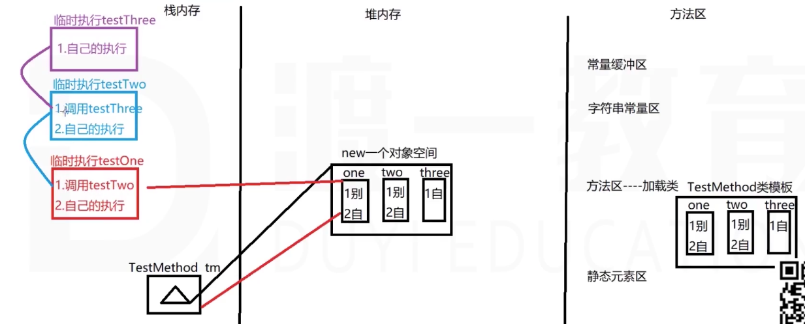

   循环能做的事，递归都能做，但是递归能做的，循环不一定能做。

   递归的逻辑：先等着别人先干完事，我再执行。

   * 所以for循环是1-5层盖宝塔。递归是5-1等待，1执行完，逐步完成最后的执行。
   * 递归是调用从上到下，执行从下到上。
   * 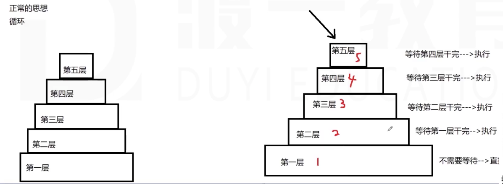

   ```java
   public void buildTower(int floor){
     if(floor>1){  //停止递归的条件
       this.buildTower(floor-1);  //递归
     }
     System.out.println("盖到了第"+floor+"层");
   }
   ```

   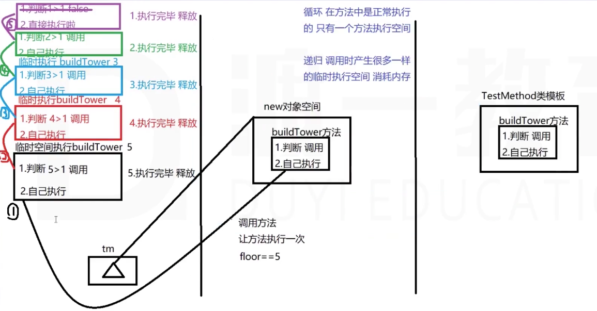

   * 递归更消耗内存

3. 遍历文件夹

   ```java
   public class TestFIle{
     public void showFIle(File file){
       //判断file如果是一个文件夹，且有元素，则找一个人去里面找
       File[] files = file.listFiles();
       if(files!=null && files.length!=0){//说明此元素是文件夹，且有子元素
         for(File f:files){
           showFile(f);//每个子元素完成类似操作
         }
       }
       System.out.println(file.getAbsolutePath());//如果file只是个文件或空文件夹，那么打印绝对路径
     }
   }
   ```

   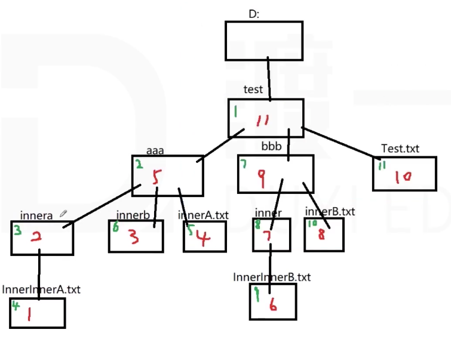

   * 绿色为如果把输出本文件的绝对路径放在第一行执行。（红色是放在最后一行执行）

4. 删除一个文件夹

   * 因为.detete()方法只能删文件或空文件夹，不能删有子元素的文件夹。所以要设计一个递归方法来删除一个文件夹。

   * ```java
     public void deleteFiles(File file){
       FIle files = file.listFiles();
       if(files!=null && files.length!=0){//注意files是一个数组
         for(File f:files){
           deleteFiles(f); //对每一个子元素来一遍这个操作
         }
       }
       file.delete();//删除一个文件或空文件夹
     }
     ```

5. 文件夹的路径（找父路径）

### 1、字节型文件流 - Stream

容器：

1. 变量：只能存一份
2. 数组：能存多个，数据类型统一
3. 集合：能存多个，数据类型统一，存储数量可变，泛型
   * 以上都存储在由JVM开辟的内存空间中，数据存储是临时性的。
4. 文件：能存多个
   * 文件存在硬盘上，永久性保存。
   * 数据虽然安全了，但需要通过IO操作文件。不能像前三个一样，直接操作。
   * 这就是数据库。

#### 1.1 FileInputStream类 - 继承InputStream(字节型输入流的父类)

构造函数：

1. **FileInputStream(File file)**

   ```java
   FileInputStream fis = new FileInputStream(new FIle("D://test//Test.text"));
   ```

2. **FileInputStream(String name)**

   ```java
   try{
     FileInputStream fis = new FileInputStream("D://test//Test.txt"); //很有可能会抛出文件不存在的异常，所以必须处理
   }catch(FileNotFoundException e){ //编译时异常
     e.printStackTrace
   }
   ```

方法：

1. .read() 每次读取一个字节(有个指针，每次调用读取下一个字节)

   *  --> int(该字节对应的Unicode码)，读不到则-1
   * `\n换行-结束本行=10  \r回车-光标会到最前=13`  可以把int转为char或任何你希望看到的输出形式
   * 会有编译时异常，所以也要try-catch

2. .read(byte[] b) 每一次读一个字节，存到数组里

   * --> int 读取到的有效字节个数，

   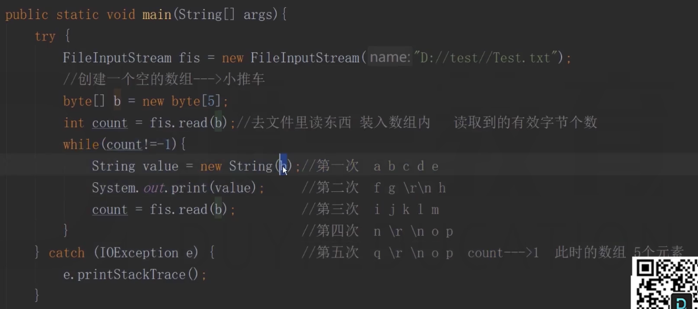

   * 得到的输出结果：

     ```java
     abcdefg
     hijklmn
     opq
     op  --> 这不在原文件中，为什么重复出现了？因为数组是不断被覆盖的。当没有足够多的元素覆盖到数组时，旧的元素还在里面。  
     ```

     程序修改：

     ```java
     String value = new String(b, 0, count); //读了多少个字符，就把多少字符存入String。（就数组依然没有覆盖完毕）
     ```

3. .read(byte[], int off, int len) --> int
4. .avaliable() 流管道中有多少缓存的字节（并不是文件中的字节，而是流管道中读取了文件的多少字节）
  
   * 可能在读取网络数据的时候，流管道中的字节数可能会有问题。不一定是同一批一起来的。
5. .skip(long n) 跳过几个字节 --> long(一般这个返回值不接收)
   * 多线程：利用几个线程同时读取文件
   * 即100000个字节，5个线程同时读取：1-2000，2001-4000，。。。（迅雷下载）

6. .close() 关闭流管道。(流管道必须要关，否则进程一直不结束)

   * 管道一定要关。一般放在finally里面。

   * 由于fis.close()必须放在finally里，而fis是定义在try里面的，所以办法是：把变量fis放在try外，赋值放在try里。另外finally里也要做判断和try-catch。

     ```java
     FileInputStream fis;
     try{
       fis = new FileInputStream(new File("D://test//Test.txt"));
       fis.skip(5);
       int code = fis.read();
     	System.out.print(code);
     }catch(IOException e){
       e.printStackTrace();
     }finally{
       try{//保险起见，因为fis如果没有成功找到file，可能有空指针的问题。
         if(fis!=null){
           fis.close();
         }catch(IOException e){
           e.printStackTrace();
         }
       }
     }
     ```

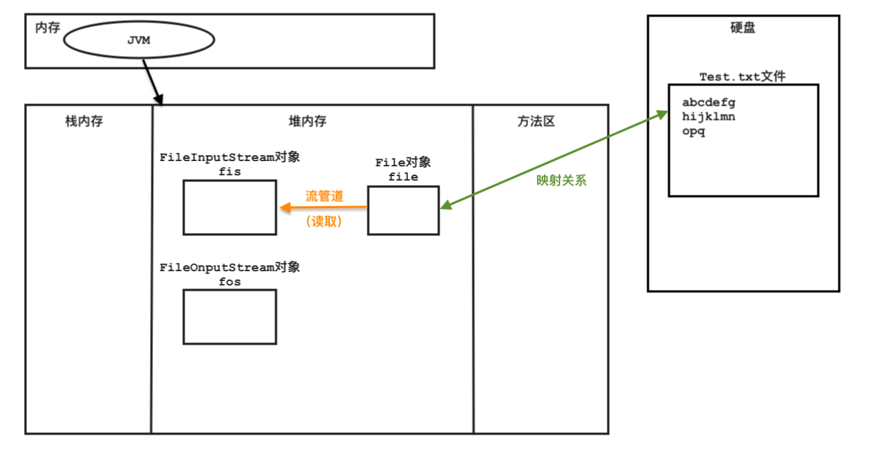

* 通过File对象来间接操作文件。

#### 1.2 FileOutputStream类 - 继承OutputStream(字节型输出流的父类)

构造函数：

0. 文件输出流不会造成FileNotFoundException，因为它总是会帮你创建一个新的指定文件。

1. **FileOutputStream(String path)**
   * 此方法的底层是：无论它是否能找到指定文件，它都会帮你创建一个新的此文件，并且覆盖掉旧的。
2. **FileOutputStream(String path, boolean append)**
   * 如果append==true，那么调用.write()会在文件(如果能找到这个文件)文字内容后面追加字节。如果文件找不到，则新建，并且文件支持追加。
3. **FileOutputStream(File f, [boolean append])**

方法：

1. .write(int code) 把写入流管道，一次写一个。.flush() 把流管道中的文字写入文件 - 刷新（新版本java把这个方法隐藏了）

   * int可以写char，'c'会自动转化为int。

2. .wirte(byte[] b)

   ```java
   String str = "1+1=2";
   Byte[] b = str.getByte();
   fos.write(b);  //前提是fos的append==true
   ```

3. .close()

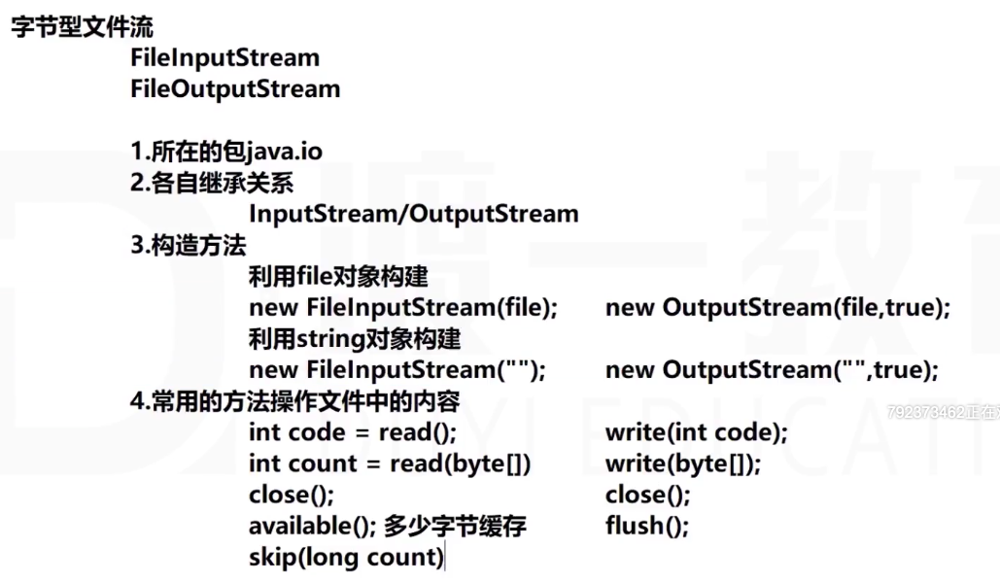

#### 2.n 练习

1. 文件的复制

   C://test//aaa.txt ---复制到---> D://某个位置

   步骤：找到C盘中的源文件，读内容。去D盘创建新文件，写入内容。

2. 文件的加密

   加密和解密

3. 文件夹的复制（递归）
4. 文件的剪切：先复制，然后删除原文件

### 2、字符型文件流 - Reader

字节型输入流**读取中文**：会按照字节范围读，中文字符占两个字节。拆能拆着读，关键是返回时组合不能有问题。

* 可以用byte[] b读取文件

  ```java
  try{
    FileInputStream fis = new FileInputStream("D://test//Test.txt");
  	byte[] b = new byte[5];
  	int count = fis.read(b);//一次读5个字节，有效读取次数存入count
    try{
      while(count!=-1){
        System.out.print(new String(b,0,count,"GBK")); //组合时
        count = fis.read(b);
      }
    }
  }catch(IOException e){
    e.printStackTrace();
  }finally{
  	fis.close();
  }
  ```

* 字节流的好处：什么文件都可以处理。不好处：可能会存在断码问题。
  
  * 能处理的文件是：纯文本文件。即用记事本打开能看懂的。docx就不是这类型。

#### 2.1 FileReader - InputStreamReader - Reader

构造函数：

1. FileReader(File f)
2. FileReader(String pathname)

* 也要处理异常

方法：

1. .read() 一次读一个字符 --> int
2. .read(char[] c) 一次读c.length个字符 --> int读取到的字符个数
   * .read(new char[1024])。把读取到的字符存入char数组。

#### 2.2 FileWriter - OutputStreamWriter - Writer

构造函数：

1. 带file参数，[boolean append]
2. 带String参数，[boolean append]

方法：

1. .write(int i) 一次写一个char字符
2. .write(char[] c)
3. .wirte(String s)

> #### Byte 和 char
>
> 1 bit = 0/1
>
> 1byte = 8bits
>
> 1kb = 1024 bytes
>
> |       |                 |          |
> | ----- | --------------- | -------- |
> | byte  | 1byte = 8 bits  | -128~127 |
> | short | 2bytes = 16bits | 3万2     |
> | int   | 4bytes = 32bits | 21亿     |
> | long  | 8bytes = 64bits |          |
>
> char是UTF-16(16-bit Unicode Transformation Format)编码的字符集。由1-2个16bits的代码单元组成。
>
> * is a [character encoding](https://en.wikipedia.org/wiki/Character_encoding) capable of encoding all 1,112,064 non-[surrogate](https://en.wikipedia.org/wiki/Universal_Character_Set_characters#Surrogate) [code points](https://en.wikipedia.org/wiki/Code_point) of Unicode。
>
> * UTF-16的编码方式为：
>
>   1. Characters with values less than 0x10000 are represented as a single 16-bit integer with a value equal to that of the character number. 
>
>      * 值<65536的char，直接用16-bit的整数来表示这个char。
>
>   2. Characters with values between 0x10000 and 0x10FFFF are represented by a 16-bit integer with a value between 0xD800 and 0xDBFF (within the so-called high-half zone or high surrogate area) followed by a 16-bit integer with a value between 0xDC00 and 0xDFFF (within the so-called low-half zone or low surrogate area).
>
>      ```
>      Note: Values between 0xD800 and 0xDFFF are specifically reserved for use with UTF-16, and don't have any characters assigned to them.
>      ```
>
>      * 65536<=char值<=1114111的char，用两个大小分别在55296~56319和56320~57343的16-bit整数来表示。
>      * 在这两个区间，没有对应的Unicode字符，这两个区间纯粹用于为UTF-16编码。
>
>   3. Characters with values greater than 0x10FFFF cannot be encoded in UTF-16.
>
> 在学String的时候，有codePoints和code unit的区别问题。
>
> * String的本质是一个char系列。但是char是UTF-16编码的。
> * 对于Unicode编码范围大于65535的char，要用两个code units来表示这个字符。
> * str.length() 得到的是这个字符串的code units数量。当你使用str.charAt(i)，得到的也是对应的code unit的结果，而不是真正的char。如果你想得到一个字符串真实的长度，要用str.codePointCount()。
> * 所以书中强烈不建议在程序中使用char类型。并且把字符串当做抽象数据类型处理。（没懂）

疑惑是：文件用byte读写和用char读写的区别是什么？

* 最终两种方式都可以把文件底层的010101完整地复制过来。但是如何转回呢？哦，因为我们不需要输出？？？
* 当我们要输出打印的时候，就要考虑，当初那个文字，在写入时，用的是什么字符集。数字就是那些数字，它包含着完整的信息。你如何解码，决定了这个字符它转为char之后，表现为什么——是英文，是数学符号，是德文，中文，阿拉伯文。所以说，解码由字符集决定。
* 你写了什么，就存进去了什么。中文也有储存的方式。但是怎么把复制过来的数字们，转成原文。需要字符集。

#### 2.3 字符集

计算机最早设计时只处理英文字母、数字和符号——1字节  8bits 256就够。

后来要处理比如中文这样的字符：需要更多字符来存储和表示它。

拆分组合的规则——就叫字符编码。

字符集编码有很多种，常见的有：

* ASCII = American Standard Code for Information Interchange 美国信息交换标准码（单字节）
* GB2312  GBK  BIG5(包括了繁体字)
* Unicode(java默认)
* UTF-8
* ISO-8859-1(Tomcat默认编码字符集)  (单字节)

Windows默认字符集GBK  Linux(MacOS)默认字符集UTF-8

IDE默认字符集：

* IDEA = UTF-8
* Eclipse = BGK

> 指定字符集进行String构建：new String(byte[], "UTF-8");
>
> 根据字符集解读String：String s = "你我他";   byte[] b = s.getBytes("UTF-8");

HTML浏览器解析文字使用的字符集：UTF-8或GBK

> 理解：文字在写入的时候，编辑器或系统本身有默认的编码字符集，一个字被通过某种方式编码储存在电脑上(010101-数字)。
>
> * 当我们复制的时候，底层的010101，即数字，标识本身，会被完整复制。不论是以byte为单位，还是以char为单位。
>   * byte=8bits   char=16bits   （但char存在大于65535的值，这种时候怎么处理的？不过复制是不会有问题）
> * 当我们读取的时候，有底层的转码过程，即把01001这样的数字转为对应char值的过程。编码的字符集，和逆编码的字符集如果不一样，必然会有不同的结果出来。
>   * 我可能需要试一下，mac记事本里写中文，idea是否能读取出来。byte应该不行（不一定）。
>   * byte用数组测。char用超过65535的值测。

### 3、缓冲流*

为了在流管道内，增加缓存的数据，让我们使用流读取文字更加稳定流畅。

#### 3.1 **BufferedInputStream** / **BufferedOutputStream**

* 带缓冲流的文件字节流：**BufferedInputStream** / **BufferedOutputStream**

  * 构建方式：使用低级流构建 -> 真实操作还是低级流，只不过高级流有缓存。

    方法：与低级流方法基本一致

    * BufferedOutputStream没有append属性。因为高级流的操作由低级流完成。

#### 3.2 BufferedReader / **BufferedWriter**

* 字符流：**BufferedReader** / **BufferedWriter**
  * read方法：.read()  .readLine()读一整行-->String
  * write方法：.write(int / char[] / String)      .newLine()光标移到下一行   .flush() -> Flushes the Stream

## 二、数组流

byte[]           ByteArrayInputStream  ByteArrayOutputStream

char[]           CharArrayReader     CharArrayWriter

## 三、数据流

DataInputStream     DataOutputStream

读取基本数据。

## 四、对象流*

ObjectInputStream   ObjectOutputStream

对象的序列化/反序列化：

* 对象序列化指：将一个对象拆分为字节碎片，记录在文件中
* 对象反序列化：将对象的字节碎片组合成一个完整的对象
* 要使用对象流的对象/类：必须实现了Serializable接口(示意性接口，无任何实质性操作)

构造：对象流是高级流，需要一个低级流为它干活。

对象存入文件时，遇到的问题：

* 对象所在的类需要序列化，即实现序列化接口
* 同时为了对象可以反序列化，需要加一个属性 private long serialVersionUID = 任意Long;用于检测版本。

对象读取时，遇到的问题：

* 对象没有serialVersionUID：需要在对象所在类，加一个属性。

> EOFException：说明没有对象

通常，我们会把对象放在集合里，然后把集合用对象流存入文件。

## 五、字符串流

StringReader   StringWriter


# 线程

之前我们接触过：

* String家族：StringBuffer -> StringBuilder

* 集合：Vector -> ArrayList      HashTable -> HashMap

## 一、线程相关概念：

* 程序：一组静态代码
* 进程：正在执行的程序
* 线程：正在执行程序中的小单元

线程：

1. 主线程：系统线程
2. 用户线程：main
3. 守护线程：GC

学习线程：

* 线程——操作系统级别 CPU

* 如何在java中创建线程

* 掌握每一个线程的几种不同状态，以及状态间如何切换

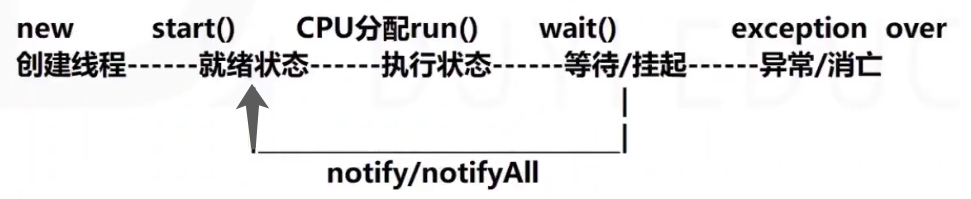

### 1. 实现线程的过程1：

1. 自己描述一个类
2. 继承extends父类Thread
3. 重写run方法
4. new一个类对象，调用strat()让线程进入就绪状态（CPU分配时间碎片，调用我们重写的run()就可以执行了）

例子1：跑步小例子

例子2：字节型文件输入流，5个线程对象同时读。

### 2. 避免单继承的缺陷，实现线程的过程2：

1. 描述一个类
2. 实现implements一个父接口Runnable
3. 重写run方法
4. new一个类对象，new一个Thread对象(引用类对象)：`Thread t1 = new Thread(new People("博尔特"));`，线程对象.start()进入就绪状态。

例子3：12306窗口卖票。

> User类，Ticket类这种只有属性，没有方法的类，一般存在文件中。所以里面的**属性，最好不要写基本类型，全部用引用类型和包装类。**因为文件读取可能会有读不出内容的时候，会是null，如果存入基本数据类型，会异常。
>
> System12306类：
>
> * 属性：ticket对象要存入系统的集合属性中——用vector比ArrayList好，因为线程安全。`private Vector<Ticket> tickets = new Vector<>();`

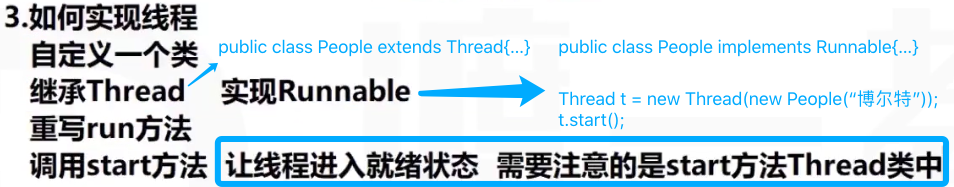

* 所采用的例子是运动员跑步。

## 二、线程状态切换 - 生产消费者模型

生产者放东西，消费者拿东西。尽量平衡放和拿的速度。

购票例子：利用Vector集合的线程安全特性，多个线程并发操作同一个集合时，不会抢夺资源。

1. 生产消费者模式，会引发**线程安全问题**——资源抢夺的问题。
   * 两个生产者同时放对象，可能会产生异常。
   * 两个消费者同时取，会产生异常。（判断都能通过，拿的时候不一定有资源，会产生Array）

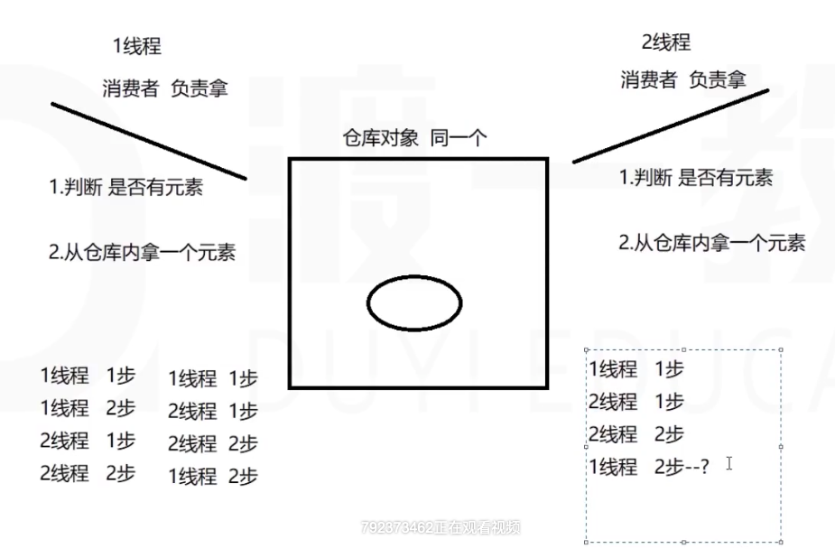

2. 解决线程安全问题：

   * 让仓库**对象在被某个线程访问的时候，锁定对象，不允许它再同时被其他线程访问**。那么仓库对象只能被一个线程访问，其他线程出于等待状态。

   * 修饰特征符：**synchronized** 同步——只有一个线程访问。（线程安全锁）

     1. **放在方法结构上**：调用这个方法的仓库对象被锁定，被访问这个对象的线程锁定。

        ```java
        public synchronized void get(){   //调用这个方法的仓库对象被锁定，只能被一个线程访问
          仓库.remove();
        }  
        ```

     2. **放在方法（构造方法、块）内部**：

        ```java
        public void get(){
          ...
            ...
            synchronized(对象){...}  //可以锁定调用这个方法的对象和括号中的对象
          ...
        }
        ```

3. 在 (不加锁的) void方法中使用return：可以让方法执行到这里时结束方法。(add和get方法中)

   但是，我们希望线程在这里开始等待。而不是结束方法。

   1. wait()   Object类中的方法 —— 对象等待 —— **this.wait()不是仓库对象等待，是访问这个对象的线程wait()。**

      * add和set方法中的else { 从return改为wait() } ---> 会产生假死状态 —— 线程全部进入等待状态。
      * 那么我们还需要叫醒线程。

   2. notify()   notifyAll()  Object类中的方法 —— 唤醒 —— 但是会产生一个**IllegalMonitorStateException异常**

      * 原因是仓库对象执行到this.wait()的时候，通知访问此对象执行此方法的线程对象进入等待状态。但由于多线程并发(方法没有加synchronized锁)，”通知等待“的线程变成了另一个线程，导致了这个异常。

      > notify()随机叫醒一个线程，所以一般notifyAll()全部叫醒。
      >
      > 但是有时候，即使你全部唤醒，但是一经判断又执行不了，又进入了睡眠状态。
      >
      > 所以，设置优先级的方法，来帮助我们改变线程顺序，但也不完全能决定线程顺序。
      >
      > * sleep()   run()  start()  setPriority()  getPriority()  是Thread类中的方法
      > * wait()  notify()  notifyAll()  是Object类中的方法

      设置线程优先级：可以帮助我们改变线程执行顺序，但不能完全决定线程顺序 —— 因为这由CPU分配时间碎片。

      ```java
      producer p = new Producer();  
      p.setPriority(10);              p.getPriority();
      ```

      * 1-10，数字越大，优先级越高，更容易获得CPU分配的资源碎片

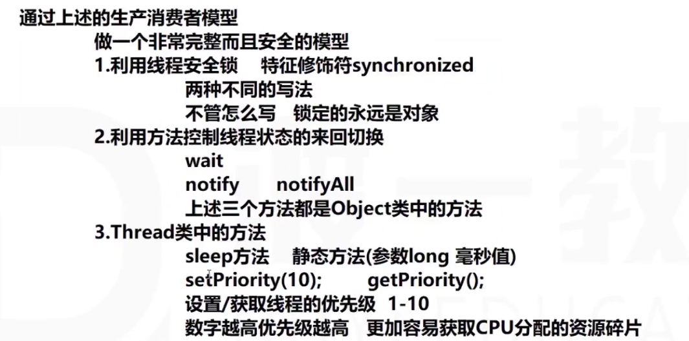

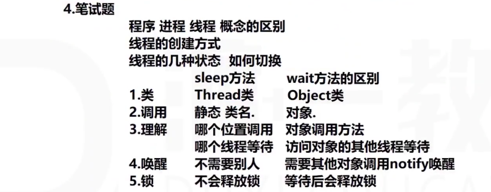

## 三、join

Thread类方法：让两个并行的线程合为一个单线程。

设计一个模型：

1. 两个线程：one和two，让tow加入one里面
2. 设计模型时：two线程在one线程的run()方法里创建，保证二者的先后顺序
3. two.join() 则two执行完，one继续执行；two.join(2000) 则two执行2秒后，one不再等待，继续自己的执行。

```java
public class ThreadOne extends Thread{
  public void run(){
    //one先启动
    ThreadTwo two = new ThreadTwo();
    two.start();//two就绪 --> CPU分配后，自动启动
    try{
      two.join(2000);//two加入one。谁加入，谁join。                -----//线程对象.join()要try-catch
    }catch(InterruptedException e){
      e.printStackTrace();
    }
		//one等待two执行完毕，然后one执行完毕。
  }
  
}
public class ThreadTwo extends Thread{
  public void run(){
    try{
      Thread.sleep(5000);//two的执行过程就是睡5秒。            ------//Thread.sleep()要try-catch
    }catch(InterruptedException e){
      e.printStackTrace();
    }
  }
}
```

4. one对two有两次操作：
   * join时允许two进入线程，并且two先执行。
   * two执行完毕。或，one等待2000毫秒后，把two推出，自己继续执行。
5. 此时加入three：

```java
/** 
 * 线程3的设计目的：在two的执行过程中，在one推出two之前，three把two锁定
 * synchronized锁的使用方法：
 *	 ①写在方法体上，谁调用这个方法，就锁谁。这里锁的就是ThreadThree对象，这显然不满足我们的目的。
 *	 ②方法内，synchronized(要锁定的对象){}。这个符合我们的需要。
 */
public class ThreadThree extends Thread{
  ThreadTwo two;
  public ThreadThree(ThreadTwo two){
    this.two = two;
  }
  public void run(){ 
    synchronized(two){ //锁定two
      try{
        Thread.sleep(10000);//three睡眠10秒
      }catch(InterrupedException e){
        e.printStackTrace();
      }
      //two被释放
    }
    //three执行结束
  }
}

public class ThreadTwo extends Thread{
  public void run(){
    ThreadThree three = new ThreadThree(this);  //在two中new一个three对象，用于锁定自己
    three.start();
    try{
      Thread.sleep(5000);//two的执行过程就是睡5秒。            ------//Thread.sleep()要try-catch
    }catch(InterruptedException e){
      e.printStackTrace();
    }
  }
}
```

* 此时，线程one启动 -> two启动 -> three启动。
* two加入one -> 2秒后，one要将two推出，却发现two被其他对象锁定 -> one只能等待其他对象把two释放后，才能推出。
* two在被锁定时执行完毕，结束 -> three锁定two结束，释放two -> three结束 -> one推出two，one执行结束。

```java
one start.
two start.
three start.
two is locked.
two end.
two is free.
three end.
one end.
```

* 锁非常厉害：一旦对象被锁定，不释放的情况下，其他对象都必须等待。
* 锁可能会产生死锁的问题。
  * 死锁：所有线程都在互相等待，僵持。

join源码：

```java
public final synchronized void join(long millis){
  long base = System.currentTimeMillis();
	long now = 0;
  if(millis<0){
    throw new IllegalArgumentException("timeout value is negative");//等待时间不能为负数
  }
  
  while(isAlive()){ //join(0)走这个分支
    wait(0); 
  }else{            //join(2000)走这个分支
    while(isAlive()){
      long delay = millis-now; //2000-0==2000毫秒
      if(delay<=0){
        break;
      }
      wait(delay);
      now = System.currentTimeMillis()-base;
    }
  }
}

public final synchronized void join() throws InterrupedException{
  join(0);
}
```

* **final**：方法不能被重写

* **synchronized**：锁。**谁调用这个方法，谁被锁定。谁锁定它？谁访问了这个被锁定的对象，就是谁锁的。**

  * two调用了join方法：

  * ```java
    while(isAlive()){//two.isAlive()==true
      wait(0);//this.wait() --> two.wait() --> two调用wait()，不是two等着，是访问two对象的线程等着 --> one等着
    }
    ```

  * wait(0)：一直等着。wait(2000)：等待2000毫秒。

  * **wait() 方法是Object类的方法，并且是public final nativ void方法。**

* **方法重载**：

  * **.join() 无参数：**表示一直等two执行完，one才执行
  * **.join(2000) 有参数：**表示one等待two2000毫秒时间，然后不再等待，将two推出，自己继续执行。

## 四、死锁

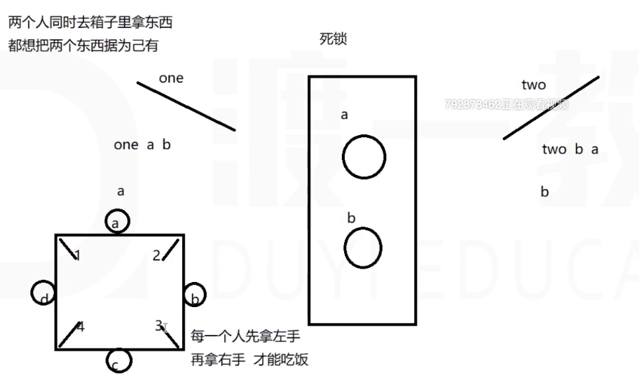

经典死锁模型：哲学家就餐问题。

可能产生的结果：

1. 有的哲学家率先拿到左右的筷子，吃完，释放筷子，其他哲学家逐步拿到已吃完的哲学家释放的筷子，任务顺利完成。
2. 所有哲学家同时，都先拿到左手筷子，全在等待右手筷子 —— 死锁。

解决死锁的问题：

1. 礼让 —— 产生时间差
2. 不要产生对象公用的问题

## 五、Timer计时器 - java.util

一个线程应用。Timer是一个线程类。

```java
Timer timer = new Timer();//启动一个timer thread小线程，做记录，每隔一段时间。
timer.schedule(TimerTask task, Date firstTime, long delay, long period); //毫秒值

//使用.schedule()方法:
SimpleDateFormat sdf = new SimpleDateFormat("yyyy-MM-dd HH:mm:ss");
Date firstTime = sdf.parse("2019-01-31 11:50:00");//.parse()方法将String转换成Date类型
Timer.schedule(new TimerTask(){
  public void run(){
    for(int i=0;i<10;i++){
      System.out.println("给"+i+"发送了一条垃圾信息");
    }
  }
}, firstTime, 3000);
```

* TimerTask是一个抽象类，不能new对象，所以此处是一个匿名内部类。即，这个匿名内部类是TimerTask类的子类-具体类，并且没有名字。

## 六、多线程的使用

有效利用多线程的关键是理解程序是并发执行而不是串行执行的。例如：程序中有两个子系统需要并发执行，这时候就需要利用多线程编程。通过对多线程的使用，可以编写出非常高效的程序。

不过请注意，如果你创建太多的线程，程序执行的效率实际上是降低了，而不是提升了。请记住，上下文的切换开销也很重要，如果你创建了太多的线程，CPU 花费在上下文的切换的时间将多于执行程序的时间！


- 新建状态:

  使用 **new** 关键字和 **Thread类或其子类**建立一个线程对象后，该线程对象就处于新建状态。它保持这个状态直到程序 **start()** 这个线程。

- 就绪状态:

  当线程对象调用了**start()**方法之后，该线程就进入就绪状态。就绪状态的线程处于就绪队列中，要等待JVM里线程调度器的调度。

- 运行状态:

  如果就绪状态的线程获取 CPU 资源，就可以执行 **run()**，此时线程便处于运行状态。处于运行状态的线程最为复杂，它可以变为阻塞状态、就绪状态和死亡状态。

- 阻塞状态:

  如果一个线程执行了sleep（睡眠）、suspend（挂起）等方法，失去所占用资源之后，该线程就从运行状态进入阻塞状态。在睡眠时间已到或获得设备资源后可以重新进入就绪状态。可以分为三种：

  - 等待阻塞：运行状态中的线程执行 wait() 方法，使线程进入到等待阻塞状态。
  - 同步阻塞：线程在获取 synchronized 同步锁失败(因为同步锁被其他线程占用)。
  - 其他阻塞：通过调用线程的 sleep() 或 join() 发出了 I/O 请求时，线程就会进入到阻塞状态。
    - 当sleep() 状态超时，
    - join() 等待线程终止或超时，
    - 或者 I/O 处理完毕，线程重新转入就绪状态。

- 死亡状态:

  一个运行状态的线程完成任务或者其他终止条件发生时，该线程就切换到终止状态。

# 反射 reflect

底层的技术——反射技术。

String类是一种特殊的引用类型。String s = "abc";  new;

* 不可变特性：长度，内容（public final class String{ private final char value[]; ...} )

* 但是String可以通过反射改变value值

反射 reflect：

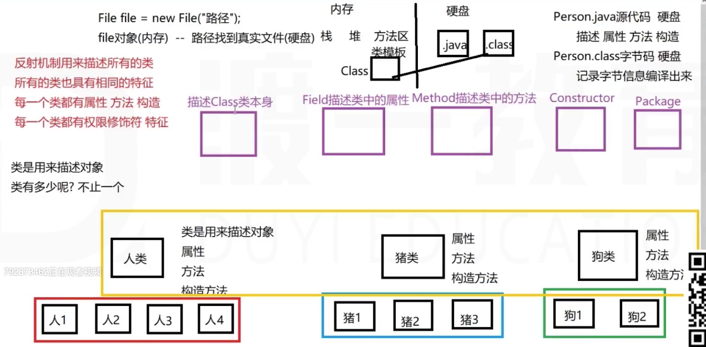

* 类是用来描述对象的
* 反射机制用来描述一组类
  * Class  描述类本身
  * Field  描述类的属性
  * Method  描述类的方法
  * Constructor  描述类的构造方法
  * Annotation  描述类的注解@Override (注解可以放在类的上面、属性上、方法上、构造函数上、参数前)
  * Package  描述类所属的包

1. 如何获取Class
   * Class clazz = Class.forName("包名.类名");  //类全名
   * Class clazz = 类名.class;
   * Class clazz = 对象变量.getClass();  //Object类中的方法

2. Class常用方法

   * .getModifiers() -> int  //每个修饰符用一个整数来表示：
     
* 0默认不写  1public  2private  4protected  8static  16final  32synchronized  64volatile  128transient  256native  512interface  1024abstract
     
   * .getName() -> String类全名（包括包名）
   
   * .getSimpleName() -> String类名

   * .getPackage() -> Package  获取包
   
   * .getSuperClass() -> Class  获取父类

   * .getInterfaces() -> Class[]  获取所有接口

   * `-------------------------------------------------------------------------------------------------`
   
   * .newInstance() -> Object  调用无参数构造器，构造一个对象，但需要造型
     
   * Person p = (Person) Class.forName("Person").newInstance();  
     
* .getField(String "属性名") -> Field nameField 获取属性
   
     * 这个Field属性：.getModifiers() -> int 获得属性自己的修饰符
     * .getType() -> Class 获取属性所属的类
     * .getName() -> String 获取属性名
     * 操作属性：
     * **nameField.set**((Person)Class.forName("testReflect.Person").newInstance(), "zhang"); 用一个属性对象，给一个类对象赋值
     * **nameField.get**(p);
   
     > 正常创建对象和属性赋值：
     >
     > * 对象 = new();
     >
     > * 对象.属性 = 值;  //赋值
  >
     > * 值 = 对象.属性;  //取值
  >
     > Field获得属性对象和赋值：
     >
     > * 属性对象 = 类.getField();
     > * 属性对象.set(哪个类对象,值);   //赋值
     > * 值 = 属性对象.get(哪个类对象);  //取值
   
   * .**getFields**() -> Field[] 获取所有属性 （只能获取公有属性，本类和父类的公有属性）
   
   * .**getDeclaredField**(String fieldName) -> Field[] 获取声明的属性（只能获取本类声明的属性，不能获取父类的属性）
   
     * 这种Field，不能用set赋值——叫产生IllegalAccessException
     * 给这个Field f，设置**.setAccessible(true)**。这个Field就可以set了。
   
   * 所以，反射可以改变String：
   
     ```java
     public class ChangeStringValue{
       public static void main(String[] args){
         String str = "anc";
         //反射可以获取私有属性，可以操作私有属性
         //1. 获取String类
         Class clazz = str.getClass();
         //2. 获取String类的value属性
         Field field = clazz.getDeclaredField("value");
         //3. 设置私有属性可以被操作
         field.setAccessible(true);
         //4. 获取value值——应该是个数组的地址
         char[] temp = (char[])field.get(str);
         //5. 设置数组的每个值
         temp[0]='z'; temp[1]='x';temp[2]='y';
         System.out.println(str);//zxy
       }
     }
     ```
   
     * String长度不可变，但是值可以变。——然而这样做并没有什么意义。

## 一、知识回顾：类用来描述对象，反射用来描述类本身。

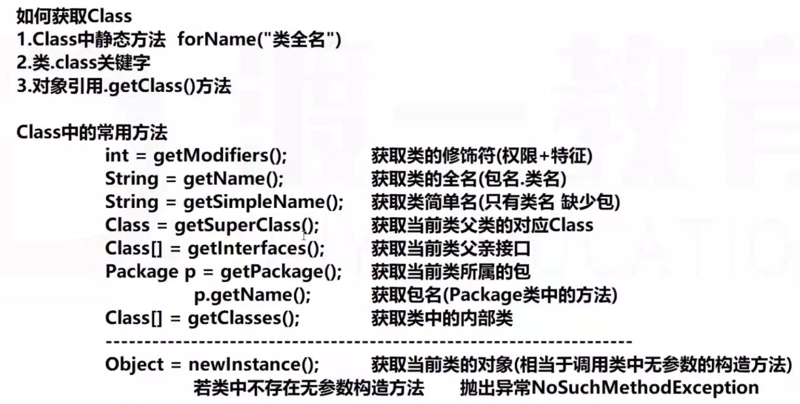


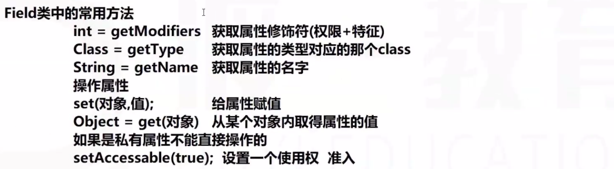

## 二、如何操作类中的方法Method

```java
public class Person{
  public void eat(){...}
  public void eat(String s){...}
}
```

1. 获取Person对应的类：Class clazz = Person.class;
2. 通过clazz，提供方法名定位方法：Method m = clazz.**getMethod**("方法名", 方法形参所属的类...);
   * 方法名："eat"
   * 方法形参所属的类：无参的eat方法——不写；有参数的eat方法——String.class
   * eg: Method m = clazz.getMethod("eat", String.class);
   * **可以获取公有方法（自己类+父类）**

3. Method的方法：

   1. m.getModifiers() --> int
   2. m.getName() --> String
   3. m.getReturnType() --> Class
   4. m.getParameterTypes() --> Class[]  参数列表
   5. m.getExceptionTypes() --> Class[]  异常类型列表
   6. m.getAnnotation()
   7. m.invoke(p对象) -> 返回值都是Object  （所以需要造型才可以使用返回值）
      * 方法.执行(本类对象，执行方法需要传递的参数列表...)

4. clazz.getMethods() --> Method[]  获取所有方法（公有）

5. clazz.**getDeclaredMethod**("name", 参数列表...) --> Method  获得声明的方法（包括私有的也可以访问到）

6. clazz.**getDeclaredMethods**() --> Method[]

   8. m.setAccessible(true)

   9. m.invoke(p)  ---> 私有方法也可以调用

## 三、如何操作类中的构造方法Constructor

1. 找到类：Class clazz = Person.class;
2. 找到构造方法：Constructor con = clazz.getConstructor([Class...参数列表类型])。
   * 类名省略不用写，只需要参数列表。如果是无参的构造函数，就不用写任何参数。
   * clazz.getConstructors()
   * clazz.getDeclaredConstructor()
   * clazz.getDeclaredConstructors()

3. con.getModifiers()
4. con.getName()
5. con.getParameterTypes()
6. con.getExceptionTypes()
7. 操作构造方法：
   1. con.newInstance(参数) --> Object

## 四、案例

Spring开源框架：

* IOC控制反转——inversion of control 对象的控制权从new手里，转移到别人手里（反转）
* DI依赖注入：属性自动注入
* AOP面向切面

设计一个方法，帮我们控制对象的创建：

* 是否需要参数？String 类全名
* 是否需要返回值？对象Objetc

```java
package ioc;
public class MySpring{
  public Object getBean(String className){
    Object obj = null;
    Scanner input = new Scanner(System.in);
    System.out.println("请给"+className+"类的对象赋值")
    try{
      Class clazz = Class.forName(className);
      obj = clazz.newInstance(); //几乎每个类都有无参数构造——所以要习惯上写无参构造器
      //在这里做一个自动DI注入，对象中的所有属性赋值(包括私有属性)——一般用set方法或构造方法
      //1. 找到所有的set方法，给属性赋值
      Field[] fields = clazz.getDeclaredFields();
      for(Field field: fields){
        String fieldName = field.getName();
        String first = fieldName.subString(0,1).toUpperCase();//属性首字母大写
        String other = fieldName.subString(1);
        StringBuilder builder = new StringBuilder("set");
        builder.append(first);
        builder.append(other);//得到了set方法的名字
        Method setMethod = clazz.getMethods(builder.toString(),field.getType());//方法名，方法的参数所在类...
        System.out.println("请给"+fieldName+"属性提供值");
        String value = input.nexLine();
        //八个基本类型，七个有带String的构造方法
        Constructor c = fieldClass.getConstructor(String.class);
        setMethod.invoke(obj,con.newInstance(value));//对象，值  //问题①：->
      }
      
    }catch(Exception e){
      e.printStackTrace();
    }
    return obj;
  }
}
```

```java
Spring spring = new MySpring();
Person p = (Person)spring.getBean("ioc.Person");//获得对象
```

问题①：在转换值类型的时候遇到问题——所以类里的属性不要写基本类型，而写包装类。

* char单独判断，单独处理
* 属性是数组、集合、对象都处理不了。

# 注解Annotation

注释：//       /* 多行注释  */       /**  文档注释 */

注解：

1. 写法： 

   ```java
   @XXX[(一些信息)]
   ```

2. 放置在哪里：

   * 类的上面
   * 类成员的上面（属性、方法、构造方法）块上不写注解
   * 参数/变量前面

3. 作用：

   * 用来充当注释（仅仅为一个文字说明）
   * 用来做代码的检测（验证），eg：@override
   * 可以携带一些信息（内容），文件、注解。
     * 文件：.properties或.xml  ——> 好处在于代码包装起来jar，文件还可以修改。不好处是源代码和配置文件分开，读改麻烦。
     * 注解：开发时容易 ——> 读写或调整容易。不好在于，代码包装起来后，注解内携带的信息不能修改。

4. java中一些人家写好的注解我们使用：

   1. @Deprecated  方法是废弃的

   2. @Override  代码检测，检测此方法是否是一个重写

   3. @SuppressWarnings(信息)   去除警告

      1. 信息是String[]：比如 {"",""} 。如果数组内只有一个对象，就不用写大括号

      * ("unused")：变量定义后没有使用

      * ("serial")：实现了序列化接口，但没有写版本号

      * > 对象的序列化：Serializable，用来说明java版本号：
        >
        > private static final long serialVersionID = 1L;

      * ("rawtypes")：集合没有定义泛型类型

        ```java
        @SuppressWarning("rawtypes")
        ArrayList list = new ArrayList();
        ```

      * ("deprecation")：方法已废弃
      * ("unchecked")

      * ("all")：所有的警告 ----> 不推荐使用！！

5. 注解中可以携带信息，可以不携带

   1. 信息不能随便写，信息的类型只能是：
      * 基本数据类型
      * String
      * 枚举enum
      * 注解类型
      * 数值类型[]  数组里只能是如上四种

6. 如何描述一个注解类型

   * 关键词：@interface

   * 目的：让注解携带一些信息或内容

   * 和interface相似：可以描述public static final属性和public abstract方法

   * ```java
     public @interface MyAnnotation{
       public static final int field = 1;//属性，很少见 
       String test();//抽象方法：默认public abstract，必须有返回类型，不能void，且类型必须是上面那些（不能是包装类）
     	//方法必须传递。方法的作用是把我们的信息传递给别人。这个String是
     }
     
     ```

   * 我们自己定义的注解如果想拿来使用，光定义一个注解类还不够，还需要用元注解来辅助说明：

     * @Target({ElementType.FIELD,ElementType.Method,...})  可以放在哪里。{枚举类型}

       * ```java
         import static java.lang.annotation.ElementType.*; //静态导入
         @Target("FIELD,METHOD");//可以不用写ElementType.了。
         ```

     * @Retention(RetentionPolicy.RUNTIME) 描述当前这个注解存在的作用域

       * 源代码 ——> 编译 ——> 字节码文件 ——> 加载 ——> 内存执行
       * SOURCE                               CLASS                                     RUNTIME

     * @Inherited 描述当前这个注解是否能被子类对象继承

     * @Document 描述是否能被文档所记录

7. 使用自己描述的注解类

   ```java
   public class Test{
     @Myannotation(test="abc")
     public static void test1(){
       ......
     }
   }
   ```

   

   问题1：在注解里描述了一个方法，方法没有参数，只有返回值String[]。使用注解时，却让我们传参数

   * 理解为：注解的方法，是将文明传递给它的参数，搬运走，给别人

   问题2：别人写的注解不用写方法名，我们自己写的却需要写名字

   * 如果我们自己定义的注解只有一个方法，就可以省略方法名
   * 如果传递的信息是一个数组，数组内只有一个元素，可以省略大括号{}
   * 如果我们的注解类有两个方法：@MyAnnotation(value="abc", num=13)
     * 先后顺序无所谓


8. 解析注解中的信息(需要反射技术)

   ```java
   public class Person{
     @MyAnnotation({"zhxy","18","female"})   //这就是一个new的注解对象
     private String name;
   }
   
   public class TestMain{
     public static void main(String[] args){
       try{
         //利用反射获得注解对象
         Class clazz = Person.class;
     		Field field = clazz.getDeclaredField("name");
         MyAnnotation a = (MyAnnotation)field.getAnnotation(MyAnnotation.class);//要找MyAnnotation类型的注解
         //方法一：对象调用方法 —— 利用a对象，执行以下test方法
         String[] values = a.test();
         System.out.println(values);//zhxy
         //方法二：利用反射，执行a中的value方法
         Class aClazz = a.getClass();
         Method am = aClazz.getMethod("test");
         //am.invoke(对象，参数); -> 对象就是a，参数无。
         String[] values = (String[])am.invoke(a);//invoke方法返回的类型是Object类型
       }catch(Exception e){
         e.printStackTrace();
       }
     }
   }
   ```

9. IOC——用注解存放对象属性值

   ```java
   package ioc;
   public class Person{ //实体对象: 只有属性且类型是基本类型+String。没有方法，没有逻辑，只有构造函数。
     private String name;
     private Integer age;
     private String sex;
     
     @MyAnnotation({"zhang","18","male"})
     public Person(){}
     
     //方法：getName()   setName()
     //     getAge()    setAge()
     //     getSex()    setSex()
   }
   ```

   设计一个方法：给一个类名字，返回一个对象，对象有属性值。

   ```java
   public class MySpring{
     public Object getBean(String className){
   		Object obj = null;
       try{
         Class clazz = Class.forName(className);
         //obj = clazz.newInstance();
         Constructor con = clazz.getConstructor();
         obj = con.newInstance();
         //给对象的属性赋值
         Annotation a = con.getAnnotation(MyAnnotation.class);
         Class aClazz = a.getClass();
         Method am = aclazz.getMethod("test");
         String[] values = (String[])am.invoke(a);
         //赋值：找到属性对应的set方法进行赋值
         Field[] field = clazz.getDeclaredFields();
         for(int i=0; i<field.length;i++){
           //获取属性名
           String fieldName = field[i].getName();
           String first = fieldName.subString(0,1).toUpperCase();
           String other = fieldName.subString(1);
           String setMethod = new StringBuidler("set");
           setMethod.append(first);
           setMethod.append(other);
           Method m = clazz.getMethod(setMethod.toString(),field.getType());
           //执行找到的set方法: 但要注意String参数传入对应方法处理:找到field所在类带String参数的构造函数->创建对象
           //m.invoke(obj, values[i]);
         	m.invoke(obj, field.getType().getConstructor(String.class).newInstance(value[i]));
         }
       }catch(...){
         ...
       }
     }
   }
   ```

   使用：

   ```java
   Person p = (Person)(new MySpring().getBean("ioc.Person"));
   ```

   缺点：

   * 只能处理八个包装类（char还没处理），数组集合对象不能处理。通用性不够。

作业：

试着用文件流存值。

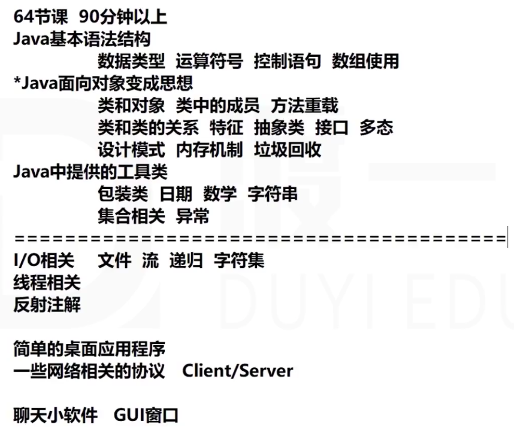

