本门课程一共2600分钟，1.5倍速是1733分钟，约29小时。计划每天5小时，6天完成。

> 包括笔记扩充，和对应书籍，把笔记完善到最佳版本。

# 〇、java历史

创始人：James Gosling

Sun公司：standard university network - 后注册公司名为：Sun Microsystem

1995年Sun公司正式发布java语言：1996年1月，开发工具包JDK1.0

1999年6月，java第二代平台JDK1.2，细化了三个不同方向的java版本：

* Java2 Standard Edition（J2SE）标准版，桌面级C/S
* Java2 Enterprise Edition（J2EE）企业版，企业级B/S
* Java2 Micro Edition（J2ME）微型版，移动端

2004年5月：JDK1.5版本发布。引入泛型，自动拆箱装箱等。改名Java5。

2005年6月：java6。最经典版本，留存最久版本。

2009年，Oracle并购Sun公司。java易主。

2011年，2014年，2017年，Oracle发布java789。

现在到java11。

### java特性

1. 跨平台。
2. 面向对象。
3. 简单性。省去了C++的多继承，指针等等
4. 健壮性。（robust）垃圾回收机制，异常处理机制
5. 多线程。并行操作，提高性能降低性能，线程安全
6. 大数据开发。（hadoop是java写的）

JVM，在内存中开辟一块空间，把源文件编译成字节码。

计算机的硬件组成：

* 内存（条形 8G 芯片 寻址 临时执行使用）
* 硬盘（矩形 1T 机械/固态 扇区 永久性保存）

jdk里包含jre，安装时就不用安装jre了。

### JDK里面包含什么

* bin文件夹：包含java语言的工具，最重要的是javac.exe 和 java.exe

* include文件夹：包含其他语言写的程序，native修饰符

* jre文件夹：java运行环境

* lib文件夹：以.jar打包好的，别人写的java类

* src.zip压缩文件：java源代码

# 一、java程序基础

```java
class 类名{
  	public static void main(String[] args){
      ...
    }
}
```

此处文件名与类名可以不一致。

但是如果是public class，类名和文件名就必须一致。

> 命名规则：
>
> * 字母(大小写敏感)
> * 数字(0_9，不能用作开头)
> * 符号(_$)（很少用来开头）（内部类，用dollar符开头）
>
> 规约：1. 大驼峰。2. 见名知义

### 1. 在运行程序时遇到的两个问题：（配置环境变量）

1. javac需要在doc命令窗口中使用
2. 需要把javac.exe和java.exe实现：在电脑中任何位置都能调用它们（搭建环境：配置环境路径）
   * 要把bin文件夹放入个人的【系统环境变量】中：把bin文件夹路径加入环境变量。
   * 重启cmd窗口
3. （答疑）还有很多人配置classPath，JAVA_HOME
   * classPath目的是，不管源文件在哪，生成的class文件都统一存储在配置的目录下
   * JAVA_HOME，目的是为了让路径的写法更简单（相对路径写法）

### 2. 执行.java文件

```bash
javac 文件名.java  //--> 生成了 类名.class 文件
java 类名
```

类名的文件后缀不需要写。

### 3. java数据类型

基本数据类型8种：4种整型(long int short byte)、2种浮点型(float double)、字符型(char)、布尔型(boolean)

引用数据类型5种：数组[]、类(抽象类)class、接口interface、枚举enum、注解@interface

#### 3.1 8种基本数据类型

|       整型       |  内存   |       |         取值范围         |                   取值方法                   |
| :--------------: | :-----: | :---: | :----------------------: | :------------------------------------------: |
| **byte** 字节型  | 8 bits  |  256  |        -128 ~ 127        | 0 000 0000<br />第一个bit位记录符号：0正 1负 |
| **short** 短整型 | 16 bits | 65526 |      -32768 ~ 32767      |                                              |
|   **int** 整型   | 32 bits | 42亿  | -2147483648 ~ 2147483647 |                                              |
| **long** 长整型  | 64 bits |  ...  |           ...            |                                              |

**float** 32位，**double** 64位：

* float，1位符号，8位整数部分，23位小数部分
* double，1位符号，11位整数部分，52位小数部分

**char**类型 16bits：

* 为了解决字符数字和整数的数字冲突，所以字符型所有字符，用单引号括起。eg：'a'  '+'
* 英文、符号、数字是1bit，用ascii编码。中文是2bits，用Unicode编码。
  * ascii编码（美国信息交换标准代码）：a ----- 0000 0000 ----- 97
  * 英文符号数字，加起来只有160+种。所以1bit够用。
  * 中文用Unicode编码，范围是0 ~ 65535（没有负数）。

**boolean**类型 1bit：true / false

> c语言中1和true可以转换，但是java中，1就是1，true是true，二者不转换。

#### 3.2 5种引用数据类型

### 4. java常量和变量

#### 4.1 常量

常量：在程序运行过程中，值不能改变的。

常量用于：

* 便于程序计算，比如π
* 代表一种含义，比如贪吃蛇中的1234分别代表up down left right四个方向

什么样的值算常量？

1. 固定不变的值：1  3.14  ‘a'  true
   * 所有基本类型的值，是固定不变的，就是常量
2. 特殊的常量
   * “abc” ---> String是一个引用数据类型，但String类的对象是不可变的，不能被修改（但可以改变引用来实现修改效果）。可以简单视为常量
3. 自己创建的空间，存储一个值，让它固定起来，不能改变
   * final修饰符：`final int up = 1;`

#### 4.2 变量

在程序执行过程中，值可以改变的。

变量是一个内存空间。

1. 变量空间在创建（声明）时，必须指定 数据类型 和 变量空间名字。

2. 变量空间里，只能存储一个内容（值 或 引用）
3. 变量空间的内容，可以改变

##### 创建变量：

```java
int a;
String b;
```

> 变量命名规则：
>
> ​	字母(大小写敏感)、数字(0-9,不能开头）、符号(_ $) 、中文（不推荐）
>
> 规约：
>
> ​	小驼峰，见名知义

**变量如果只声明了，却没有赋值（里面没有内容），则不能使用。**

##### 赋值变量：

```java
byte x = 1;
```

> 问题：
>
> 1. x是什么？变量空间  存在哪？------> 栈内存里
> 2. 1是什么？常量  存在哪？ ------> 常量缓冲区
> 3. =是什么？赋值符号 做了什么？

java文件在电脑中执行：

1. `java Demo` ---> 把硬盘上的Demo.class内容，加载到内存里。

2. 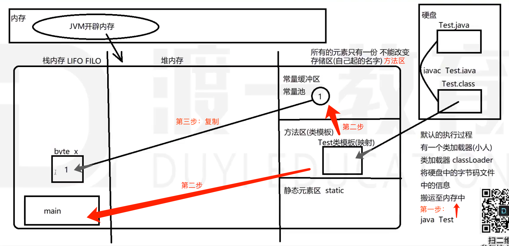

   栈内存：Last in, first out.

   1. ClassLoader把.class文件的信息映射到内存方法区。
   2. 堆内存里只存东西，不能用。所有的执行都在栈内存进行。
   3. 所以main方法的执行，在栈内存中进行。
   4. 然后声明变量x，在栈内存。存储区的常量只有一份不能改变，所以1是被复制过去的。

> 练习：
>
> 1. float e = 3.14F; float值要加F。（大小写都行）
>
>    因为常量池中默认存储空间大小：
>
>    * 1 ---> 用32bits存储（int）
>    * 3.4 ---> 用64bits存储（double）
>
> 2. byte a = 1; 大进小，没有报错，是因为1在存储中前面24位都是0，所以在存入a时，可以自动砍掉不存。
> 3. long d = 2147483648L; 数值超过int取值范围时，要加L。如果不加，编译时会告诉你，数字过大。
>    * 如果你依然要用这么大的数，在数后面加上L。
>    * 否则编译器认为你写错了。给你报错，并且不能通过编译。

#### 4.3 字符与字符串

|               字符                |                            字符串                            |
| :-------------------------------: | :----------------------------------------------------------: |
|               char                |                            String                            |
|           基本数据类型            |                         引用数据类型                         |
| 'a'<br />单引号内：必须有一个字符 | "a"  "abc"  "" null<br />双引号内：可以有0~多个字符。null表示 |

#### 4.4 数据类型之间的转化

大类型相同，可以直接转换：

1. 基本类型 与 基本类型 —— 可以直接转化（自动 或 强制）

2. 引用类型 与 引用类型 —— 可以直接转化（自动 或 强制：上转型或下转型）

* 基本类型 与 引用类型 —— 间接转化：使用包装类

##### 大类型相同 + 小数据类型相同：

* 整型 ←→ 整型 / 浮点 ←→ 浮点

  * 比较的是内存空间大小，大空间可以直接接受一个小值
  * （小到大）直接自动转换：`byte a = 1; int b = a;`

  * （大到小）**强制类型转换casting**：`int a = 1; byte b = (byte)a;`   `double d = 3.14; float f = (float)d;`

  > 强制类型转换时：比如int a = 1000; byte b = (int)a;
  >
  > 1. 1000转换为二进制：00000000 00000000 00000011 11101000  （方法：1000除以2取余，余数倒序排列——得有效位）
  >
  > 2. 截取8位：11101000
  > 3. 第一位是1所以是负数，负数转化为十进制：按位取反，加1，加负号。所以结果是b = -24。
  >    * 按位取反：00010111
  >    * 加1：00011000
  >    * 转换为十进制：- (8+16) = -24

##### 大类型相同 + 小类型不同：

* 整型 ←→ 浮点数
  * 比较精确程度：任何一个浮点型可以接受一个整型值。反之需要强制类型转化（强行把小数部分去掉）。
  * （整到浮）自动直接转换（long → float会让数值改变）
  * （浮到整）损失精度，**casting**：`float a = 3.0f; int b = (int)a;` 即使是3.0也要强制转换一下，否则会编译报错。

* 整型 ←→ 字符型：
  * （char到int）自动转化，Unicode底层计算用int。如果是char → short，要强制转化。 
  * （整到char）强制转化。

* boolean不能跟其他类型转化。

#### 4.- 注释

```java
//单行注释
/* 多行注释 */
/** 文档注释 */
```

### 5. java运算符

运算符，用于指明对于操作数的运算方式。

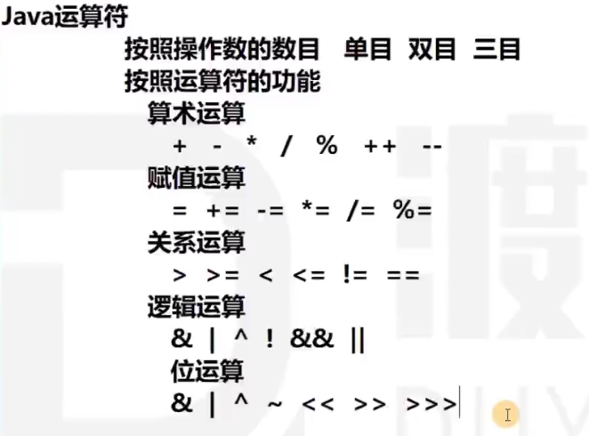

按照操作数的数目分类：

* 单目 a++
* 双目 a+b
* 三目 (a>b?)x:y

按运算符的功能分类：

* 算数运算符：` + `  ` - `  ` * `  ` / `  ` %(取余/取模)`   ` ++ `   ` -- `
* 赋值运算符：`=`  `+=`   `-=`   `*=`   `*=`  `%=`
* 关系运算符：`>`   `<`   `>=`   `<=`   `!=`   `==`  `instanceof`
  * 输出结果是boolean类型：true false。
* 逻辑运算符：`逻辑与&`  `逻辑或|`   `逻辑异或^`   `逻辑非!`   `短路与&&`  `短路或||`
  * 输出结果：boolean类型，true false
  * ^异或：左右不一致，为true
  * &&短路与：**什么时候短路？**
    1. 当左边为false的时候，直接短路，输出结果false。
    2. 如果发生了短路，性能比逻辑与&稍快。二者计算结果一样，发生短路时，短路效率更高。
  * ||短路或：
    1. 当左边为true时，直接短路，输出true。
* 位运算符（bit）：`&`  `|`  `^`  `~`  `<<`  `>>`  `>>>`
  * 输出结果：二进制数运算，再转化为十进制
  * &按位与、|按位或、^按位异或、~按位取反
  * <<按位左位移、>>按位右位移、>>>按位右位移(无符号)

#### 5.1 ++ --问题：

```java
int a = 1;
a = a++;
a == ? //1还是2？
```

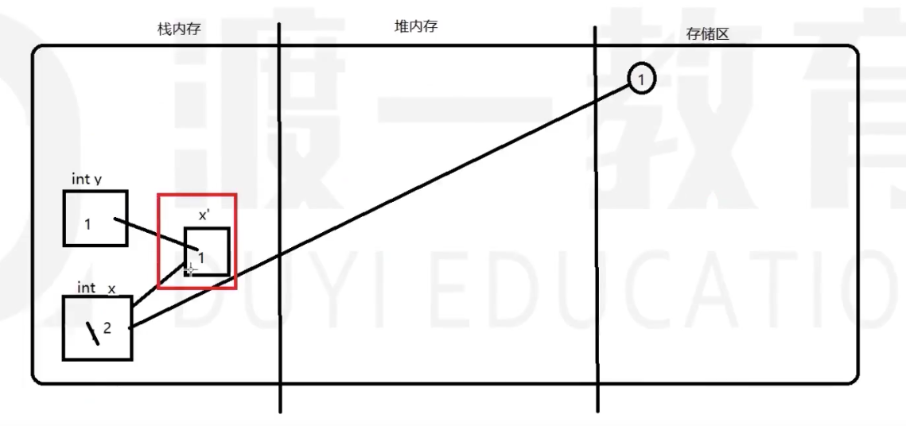

1. int x = 1; ----> 在栈内存得到一个区域，并复制常量1到区域内。

2. int y = x++; -----> 

   ①创建y。

   ②自增运算：创建一个x的临时副本区，备份x的值，备份方法根据自增属性确定。

   * x++  先备份，后自增（int x的值变为2，备份区的值存1）
   * ++x  先自增，后备份（int x为2，备份区备份2）

   ③赋值运算。备份区的值赋值给y，所以y == 1。

   ④备份空间没用了，销毁。

3. 所以本题：a = a++; a先自增，又被赋以自增前的原值，所以值为1。

笔试题：

```java
public class Demo1{
	public static void main(String[] args){
		int a = 1;
		for(int i=1; i<=100; i++){
			a = a++;
		}
		System.out.println(a);
	}
}
```

```java
public class Demo2{
	public static void main(String[] args){
		int m = 1, n = 2;
		int sum = m++ + ++n - n-- - --m + n-- - --m;
		System.out.println(m+" "+n+" "+sum);
	}
}
```

```java
Demo1：1
Demo2：0 1 2
```

#### 5.2 += 和 = +

```java
byte x = 1;  			//=号: 自动转化（去掉前面没用的0）
x += 2;      			//+=也是赋值运算: +号自动转化提升，=号再自动转化降低（去掉前面没用的0）
x = x + 3;//会编译出错。类型从int到byte会损失精度。需要进行强制类型转换：
x = (byte)(x + 3);//不会编译出错。
```

第1个式子和第2个式子：=号和+=号后面是一个数字（常量），它可以自动帮你转化。

第3个式子，=号后面是一个表达式，它不能确定你的运算结果，所以不能帮你自动转化。只能判断数值类型。

#### 5.3 = 和 ==

= 赋值：=右边的结果存入=左边的变量空间

== 比较符号：=左右的值或引用是否一致

#### 5.4 进制、反码、补码

八进制，0开头。

十六进制，0x开头。

|        |                  6                  |                              -6                              |
| :----: | :---------------------------------: | :----------------------------------------------------------: |
| 原码： | 00000000 00000000 00000000 00000110 |             10000000 00000000 00000000 00000110              |
| 反码： | 00000000 00000000 00000000 00000110 | 11111111 11111111 11111111 11111001<br />（符号不变，其余取反） |
| 补码： | 00000000 00000000 00000000 00000110 |     11111111 11111111 11111111 11111010<br />（反码+1）      |

* 反码：正数不变。负数符号位不动，其余取反。
* 补码：正数不变。负数反码＋1。

问题：~6 = ？

1. **计算机中不管是正数还是负数，存储的形式都是以补码形式来存储。**

2. 注意：反码是一种形式，**取反是取反是一个计算过程（每一个位置都取反）**。

3. 所以，~6是把6的补码取反，得11111111 11111111 11111111 11111001。

4. 转换十进制：按负数来处理

   ①反码（符号不变，其余取反）：10000000 00000000 00000000 00000110

   ②补码：10000000 00000000 00000000 00000111

   ③得：-7

5. 总结：~x的结果是—— -x-1

#### 5.5 左位移<< 右位移>>  无符号右位移>>>

左位移n：相当于，乘以2的n次

右位移n：除以2的n次

**问题：-6>>1**

11111111 11111111 11111111 11111010

* `>>` 保留符号位置
  * 1111111 11111111 11111111 11111101
* `>>> `不保留符号位置，都填0
  * 0111111 11111111 11111111 11111101

右位移取决于sign-extension。无符号右位移，全部用0。

```java
01111111 >>> 2 = 00011111
10000000 >>> 2 = 00100000

01111111 >> 2 = 00011111
10000000 >> 2 = 11100000
```

#### 5.6 笔试题

1. &和&&的区别：
   * &可以视为逻辑运算，可以视为位运算。&&只能进行逻辑运算。
   * 如果两个符号都做逻辑运算，区别是：
     * &左右都是true，最终结果为true
     * &&短路与，正常情况下执行结果与&一致。当左边为false时，发生短路，结果为false

2. 最有效率的方式计算2*8。

   * 计算机中的乘法运算：（跟小学乘法一样，32位bit的数字，按位乘，再相加，再换成十进制）

     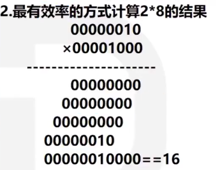（注意：这里省略了前面的0，应该是32位，这里只写了8位。）

   * 最有效的方法是2*8相当于2乘以2的3次幂。即2<<3。

3. int a = 1; int b = 2; 如何讲两个变量的值互换？
   * 方式一：用int c做中间交换。
     * 便于理解，但产生了新的运算空间。
   * 方法二：a = a+b; b = a-b; a = a-b;
     * 省了一个运算空间，相对不易理解
   * 方法三：a = a^b; b = a^b; a=a^b;
     * 1^2^2 ==> 1 **一个数字异或同一个数字两次，值不会改变。**
     * a = 001^010 = 011   (得异或中间值)
     * b = 中间值^b = 原a
     * a = 中间值^b = 原b

##### TODO：去网上找运算符号的优先级别，找符号运算题。

##### 综上：已学 [ 运算符号  变量空间  空间转换  数据类型 ]

### 6. java语法结构

顺序结构

分支结构：单分支if  多分支switch

循环结构：for    while    do…while

#### 6.1 单分支if

| 单行if                               | if...else...                                          | 嵌套if else                                                  |
| :----------------------------------- | :---------------------------------------------------- | ------------------------------------------------------------ |
| if(condition){<br />...<br />}<br /> | if(condition){<br/>  ...;<br/>}else{<br/>  ...;<br/>} | if(condition){<br/>  ...<br/>}else if{<br/>  ...<br/>}else{<br/>  ...<br/>} |

* if后面的大括号可以省略，省略后只有一行代码与之有关。
* condition的结果是一个boolean值。

> 让用户在程序外输入值——需要使用Scanner类。
>
> 想要实现让用户输入一个日期，我的程序给出结果，而不是每次我在程序里改值：
>
> 1. 引入scanner类：import java.util.Scanner;
> 2. new创建Scanner对象：Scanner input = new Scanner(System.in);
> 3. 使用Scanner类的对象做事：input.nextInt()读一个int值；input.nextLine()读一行。
> 4. 把读出来的值存入int变量day中去。（不存也行，下面if直接用）
>
> ```java
> import java.util.Scanner;
> public class Demo{
>   public static void main(String[] args){
>     System.out.println("请输入一个数字");
>     Scanner input = new Scanner(System.in);
>     int day = input.nextInt();//.nextInt()读一个int值，.nextLine()读一行。
>     if(day==1){
>       System.out.println("Monday");
>     }else if(day==2){
>       System.out.println("Tuesday");
>     }...else{
>       System.out.println("超过7不行");
>     }
>   }
> }
> ```

##### ※ 写程序时需要注意的问题

1. 可读性：名字规范，缩进，注释
2. 健壮性：判断逻辑要严谨、闭合
3. 实现功能的基础上，优化代码结构（代码结构简单、减少冗余、性能：内存空间问题，复用性，可扩展性）。

* 所以把有误提示信息放在if判断的最前面更好。
* 代码长度减少，判断次数减少（实现功能是其次，设计好代码）

```java
import java.util.Scanner;
public class Demo{
  public static void main(String[] args){
    Scanner input = new Scanner(System.in);
    System.out.println("请输入一个月份");
    int day = input.nextInt();//.nextInt()读一个int值，.nextLine()读一行。
    if(day>=12 || day<=1){
      System.out.println("输入数据有误");
    }else if(day>=3 && day<=5){
      System.out.println("春天");
    }else if(day>=6 && day<=8){
      System.out.println("夏天");
    }else if(day>=9 && day<=11){
      System.out.println("秋天");
    }else{
      System.out.println("冬天");
    }
  }
}
```

> Math包。（产生一个随机骰子数）
>
> * import java.lang.Math; Math在lang包，lang包可以省略引入。
> * new对象，因为Math的方法都是static方法，不需要对象。所以可以直接使用Math方法。
>
> double a = Math.random();  ---->产生的是double，范围是[0.0-1.0)。
>
> int disc = (int)(a*6+1);   ---->小数乘6，得结果是0-5.999，+1得1-6.999。强制类型转换，去掉小数点，就是1-6。

```java
import java.util.Scanner;
public class Demo{
  public static void main(String[] args){
    int disc = (int)(Math.random()*6+1);
    Scanner input = new Scanner(System.in);
    System.out.println("买大买小  买定离手");  //用户输入: 大 或 小
    String choose = input.nextLine();
    if((disc<=3 && choose.equals("小"))||(disc>3 && choose.equals("大"))){
      System.out.println(disc+",对了");
    }else{
      System.out.println(disc+",错了");
    }
  }
}
```

> String类型的值，判断相等，用.equals()
>
> Math.random()别忘了后面的括号

#### 6.2 多分支switch

switch只能做==类型的判断。

```java
switch(值){//值可以是: byte short int char  1.5版本enum  1.7版本String
  case 值1:
    			...;
    			[break;]//break可有可无，根据需要决定
  case 值2:
    			...;
  default:
    			...
}
```

switch和else if孰优孰劣？

* if语句。好处是，小括号里可以写很复杂的逻辑。不好是，执行慢。
* switch。好处：判断的过程效果更高。if是一个一个判断，switch是直接判断所有情况。不好是，只能做==固定值判断。

固定值判断，用switch。

* If ( 逻辑 ) {........}

* switch ( 值 ) {........}

> switch作业：判断学生成绩，60以下不及格，60-69及格，70-79中，80-89良，90-99优秀，100满分，数据有误。
>
> * 遇到的问题是，switch只能做值的判断，范围怎么变成值？
>   * 把分数/10，然后类型转换为int，得到分数段。然后做分数段switch判断即可。
>   * case 012345公用一个输出；之后每一个case一个break。
>   * 100的情况要判断：case 10: if(score=100){输出; break;}  default: 输出”没你“；
>     * 注意这个break。

#### 6.3 循环结构for,while,do...while

```java
for( 初始值; 终点判断条件; 变化量){
  .........  
}
while(终点判断条件){
  .........
}
do{
  ....
}while(终点判断条件)
```

* for循环允许把三个量放在括号里，但不是都要写
* 初始值在for外设定，for( ; 终点判断条件; 变化量) 分号不能省。

什么时候用while？

* 我只知道终点条件，不知道要执行几次循环，用while。

步骤：

1. 初始值
2. 判断条件：
   * true ---->  3. 执行条件  ----->  4. 执行变化量
   * false ----> 结束循环

> 变量的生命周期：从声明开始创建，用完回收。

#### 6.4 关键字break和continue

**break**：中断循环。在循环语句和switch的case中使用。

* 直接跳出最近一层for循环语句。for的i++也不执行，直接跳出。

* 隔循环中断外层循环语句：

  * 给外层循环前面加名字和冒号：

  * ```java
    name:
    while(...){
      for(...){
        break name;
      }
    }//continue同理
    ```

**continue**：结束本次循环，进入下一次循环。

1. break例题：下面shuai输出几次？最后i=？j=?

```java
public class Demo{
  public static void main(String[] args){
    int i = 1;
    int j = 1;
    for(;i<=5;i++){
      for(;j<=5;j++){
        if(j==3){
          break;
        }
        System.out.println("shuai");
      }
    }
    System.out.println(i);
    System.out.println(j);
  }
}
```

2次。i=6, j=3。

#### 6.n练习题

1. 甲乙丙丁题：甲+10  乙-20  丙*2  丁/2  则相等。总数370。

```java
for(int ave = 50; ave <= 100; ave++){
      if(ave-10+ave+20+ave/2+ave*2 == 370){
        System.out.println("甲乙丙丁分别是："+(ave-10)+","+(ave+20)+","+(ave/2)+","+(ave*2));
      }
}
//甲乙丙丁分别是：70,100,40,160
优化：如何让for循环的次数减少？ave的上限是95，下限是95/2=47。
```

2. 鸡兔同笼题：50只，160脚。

```java
for(int chiken = 0; chiken<=50; chiken++){
      for(int rab = 0; rab<=50; rab++){
        if(rab+chiken==50 && rab*4+chiken*2==160){
          System.out.println("鸡"+chiken+",兔"+rab);
        }
      }
}
//鸡20,兔30
//---------------优化: ----------------
for(int chiken = 0; chiken<=50; chiken++){
  	if((50-chiken)*4+chiken*2==160){
   	 	System.out.println("鸡"+chiken+",兔"+(50-chiken));
 		}
}
```

3. 找三位数字的水仙花数：各位数的3次方之和，等于此数本身

   四位数的水仙花数：各位数的4次方之和，等于此数本身

```java
for(int n = 100; n<=999; n++){
      int h = n/100;
      int t = (n-100*h)/10;  //t = n%100/10 或 n/10%10
      int o = n-100*h-10*t;  //o = n%10
      if(o*o*o+t*t*t+h*h*h == n){
        System.out.println(n);
      }
}
//153 370 371 407
double n = Math.pow(double a,double b)  //a的b次方,输出结果是double类型
//---------------优化: ----------------
for(int n = 100; n<=999; n++){
  if(Math.pow(n/100,3)+Math.pow(n/10%10,3)+Math.pow(n%10,3) == n){
        System.out.println(n);
	}
}
```

for循环嵌套：

画星星：

```bash
      *
     **
    ***
   ****
  *****
 ******
```

```java
public class Demo{
  public static void main(String[] args){
    System.out.println("输入一个数");
    Scanner input = new Scanner(System.in);
    int n = input.nextInt();//单数
    for(int i=1; i<=n; i++){
      for(int j=1; j<=n; j++){
          if(j<=(n-i)){
            System.out.print(" ");
          }else{
            System.out.print("*");
          }
      }
    	System.out.println();
		}
  }
}
```

画星星2：

```bash
***********
***** *****
****   ****
***     ***
**       **
*         *
```

```java
import java.util.Scanner;
public class Demo{
  public static void main(String[] args){
    Scanner input = new Scanner(System.in);
    System.out.println("输入一个单数");  //输入第一行需要多少星星（必须是单数）
    int n = input.nextInt();//单数
    for(int i=1; i<=(n/2+1); i++){
      for(int j=1; j<=n; j++){
         if(i>1 && (j>=(n/2-i+3)&&j<=(n/2+i-1))){
          System.out.print(" ");
         }else{
          System.out.print("*");
         }
      }
      System.out.println();
    }
  }
}

//---------跟好理解的版本------------输入行数即可
import java.util.Scanner;
public class Demo{
  public static void main(String[] args){
    Scanner input = new Scanner(System.in);
    System.out.println("请出入行数");
    int line = input.nextInt();
    for(int i=1; i<=line; i++){
      if(i==1){
          for(int j=1;j<=2*line-1;j++){
            System.out.print("*");
          }
      }else{
          for(int j=1; j<=line+1-i;j++){
            System.out.print("*");
          }
          for(int j=1; j<=2*i-3;j++){
            System.out.print(" ");
          }
          for(int j=1; j<=line+1-i;j++){
            System.out.print("*");
          }
      }
      System.out.println();
    }
  }
}
```

金字塔数字：

```bash
    1
   121
  12321
 1234321
```

```java
//第i行: 先输出line-i个空格，然后输出1~i，再倒序(i-1)~1,换行。
import java.util.Scanner;
public class Demo{
  public static void main(String[] args){
    Scanner input = new Scanner(System.in);
    System.out.println("请出入行数");
    int line = input.nextInt();
    for(int i=1; i<=line; i++){
      for(int j=1; j<=line-i; j++){
        System.out.print(" ");
      }
      for(int j=1; j<=i; j++){
        System.out.print(j);
      }
      for(int j=i-1; j>=1; j--){
        System.out.print(j);
      }
      System.out.println();
    }
  }
}
```

九九乘法表：

```bash
1*1=1 
1*2=2 2*2=4 
1*3=3 2*3=6  3*3=9 
1*4=4 2*4=8  3*4=12 4*4=16 
1*5=5 2*5=10 3*5=15 4*5=20 5*5=25 
1*6=6 2*6=12 3*6=18 4*6=24 5*6=30 6*6=36 
1*7=7 2*7=14 3*7=21 4*7=28 5*7=35 6*7=42 7*7=49 
1*8=8 2*8=16 3*8=24 4*8=32 5*8=40 6*8=48 7*8=56 8*8=64 
1*9=9 2*9=18 3*9=27 4*9=36 5*9=45 6*9=54 7*9=63 8*9=72 9*9=81 
```

```java
import java.util.Scanner;
public class Demo{
  public static void main(String[] args){
      for(int i=1; i<=9; i++){
        for(int j=1; j<=i; j++){
          System.out.print(j+"*"+i+"="+i*j+"\t");
        }
        System.out.println();
      }
  }
}
//  \t制表符: 是把输出的结果当表格单元来处理，这样输出的结果能对齐。
//  \n换行  \r回车
//  \r表示本行结束，\n表示光标到下一行
```

2-100之间的质数：

```bash
2 3 5 7 11 13 17 19 23 29 31 37 41 43 47 53 59 61 67 71 73 79 83 89 97
```

```java
public class Demo{
  public static void main(String[] args){
    for(int i=2; i<=100; i++){
      int c = 0;
      for(int j=2; j<=Math.sqrt(i); j++){
        if(i%j==0){
          c++;
          break;
        }
      }
      if(c==0){
        System.out.print(i+" ");
      }
    }
    System.out.println();
  }
}
```

### 7. java数组

变量：类型固定、容器只能存一份内容。

数组：类型固定、容器能存

* 数组本身是引用类型
* 数组在堆内存中是一串连续的地址
* 堆内存的数组长度一旦确定，不能改变
* 数组在初始化时，必须指定**长度和类型**
* 栈内存的数组变量，存的是堆内存数组的第一个元素的地址引用
* 数组内存储的类型，可是基本数据类型，可是引用数据类型

声明：

```java
数据类型[]  数组名;
int[] x;
//int []x;  int x[]; 也都可以
```

创建初始化：

```java
//静态初始化: 有长度 有元素
int[] array = {1,2,3,4,5};
int[] array = new int[]{1,2,3,4,5}; //匿名数组 赋值给 数组变量array

//动态初始化: 有长度 无元素
int[] array = new int[100]; //创建长度为100的int数组 赋值给 array。--> 每个元素都被赋予默认值
下一步赋值
```

* new：凡是引用类型的创建，都要用new
* 一旦创建，数组长度不能改变。（可改变长度的是array list——数组列表）
* int[ ] array = new int[100]; 创建一个长度100的数组，里面的每个元素赋予默认值：
  * 整数类型，默认0。浮点型 0.0。
  * boolean类型，默认false
  * char类型，0对应的char
  * 对象类型，默认null

访问：存取都可以

```java
int a = array[0]; //访问
array[0] = 5;     //赋值
```

遍历：

* for、while循环 均可

  * 好处：可以访问每个元素，存取值都方便。不好处：不方便写

* for each: for(你定义的变量-用于接收数组每个元素:遍历的数组){...}

  ```java
  for(int element : array){
    ...
  }
  ```

  * 不好处：只能取，不能存。好处：遍历方便。

**array.length** 数组的长度，没有括号（不是方法）

#### 7.a 二维数组

```java
//静态初始化
int[][] a = new int[][] {{1,2,3},{4,5},{7}};
//动态初始化
int[][] a = new int[2][4];

//遍历
for(int[] a1: a){
  for(int e: a1){
    System.out.println(e);
  }
}
```

在内存中的存储方式：

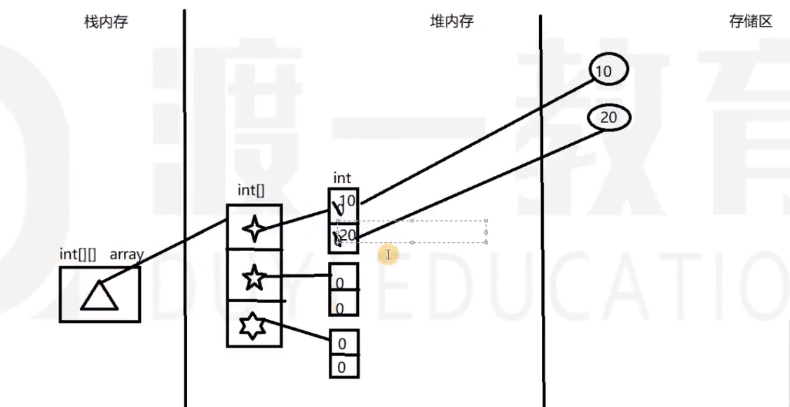

#### 7.b 多维数组

```java
int[][][] a = {{{1,2},{3,4}},{{5,6,7,8},{1,2}},{{1,3},{4,7}}};
int[][][] a = new int[3][][]; //可以，但是访问和赋值会发生 空指针异常NullPointerException (运行时异常)
```


#### 7.n 基本类型与引用类型在内存上的不同

所有的变量空间都存在栈内存。

变量空间可以存基本数据类型，也可以存引用数据类型。

* 基本类型，存的是值。
* 引用类型，存的是引用（reference）（可理解为地址）。

new就是在堆内存中申请开辟一块空间。

数组在堆内存中，是一串连续的存储地址。在栈空间中，存第一个存储区单元的地址（hashCode）。

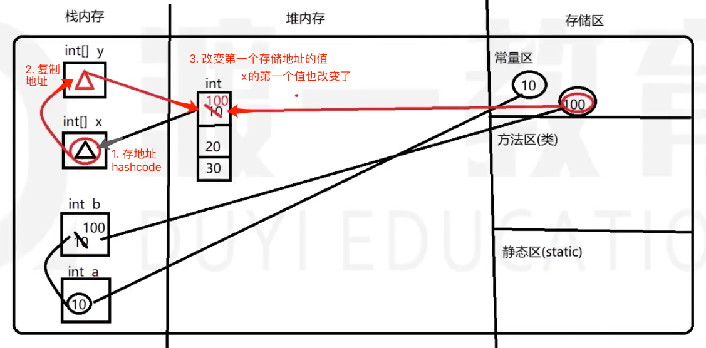

```java
int[] x = {10,20,30};
int[] y = x;
y[0] = 100;
x[0] = ?
```

数组没有任何引用指向，会被视为垃圾。GarbageCollection回收。

#### 7.1 练习：把2-100之间的素数放入数组

* int[] array = new int[50];  创建一个数组来存素数，前面是素数，后面默认0。

* int index = 0; 做数组的index，并且计数。

* for循环找素数：如果是，array[index++] = n;

* 素数存完。去掉array后面的0 ---> 创建新数组int[] arrayNew = new int[index]；
* 然后把array非0的数存入 ---> for(int i = 0; i<arrayNew.length; i++){...}

#### 7.2 练习：数组元素排序

1. 冒泡排序：两两换，每次换出最小的一个

   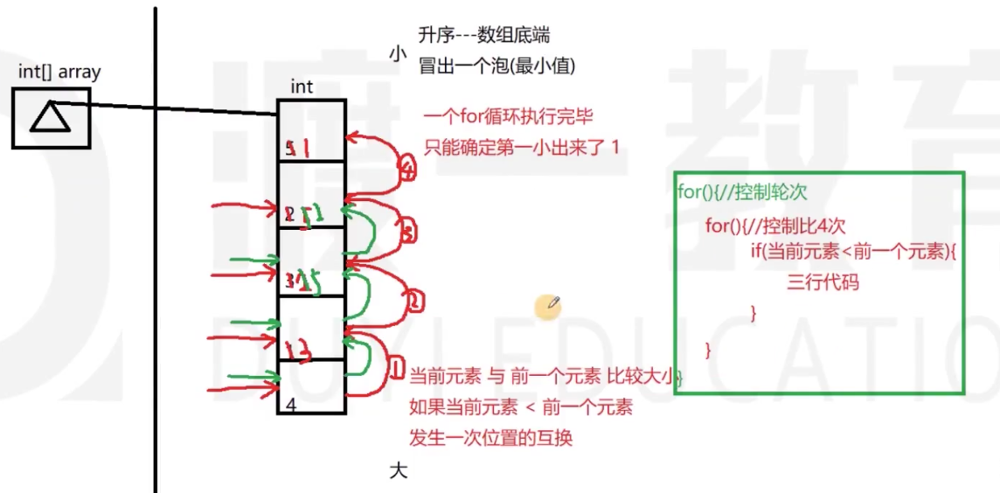

   升序排列：从数组底端到顶端，依次与前一位比较，后<前，就互换，后>前，则不换。index往前移一位。

   * 方向：从顶到底，从底到顶都可。
   * 算法复杂度：外层n次，内层index次，总数：n！次。

    ```java
   public class Demo{
     public static void main(String[] args){
       int[] array = {5,4,2,6,7};
       //冒泡排序
       for (int i=1;i<array.length; i++) {
          for(int j=array.length-1; j>=i; j--){
             int e = 0;
             if(array[j]<array[j-1]){
               e = array[j];
               array[j] = array[j-1];
               array[j-1] = e;
             }
          }
       }
       for(int e : array){
         System.out.println(e);
       }
     }
   }
    ```

### m. String[] args的使用

main方法传参，给JVM使用。

在方法中调用args参数：

```java
int length = args.length;  //args长度
for(String v : args){
  System.out.println(v);
}
```

# 二、面向对象编程

面向对象编程：

1. 先定义(描述)一个类(型)
2. 想要做的事，需要创建一个类型的对象来做事
3. 这个对象做的事，叫方法

类：

* 创建类

* 利用属性或方法，来描述这个类
* 创建一个类的对象，对象调用属性/方法，来实现功能

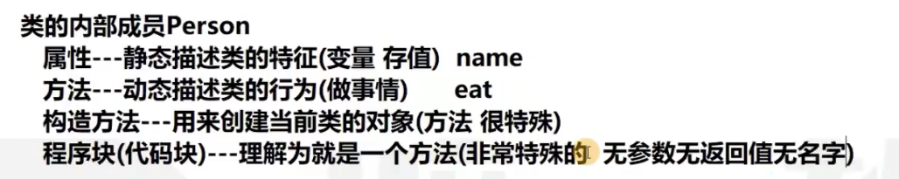

**方法和类，都有()，是用来传参数的。**

> 堆内存：
>
> * 堆内存，只存东西，不能做任何的值交换
>
> * 凡是在堆内存中创建的空间，都有默认值
> * 凡是new，都是在堆内存中创建空间。引用数据类型，都存在堆中，所以都要new。

类创建一个对象：new

* 对象.调用属性  可以存值/取值
* 对象.调用方法  执行一次（存储/执行）

### 1. 类的属性

属性：**权限修饰符 [特征修饰符] 数据类型 属性名 [ = 值];**

* 权限修饰符必须有：public、private、protected、默认不写

* 修饰符：不写则默认——本包和本类对象可访问。public 公共。
  * 权限修饰符
* 属性：如果你在类中没有定义，那么一旦创建（在堆内存中创建的一切，都有默认值），都以默认值创建。

```java
class Person{
	public String name;
  public int age;
  public String sex;
}
public class Test{
  public static void main(String[] args){
    Person p = new Person();
    p.name = "wawa";
    p.age = 12;
    p.sex = "male";
  }
}
```

这里是创建了一个Person对象

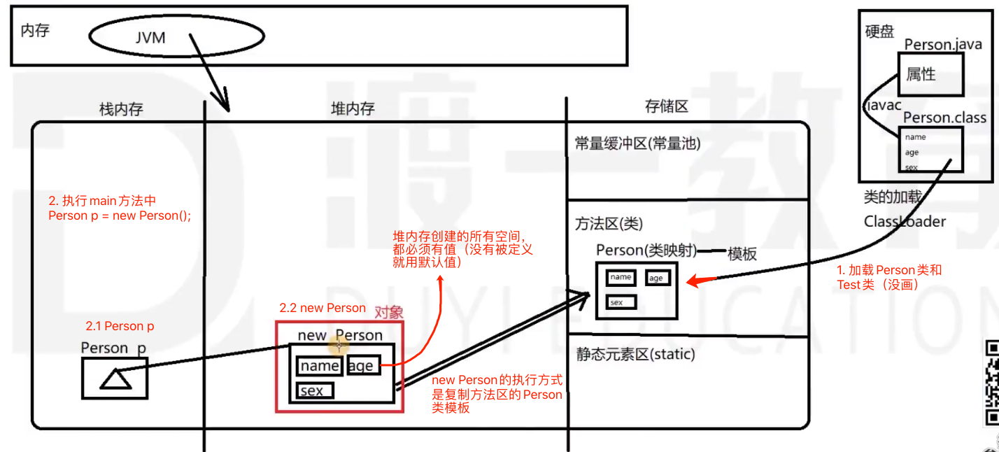

默认值：name = null;   age = 0;  sex = null;

下图：Person p1 = new Person();

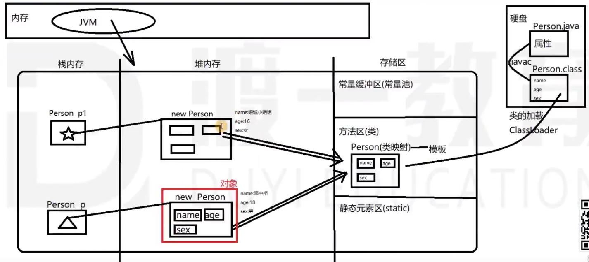

下图：Person p1 = p;

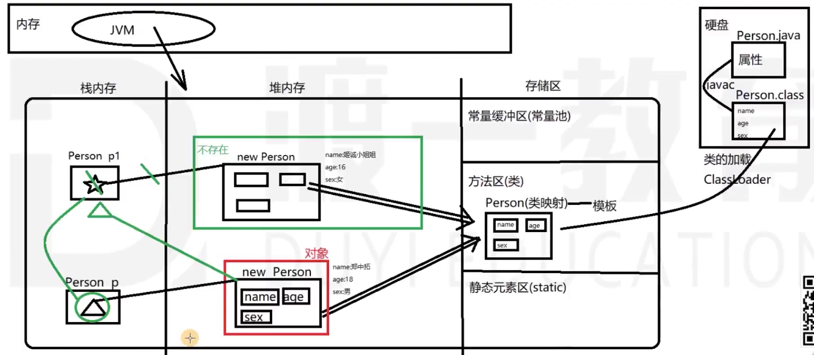


### 2. 类的方法

方法：**权限修饰符  [特征修饰符]  返回值类型  方法名字  (参数列表)  [抛出异常]  [{.....方法体.....}]**

* [ ]表示可有可无
* 权限符不写，是默认效果
* 无返回值，写void
* 参数列表可以空，但是( )必须有

* 一个方法 ----> 参数可以有多个。返回值只能有一个。

**类的方法**，在内存中执行的过程情况：

1. 方法存在哪里？—— 在**堆内存的对象空间内**
2. 方法在哪里执行？—— **栈内存**中开辟一块**临时的方法执行空间**，执行完之后，空间清除。
   * 堆里只能存，不能做值交换。所以任何执行过程，在栈内存执行。
   * 调用时把a的值传递给x（图1是基本类型，图2是引用类型）
   * 形参：方法执行时临时的变量空间
   * 实参：实参传递内容给形参

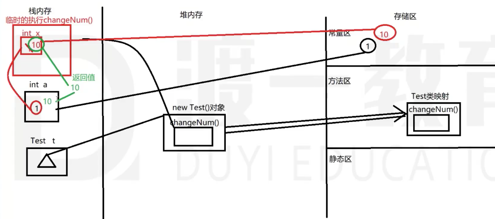

（ ↑ 图1    ↓ 图2）

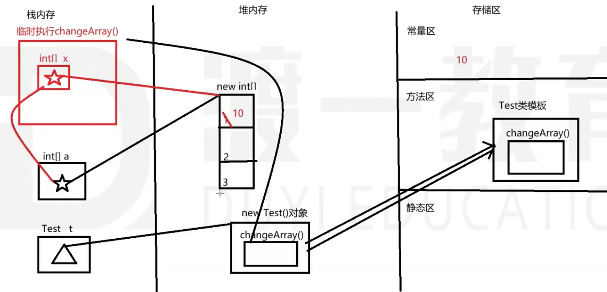

**方法参数及返回值**：

* 如果方法调用的是**基本类型**，它是复制了一个值进去执行。所以方法结束，方法不会改变方法外实参的值。

* 如果调用的是**引用类型**，方法执行时复制地址，改变了其中的值，那么方法结束，外部实参的值也被改变。

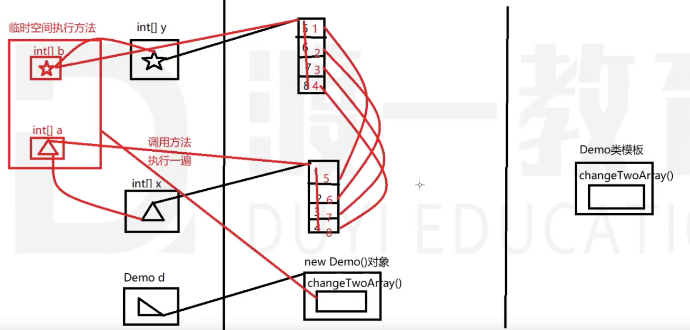

* ↑（方法：交换两个数组元素）方法执行之后，红色部分删除。黑色部分留下。
* ↓（方法：交换数组地址）方法内虽然完成了地址交换，但方法结束后，实参没变化。
  * 所以要return两个数组地址：`int[][] result = [a,b];  return result;`
  * 方法外：`x = value[0]; y = value[1];`

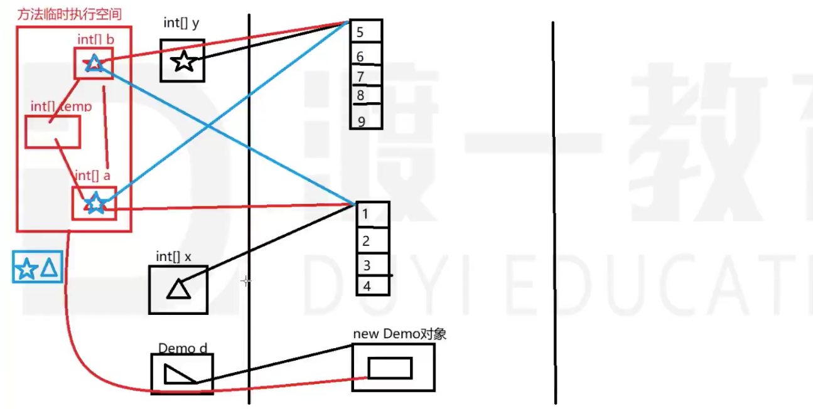

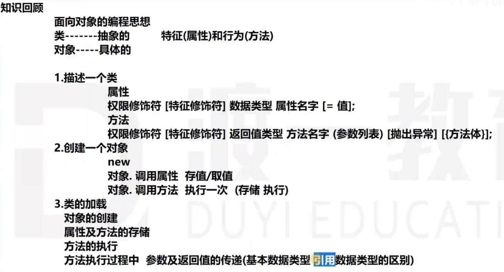

------------------------------------------------------------------------------------------------------------------------------------------------------------------------------------

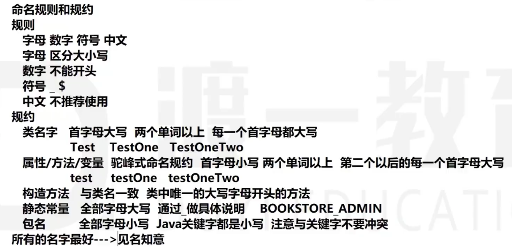

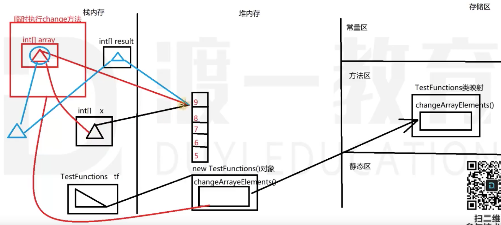

```java
public class TestFunctions{
    public int[] changeArrayElement(int[] array){
      .......
    }
}
```

### 3. 方法重载 Overload

**概念**：一个类中的一组方法，相同的方法名，不同的参数列表。

* 参数列表不同在哪里？参数个数、参数类型、参数顺序

**作用**：同一个方法，可以执行不同的操作。灵活。

**调用方法的顺序：**

* 首先通过名字定位方法
* 名字一致，通过参数列表确定方法
* 如果没有一致的参数列表方法，让参数列表**自动转化**，找对应的方法
  * Eg：你传一个char类型进去，但是只有int为参的方法，它会把char换成int，走int方法

**JDK1.5之后：动态参数列表** —— 类型固定，个数不定

* public void test( **int...x** )

* 怎么用这些参数？动态参数列表的参数x本质是数组：int[] x = {1,2,3,...};  有length属性。
  * 动态参数列表的方法，不能和相同意义的数组类型参数方法构成重载，因为它们是一样的。
  * 动参方法，可以不传参，但是数组参方法，必须有参。
  * 动参必须放在参数的后面，且只有一个。不能前面动参，再接别的参数（编译时无法识别什么时候动参结束）。

### 4. 构造方法和this

作用：构造一个类的对象

写法：**权限修饰符 类名 (参数列表) [抛出异常]{ 创建对象; -->返回一个对象 }**

* 方法名要和类名一致
* 结构上，无返回值，但实际上返回了一个对象

用法：new

特点：

1. 如果你的类中没有定义构造方法，系统会给你一个默认的无参数的构造方法。
2. 如果你定义了构造方法，默认的方法就被覆盖。
3. 构造方法也可以方法重载。

建议：

* 自己写类的构造方法时，建议把无参数构造方法，也写出来。（因为你写的会覆盖无参默认的构造方法）

```java
class Person{
   private String name;
   private int age;
   private String sex;
   
   public Person(){}
   public Person(String name, int age, String sex){
      this.name = name;
      this.age = age;
      this.sex = sex;
   }
}
```

**this：**指代当前对象 —— 正在调用的对象，或正在创建的对象。(不一定是本类对象)

* 解决属性和方法参数变量同名
* **this**可以**调用：属性和方法**（不能调用块），也可调用构造方法——只能**在一个构造方法中调用另一个构造方法**，不能再普通方法中调用构造方法。
  * 调用属性：this.属性 = 值;
  * 调用普通方法：返回类型 变量名 = this.方法名(参数列表)
  * 在一个构造方法中调用另一个构造方法：
    * this.Person(); 省略了构造方法名字 ----->  **this(参数列表)**;
    * **必须在第一行**。
    * 构造方法不能来回互相调用
    * 普通方法之间可以来回调用，但可能会产生：StackOverflowError栈溢出错误
      * 方法执行在栈内存中，反复调用产生新内存空间去执行任务，一直无法执行完毕，最终导致栈内存溢出。
* this可以在类的任何成员中写（属性、代码块、方法、构造方法）

### 5. initialization block 初始化块（代码块）

作用：跟方法一样，做事

写法：{......}

* 无参数  无返回值   无名字

用法：在每一次我们**调用构造方法时**，构造方法执行前，系统自动执行一次初始化块。**创建对象前执行。**

特点：

* 无重载
* 一个类中，可以定义多个程序块

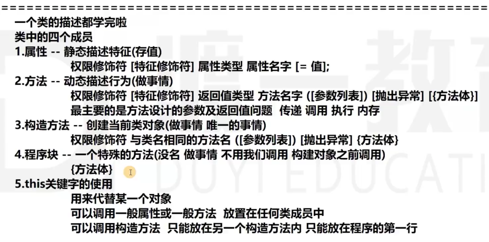


### 6. 类的加载和对象的创建（内存原理和机制）


### n. Scanner类的用法

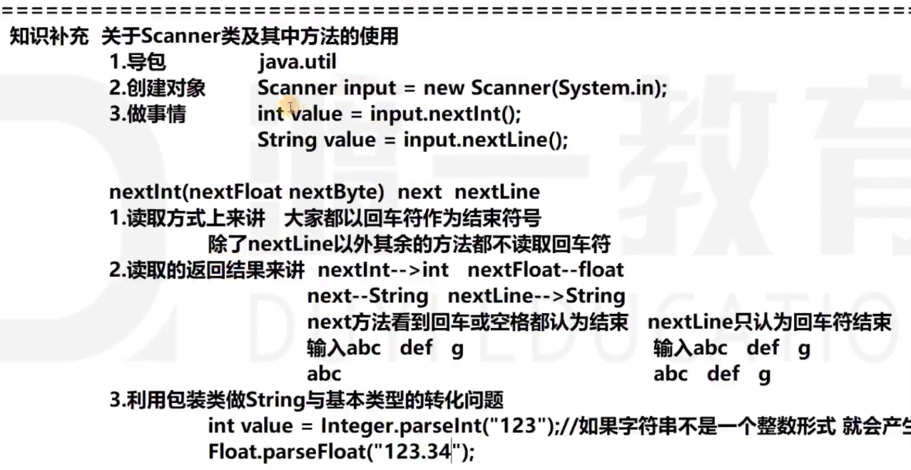

* 会产生NuberFormatException异常

```java
import java.utils.Scanner;
public static void main(String[] args){
		Scanner in = new Scanner(System.in);
  
  	String name = in.nextLine();  //阻塞效果
  	System.out.println("Please input your name:");//这个提示信息在前在后都可
  
    int password = in.nextInt(); //阻塞效果
  	System.out.println("Please input your password:");
}
```

但如果先读nextInt()，再读nextLine()，Line会得到空串，而不等待你输入。

空回车问题 —— 原因是：

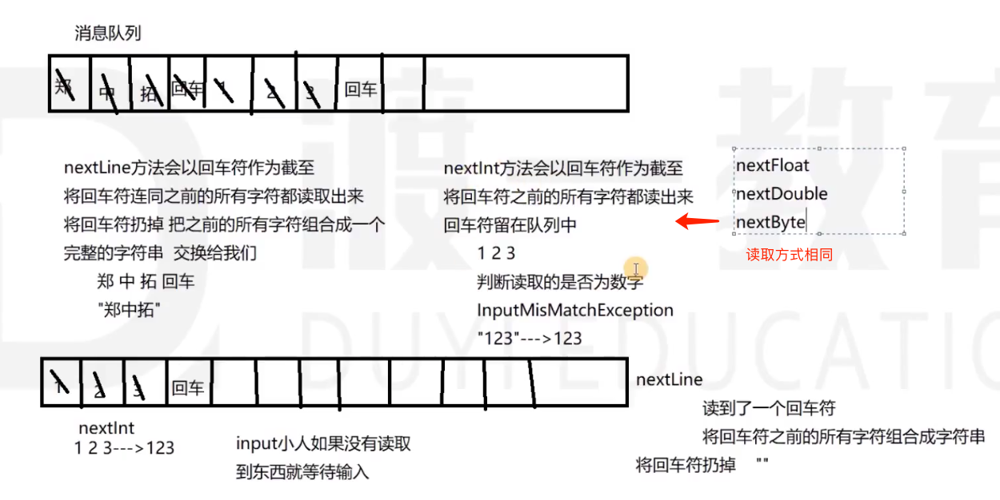

new String("郑中拓")

解决方法：

1. 在nextInt() 后面加一个nextLine()读掉回车符。接着在nextLine()接收值。
2. next()方法，不读回车，也留下回车在消息队列里。

3. 前两个方法都不好，不干净。

   * 更好的方法是，password和name都用nextLine()读取。
   * 把String转化成int。用包装类：
   * `int password2 = Integer.parseInt(password);`

   > 包装类：int - Integer      char - Character      byte - Byte      float - Float
   >
   > int --> String的方法：int+""。拼接一个空串即可。
   >
   > * 5+5+"5"+5;  --->  "1055"


### m. 练习

死循环怎么写：while(true){....}  或者   for(;;){.....}

1. 计算器  

2. 设计Arraybox类（数组容器）
   * 属性1：真实的数组
   * 属性2：int size
   * 方法：add  remove  get  获取有效元素个数size


# L、 java知识体系

**基础部分：JavaSE**

​	面向对象的编程思想 ArrayBox  LinkedBox

​	集合的使用、String类、

​	I/O流，MVC，缓存机制，文件——数据库，数据库事务，

​	反射注解，IOC

**Level One：数据库+Web**

​	数据库：本质就是文件，基本使用，性能，引擎，索引，锁

​	JDBC：Java database connection  本质是I/O  手动设计一个ORM框架——原理   Mybatis

​	Web：B/S分层架构，本质是Socket，IO，String解析

​				手动设计一个容器（服务器）   浏览器--->服务器

​				Tomcat：要了解它是怎么做出来的，而不只是会用。

​						Servlet（底层原理：生命周期、托管技术）   JSP（看似一个文件资源，其实是一个操作自由，解析）

​																											----> 手动设计一个Web框架

​						Filter一个特殊的servlet，责任链设计模式    AJAX：异步发送请求的过程

**Level Two：框架部分**

​	SSM：Spring（IOC  AOP）   SpringMVC   MyBatis

​	SSH：Spring   Struts  Hibernate

​	Linux  Maven  Git SVN

**分布式  大数据**

# N、 异常Exception

异常 —— 编译时异常、运行时异常

运行时异常：

1. InputMisMatchException 输入类型不匹配
   * Input.nextInt(); 结果输入的是a。

2. ArrayIndexOutOfBoundsException 数组索引越界（这个方法写在lang包里）

3. NegativeArraySizeException 数组长度不合法（长度出现负数）

4. NullPointerException 空指针异常
   * 引用为null，还拿来用。
5. NuberFormatException 数字格式化异常（把数字组成的字符串转化成数字，发现里面存的不是数字）

# M、 错误Error

计算机无法处理的事情。叫错误。

计算机处理编译没问题，但是人为规定不合理，为异常。

1. StackOverflowError栈溢出错误