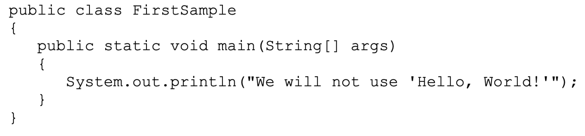
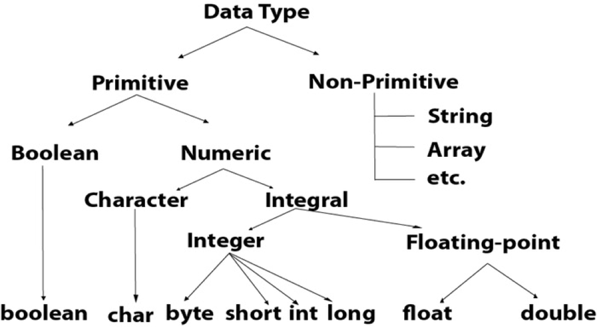
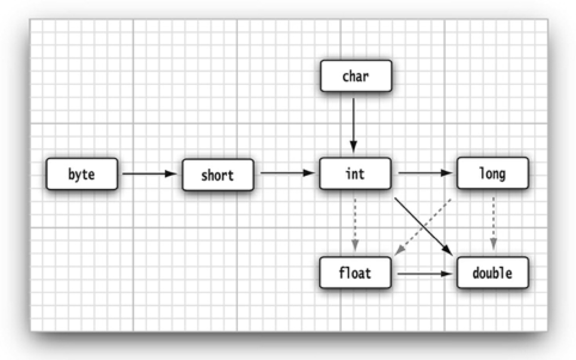
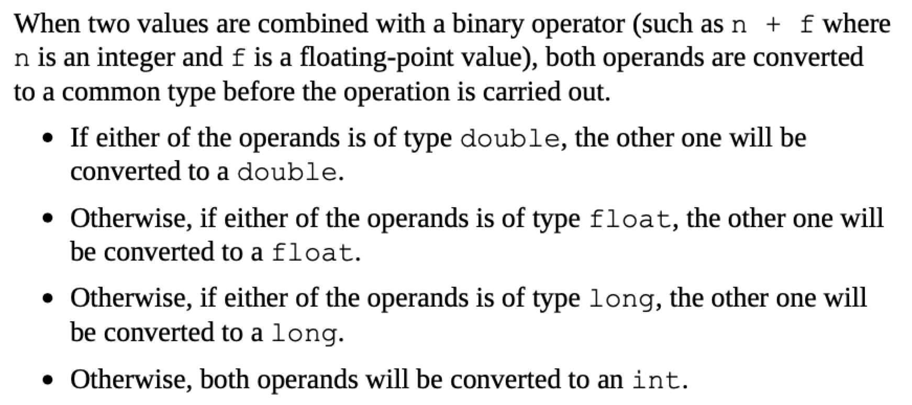
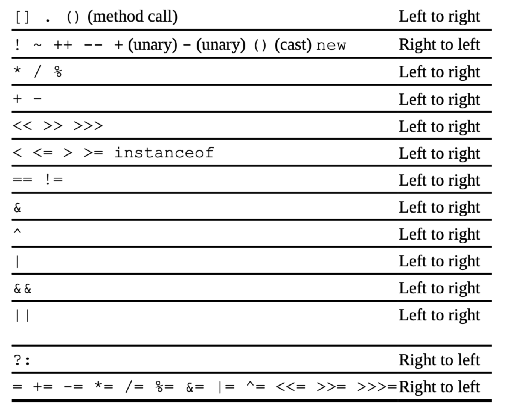

# Core Java I

## 一、An Introduction to Java

### 1.2 The Java “White Paper” Buzzwords

1. Simple.
2. Object-Oriented.
3. Distributed.
4. Robust.
5. Secure.
6. Architecture-Neutral.
7. Portable.
8. Interpreted.
9. High-Performance.
10. Multithreaded.
11. Dynamic.

**Java的版本：**Standard Edition，Micro Edition (for embedded devices)，Enterprise Edition (for server-side processing)。

## 二、The Java Programming Environment

JDK = Java development kit

JRE = Java runtime environment

## 三、Fundamental Programming Structures in Java

###3.1 A Simple Java Program

1. First and foremost, Java is case sensitive. If you made any mistakes in capitalization (such as typing Main instead of main), the program will not run. 

2. A sample program:  

   ---

   

   ---

- - - `public` - **access modifier** : control the level of access other parts of a program have to this code. 
    - `class` - **everything** in a Java program must be inside a class. 
    - The rules for class names in Java are quite generous. Names must **begin with a letter**, and after that, they can have any combination of letters and digits. The length is essentially unlimited. You cannot use a Java reserved word (such as `public` or `class`) for a class name. 
    - **The standard naming convention** (which we follow in the name `FirstSample`) is that class names are nouns that start with an uppercase letter. If a name consists of multiple words, use an initial uppercase letter in each of the words. 
    - Make the file name for the source code the same as the name of the public class, with the extension `.java` appended. 
    - The Java compiler automatically names the bytecode file `FirstSample.class` and stores it in the same directory as the source file. Finally, launch the program by issuing the following command: `java FirstSample`

- - - the Java virtual machine always starts execution with the code in the main method in the class you indicate. (The term “method” is Java-speak for a function.) Thus, you *must* have a `main` method in the source of your class for your code to execute. You can, of course, add your own methods to a class and call them from the `main` method. 
    - Java uses the general syntax: `object.method(parameters) `
    - Methods in Java, like functions in any programming language, can use zero, one, or more parameters (some programmers call them arguments). Even if a method takes no parameters, you must still use empty parentheses. 

### 3.2 Comments

- - - //
    - /* */
    - /**  */ : generate documentation automatically. 

### 3.3 Data Type

Java is a **_strongly typed language_**. This means that every variable must have a declared type. 

There are eight *primitive types* in Java. Four of them are integer types; two are floating-point number types; one is the character type `char`, used for code units in the Unicode encoding scheme; and one is a `boolean `type for truth values. 

### **3.4 Variables and Constants** 

#### **3.4.1 Declaring Variables** 

In Java, every variable has a *type*. You declare a variable by placing the type first, followed by the name of the variable. Here are some examples: 

 `double salary;`

 `int vacationDays;`

 `long earthPopulation;`

 ` boolean done;`

A variable name must begin with a letter and must be a sequence of letters or digits. *All* characters in the name of a variable are significant and *case is also significant. Spaces* cannot be used inside variable names. The length of a variable name is essentially unlimited. 

#### **3.4.2 Initializing Variables** 

`int vacationDays = 12; `

`double salary = 65000.0;`

`var vacationDays = 12; `

#### **3.4.3 Constants** 

In Java, you use the keyword final to denote a constant. 

**`final`**`double CM_PER_INCH = 2.54;`

The keyword `final` indicates that you can assign to the variable once, and then its value is set once and for all. It is customary to name constants in all uppercase. 

It is probably more common in Java to create a constant so it’s available to multiple methods inside a single class. These are usually called *class constants*. Set up a class constant with the keywords `static final`. 

#### **3.4.4 Enumerated Types** 

https://www.liaoxuefeng.com/wiki/1252599548343744/1260473188087424

### **3.5 Operators**

#### **3.5.1 Arithmetic Operators**

The usual arithmetic operators +, -, *, / are used in Java for addition, subtraction, multiplication, and division. The / operator denotes integer division if both arguments are integers, and floating-point division otherwise. Integer remainder (sometimes called modulus) is denoted by %. For example, `15 / 2` is `7`,`15 % 2` is `1`, and`15.0 / 2` is `7.5`. 

Note that integer division by 0 raises an exception, whereas floating-point division by 0 yields an infinite or NaN result. 

#### **3.5.2 Mathematical Functions and Constants** 

`Double y = Math.sqrt(4);`

`Double k = Math.pow(x, a);`

#### **3.5.3 Conversions between Numeric Types**  

The six solid arrows denote conversions without information loss. 

The three dotted arrows denote conversions that may lose precision.  

#### **3.5.4 Casts**

Conversions in which loss of information is possible are done by means of casts. 

`double x = 9.997; `

`int nx = (int) x; `

Now, the variable `nx` has the value `9` because casting a floating-point value to an integer discards the fractional part. 

If you want to round a floating-point number to the nearest integer (which in most cases is a more useful operation), use the `Math.round` method: 

`double x = 9.997;`
` int nx = (int) Math.round(x); `

The return value of the round method is a long, and a long can only be assigned to an int with an explicit cast because there is the possibility of information loss. 

#### **3.5.5 Combining Assignment with Operators** 

`x += 4;` is equivalent to `x = x + 4;`

#### **3.5.6 Increment and Decrement Operators** 

`int n = 12; `

`n++; `

`++n;`

Since these operators change the value of a variable, they cannot be applied to numbers themselves. For example, `4++` is not a legal statement. 

The prefix form does the addition first; the postfix form evaluates to the old value of the variable. 

#### **3.5.7 Relational and boolean Operators**

`3 == 7 //false`

`3 != 7 //true`

Finally, you have the usual `<` (less than), `>` (greater than), `<=` (less than or equal), and `>=` (greater than or equal) operators. Java uses `&&` for the logical “and” operator and `||` for the logical “or” operator. 

*`expression1`* **&&** *`expression2`* 

**the ternary `?:` operator** 

`condition? expression1 : expression2`
 `x < y ? x : y`

#### **3.5.8 Bitwise Operators** 

- [ ] todo

- [ ] 补充：强制类型转换的细节，字典。

  前面，类型表复制进去。

#### **3.5.9 Parentheses and Operator Hierarchy** 括号与运算符级别

`a && b || c ` means `(a && b) || c`

Since `+=` associates right to left, the expression `a += b += c` means `a += (b += c)`

## **3.6 Strings**

Conceptually, Java strings are sequences of Unicode characters. For example, the string "Java\u2122" consists of the five Unicode characters J, a, v, a, and TM. Java does not have a built-in string type. Instead, the standard Java library contains a predefined class called, naturally enough, String. Each quoted string is an instance of the String class:

`String e = ""; // an empty string `

`String greeting = "Hello";`

- [ ] 什么是built-in type.

#### **3.6.1 Substrings**

`String s = greeting.substring(0, 3);//0,1,2`

this means from position 0 inclusive to position 3 exclusive.

`s.substring(a, b)` always has length b − a. 

#### **3.6.2 Concatenation**

1. Use `+` to join (concatenate) two strings.

   `String message = "expletive" + "PG13";`

   When you concatenate a string with a value that is not a string, the latter is converted to a string. (As you will see in Chapter 5, every Java object can be converted to a string.)

   This feature is commonly used in output statements. 

   * eg:`System.out.println("The answer is " + answer);`

2. If you need to put multiple strings together, separated by a delimiter, use the static join method:

   `String all = String.join(" / ", "S", "M", "L", "XL"); `// all is the string "S / M / L / XL"

3. As of Java 11, there is a repeat method:

   `String repeated = "Java".repeat(3); // repeated is "JavaJavaJava"`

#### **3.6.3 Strings Are Immutable**

The String class gives no methods that let you *change* a character in an existing string. If you want to turn greeting into "Help!", you cannot directly change the last positions of greeting into 'p' and '!'. How are we going to modify the string? In Java, it is quite easy: Concatenate the substring that you want to keep with the characters that you want to replace.

`greeting = greeting.substring(0, 3) + "p!";`

Since you cannot change the individual characters in a Java string, the documentation refers to the objects of the String class as *immutable*. Just as the number 3 is always 3, the string "Hello" will always contain the code-unit sequence for the characters H, e, l, l, o. You cannot change these values. Yet you can, as you just saw, change the contents of the string *variable* greeting and **make it refer to a different string**, just as you can make a numeric variable currently holding the value 3 hold the value 4.

But immutable strings have one great advantage: The compiler can **arrange** that strings are ***shared***. 编译器可以让字符串共享。

To understand how this works, think of the various strings as sitting in a common pool. String variables then point to locations in the pool. If you copy a string variable, both the original and the copy share the same characters.

Overall, the designers of Java decided that the efficiency of sharing outweighs the inefficiency of string editing by extracting substrings and concatenating. Look at your own programs; we suspect that most of the time, you don’t change strings — you just compare them. (There is one common exception—assembling(集合) strings from individual characters or from shorter strings that come from the keyboard or a file. For these situations, Java provides a separate class that we describe in *Section 3.6.9*, “Building Strings,(构建字符串)” on p. 74.)

