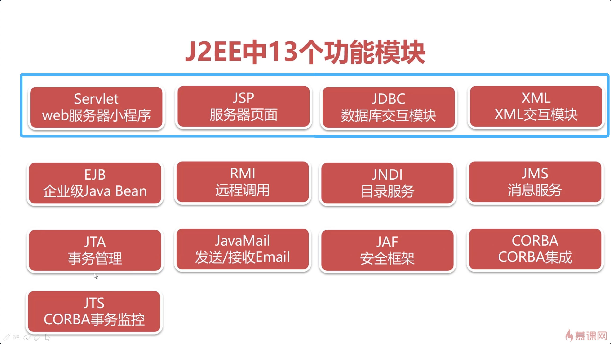

### 软件结构发展历史

* 单机时代 - 桌面应用（方便用，更新慢，共享慢）
* 联机时代 - Client-Server模式（共享块，更新慢）
* 互联网时代 - Browser-Server模式（更新快，体验慢）

### J2EE

基于J2SE增加了很多开发B/S(Web)应用程序的模块。

Tomcat是web服务器软件。只要安装Apache Tomcat，你的电脑就是Web应用程序的服务器了。

所谓服务器，也就是一台高配的，装了web服务器软件的电脑。

J2EE不需要另外安装，它依托于JRE运行，用JDK开发。

Tomcat提供硬件基础，Servlet提供软件实现。动态网页应用程序就构建完整了。

Servlet(Server applet)服务器小程序，主要功能用于生成动态web内容。是J2EE最重要的组成部分。

